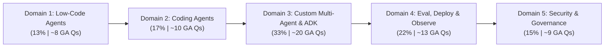
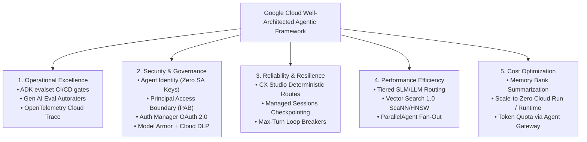

# Google Cloud Certified Professional Agentic Architect (PAA): Exam Overview & Blueprint Strategy

The **Google Cloud Certified Professional Agentic Architect (PAA)** certification validates your ability to design, build, orchestrate, evaluate, deploy, and govern autonomous agentic systems on Google Cloud. The exam rigorously tests multi-step reasoning loops, stateful orchestration, inter-agent protocols (`Agent2Agent`), standardized tool binding (`Model Context Protocol`), zero-trust security (`Agent Identity`, `Principal Access Boundary`), and trajectory evaluation (`ADK evalset`, `Gen AI Evaluation Service`).

---

## 1. Exam Mechanics, Scoring & GA vs. Beta Format Comparison

Google Cloud releases certifications initially in Beta to establish psychometric validity before General Availability (GA).

| Exam Dimension | General Availability (GA) Format | Beta Exam Format | Strategic Impact & Pacing Guidance |
| :--- | :--- | :--- | :--- |
| **Total Questions** | **60 Questions** (50 scored + 10 experimental) | **80 Questions** (all evaluated) | Assume every item counts; experimental items are unmarked. |
| **Time Allotment** | **120 Minutes** (2.0 hours) | **180 Minutes** (3.0 hours) | GA provides **2.0 min/question**; Beta provides **2.25 min/question**. |
| **Question Types** | Multiple-Choice & Multiple-Select (Choose 2–3) | Multiple-Choice & Multiple-Select | Multiple-select has **no partial credit**. Missing one option scores zero. |
| **Passing Score** | **700 / 1000** (Scaled Score, ~70% target) | Calibrated post-beta (~70%) | No penalty for guessing. Never leave an item blank. |
| **Case Studies** | 1–2 Enterprise Case Studies (~8–12 Qs) | 2 Case Studies (~14–18 Qs) | Map handoffs (`A2A` vs `ADK` graphs) before reading options. |

### Deconstructing PAA Question Anatomy

1. **Scenario Context:** Industry vertical (banking, healthcare, SaaS) and existing architecture.
2. **Agentic Failure Mode:** Why legacy automation fails (e.g., *"RAG cannot execute multi-step mutations across Cloud SQL and CRM APIs"*).
3. **Optimization Constraint:** The decisive filter—*"minimize ops overhead,"* *"zero-trust without static keys,"* or *"deterministic disclosures."*
4. **Distractor Matrix:**
   - **Distractor A (Bespoke/Legacy):** Uses custom Python FastAPI wrappers instead of **Google Cloud MCP Servers**.
   - **Distractor B (Security Violation):** Passes credentials in system prompts instead of **Auth Manager** OAuth 2.0 token propagation.
   - **Distractor C (Wrong Abstraction):** Uses custom **ADK** code when **CX Agent Studio** deterministic state machines were requested.
   - **Winning Option:** The **Google Cloud Opinionated Answer** using managed primitives.

> [!IMPORTANT]
> **Golden Rule of Google Cloud Agentic Architecture:** Always prefer **managed, standard-protocol primitives** (`ADK`, `MCP Servers`, `A2A Protocol`, `Agent Identity`, `Model Armor`, `Agent Runtime`) over DIY orchestration code, static service account keys, or unmonitored LLM calls—unless custom open-source portability or kernel isolation is explicitly required.

---

## 2. The 5 Exam Domains & Exact Blueprint Weightings

Notice that **Domain 3 (33%)** and **Domain 4 (22%)** represent **55% of the entire exam**.

* **Domain 1: Building Agents Using Low-Code Tools (13% | ~8 GA Questions):** Internal Workspace agents via **Gemini Enterprise Agent Designer** and contact centers via **CX Agent Studio**. State workflows (pages, routes, event handlers, slot filling), system instructions (persona, few-shot, CoT), **Agent Search** grounding, and multimodal ingestion.
* **Domain 2: Using Coding Agents for Application Development (17% | ~10 GA Questions):** Accelerating SDLC using **Antigravity** (CLI, SDK, App) and **Claude Code on Google Cloud**. Customizing agents via **MCP servers**, custom skills (`SKILL.md`), plugins, extension hooks (pre/post-commit, pre-tool execution), rules, and subagents. Execution sandboxes on **GKE** (gVisor/Kata) and **Cloud Workstations** (VPC-SC, zero public IP), plus governance via **Agents CLI**.
* **Domain 3: Architecting Custom Multi-Agent Systems (33% | ~20 GA Questions):** Code-first systems with **Agent Development Kit (ADK)**. Model selection (LLM vs SLM, OSS vs Proprietary) in **Model Garden**, working state in **Managed Sessions** vs semantic memory in **Agent Platform Memory Bank**, human vs agent mode in **Agents CLI**, retrieval via **RAG Engine**, **Vector Search 1.0**, and **Agent Retrieval**, zero-trust **Agent Identity**, discovery via **Agent Registry**, tool binding via **Google Cloud MCP Servers**, inter-agent collaboration with **Agent2Agent (A2A)**, and orchestration topologies (parallel, sequential, hierarchical, cyclic/DAG graphs) on **Agent Runtime**.
* **Domain 4: Evaluating, Deploying, and Monitoring Agents (22% | ~13 GA Questions):** Golden datasets and trajectory evaluation via **ADK evalset** and **Gen AI Evaluation Service** autoraters. Selecting **Agent Runtime** vs **Cloud Run** vs **GKE**. Diagnosing reasoning loops, drift, and latency bottlenecks in **Cloud Trace** and **Cloud Logging**.
* **Domain 5: Securing and Governing Agentic Systems (15% | ~9 GA Questions):** OAuth 2.0 consent via **Auth Manager**, resource ceilings via **Principal Access Boundary (PAB)** on **Agent Identity**, traffic control via **Agent Gateway**, prompt firewalls via **Model Armor**, PII masking via **Sensitive Data Protection (DLP)**, and **Human-in-the-Loop (HITL)** approval gates.

---

## 3. Complete 28 In-Scope Tools & Architectural Matrix

| # | In-Scope Tool / Protocol | Dom | Primary Role | When to Choose (Winning Pattern) | When to Avoid (Anti-Pattern) |
| :--- | :--- | :--- | :--- | :--- | :--- |
| **1** | **Gemini Enterprise Agent Designer** | D1 | Internal Workspace/SaaS low-code builder. | Internal HR/IT/sales agents needing Drive/Jira grounding. | External voice/chat contact centers needing state machines. |
| **2** | **CX Agent Studio** | D1 | Hybrid generative + state-machine contact center. | Omnichannel support needing deterministic Pages/Routes. | Repo-scale software refactoring or multi-agent code graphs. |
| **3** | **Agent Search** | D1/3 | Managed turnkey grounding search engine. | Turnkey document search with auto-chunking and citations. | Sub-10ms custom ANN vector math at billion-scale. |
| **4** | **Antigravity (CLI, SDK, App)** | D2 | Flagship autonomous SDLC coding platform. | Multi-file refactoring, task decomposition, SDK embedding. | Simple single-line autocomplete or customer chat flows. |
| **5** | **Claude Code on Google Cloud** | D2 | Terminal coding agent on Vertex AI Claude. | Interactive CLI code exploration, tests, git with privacy. | Scenarios forbidding partner models or needing Workspace UI. |
| **6** | **Agents CLI** | D2/3 | Unified CLI for agent testing & governance. | Headless CI/CD execution (`--agent-mode` JSON output). | Designing visual IVR call trees (use CX Agent Studio). |
| **7** | **Google Kubernetes Engine (GKE)** | D2/4 | Managed K8s for fleets or code sandboxes. | Running untrusted code in **gVisor**, GPU OSS SLMs, meshes. | Sporadic stateless webhooks needing zero ops (Cloud Run). |
| **8** | **Cloud Workstations** | D2 | Managed cloud IDE inside customer VPC. | Ephemeral VPC-SC developer/agent IDEs with no public IP. | Production serving of customer-facing runtime agents. |
| **9** | **Agent Development Kit (ADK)** | D3 | Code-first Python/TS multi-agent framework. | Custom topologies (`Sequential`, `Parallel`, `Loop`) in Git. | Non-technical users building FAQ bots (Agent Designer). |
| **10** | **Vertex AI Model Garden** | D3 | Enterprise catalog of proprietary & OSS models. | Cost/latency tiering (SLMs for fast routing; LLMs for depth). | Storing session transcripts or vector embeddings. |
| **11** | **Agent Platform Memory Bank** | D3 | Managed long-term cross-session semantic store. | Retaining user preferences across months via fact extraction. | Storing temporary mid-turn loop counters (Managed Sessions). |
| **12** | **Managed Sessions** | D3 | Stateful short-term working memory manager. | Checkpointing multi-turn state, scratchpad, and graph steps. | Long-term personalization across sessions months apart. |
| **13** | **RAG Engine** | D3 | Managed orchestration layer for custom RAG. | Custom control over parsing, chunking, embeddings, rerank. | Zero-code turnkey search portals (use Agent Search). |
| **14** | **Vector Search 1.0** | D3 | High-speed ANN vector DB built on ScaNN. | Billion-scale vector similarity search with sub-10ms latency. | Direct blob storage or keyword search without embeddings. |
| **15** | **Agent Retrieval** | D3 | Retrieval for multi-hop query decomposition. | Complex multi-hop queries where agent reformulates searches. | Simple static single-key lookup tables. |
| **16** | **Agent Identity** | D3/5 | Cryptographic non-human Workload Identity. | Unique per-agent identity preventing shared SA JSON keys. | Authenticating human end-users directly (Auth Manager). |
| **17** | **Agent Registry** | D3 | Enterprise catalog for agent discovery. | Dynamic runtime discovery of peer agents via schemas. | Storing Docker container images (Artifact Registry). |
| **18** | **Google Cloud MCP Servers** | D3 | Pre-built MCP servers for Cloud SQL/BQ/SaaS. | Standardized JSON-RPC DB/API access without custom wrappers. | Peer negotiation between autonomous agents (use A2A). |
| **19** | **Agent2Agent (A2A) Protocol** | D3 | Open protocol for inter-agent task handoffs. | Task delegation between heterogeneous or cross-org agents. | Connecting an agent to a passive database table (MCP). |
| **20** | **Agent Runtime** | D3/4 | Managed serverless runtime for ADK graphs. | Turnkey hosting of stateful ADK agents with checkpointing. | Custom Linux kernel modules or non-container monoliths. |
| **21** | **ADK evalset** | D4 | Code-first local/CI evaluation suite in ADK. | Unit-testing trajectories and tool sequences in CI/CD. | Cloud-hosted human annotation UI (Gen AI Eval Service). |
| **22** | **Gen AI Evaluation Service** | D4 | Managed evaluation service with autoraters. | Pairwise comparison, custom LLM-as-a-judge rubrics at scale. | Real-time inline blocking of prompt injections (Model Armor). |
| **23** | **Cloud Run** | D4 | Serverless container runtime for stateless APIs. | Hosting custom MCP servers or webhooks scaling to zero. | Stateful multi-agent graphs needing native checkpoints. |
| **24** | **Cloud Trace** | D4 | Distributed tracing backend for OpenTelemetry. | Visualizing end-to-end latency waterfalls and slow tools. | Storing full megabyte prompt payloads (Cloud Logging). |
| **25** | **Cloud Logging** | D4 | Centralized structured log management. | Debugging exact prompt drift, hallucinated JSON, alerts. | Visualizing distributed latency waterfalls (Cloud Trace). |
| **26** | **Auth Manager (OAuth 2.0)** | D5 | Managed credential broker for user OAuth 2.0. | Propagating human user identity to Jira/Salesforce ACLs. | Pure machine-to-machine background tasks (Agent Identity). |
| **27** | **Principal Access Boundary (PAB)** | D5 | IAM boundary capping accessible resources. | Hard blast-radius limit so Agent Identity avoids PCI data. | Granting permissions directly (requires IAM Allow policy). |
| **28** | **Agent Gateway, Model Armor, DLP, HITL** | D5 | Security control plane: firewall, PII, HITL. | Blocking injections inline, masking SSNs, human sign-off. | Offline batch model accuracy benchmarking. |

---

## 4. The 35-Row Keyword-to-Service Decoder Table

| # | Exam Scenario Keyword / Phrase | Winning Google Cloud Service / Pattern | Trap Distractor to Eliminate |
| :--- | :--- | :--- | :--- |
| **1** | *"Internal employee agent for Workspace/Drive with zero code"* | **Gemini Enterprise Agent Designer** | Custom ADK Python app on GKE |
| **2** | *"Omnichannel contact center with strict regulatory state machine"* | **CX Agent Studio** (Pages + Routes) | Freeform prompt in Vertex Studio |
| **3** | *"Capture missing required parameters before calling webhook"* | **CX Agent Studio Form Slot Filling** | Custom regex in Cloud Functions |
| **4** | *"Handle unexpected digressions or API timeouts in IVR"* | **CX Agent Studio Event Handlers** | Hardcoded fallback in DB |
| **5** | *"Ground low-code agent on PDF manuals with complex tables"* | **Agent Search Multimodal Layout Parser** | Text-only OCR with fixed chunks |
| **6** | *"Autonomous repo-wide multi-file refactoring & PR generation"* | **Antigravity (App / CLI / SDK)** | Vertex Studio freeform prompt |
| **7** | *"Terminal coding agent using Anthropic models on GCP"* | **Claude Code on Google Cloud** | Unmanaged external API keys |
| **8** | *"Package reusable coding procedures and bash workflows"* | **Custom Skills (`SKILL.md`)** | Weekly model weight fine-tuning |
| **9** | *"Deterministically block coding agent from committing secrets"* | **Extension Hooks** (`pre-tool-execution`) | System prompt asking nicely |
| **10** | *"Isolate untrusted LLM-generated code against kernel escape"* | **GKE Sandbox (gVisor / Kata)** | Standard Cloud Run container |
| **11** | *"Browser IDE with zero public IP, VPC-SC, persistent disk"* | **Cloud Workstations** | Local laptop SSH forwarding |
| **12** | *"Run coding agents headlessly in CI/CD with JSON output"* | **Agents CLI (`--agent-mode` JSON)** | Interactive scraping via `expect` |
| **13** | *"Build deterministic sequential then parallel multi-agent graph"* | **ADK** (`Sequential` + `ParallelAgent`) | Monolithic prompt with 20 tools |
| **14** | *"Route 90% of simple classification queries at <100ms latency"* | **SLM (Gemini Flash / Gemma)** Router | 100% traffic to Gemini 1.5 Pro |
| **15** | *"Remember user dietary preferences across separate months"* | **Agent Platform Memory Bank** | Passing 6-month chat history |
| **16** | *"Maintain active loop counter and intermediate tool output"* | **Managed Sessions** (Short-term state) | Writing loop state to BigQuery |
| **17** | *"Custom programmatic chunking, hybrid search, re-ranking"* | **RAG Engine** + **Agent Retrieval** | Dumping raw PDFs into prompt |
| **18** | *"Sub-10ms similarity search over 500M embeddings with filters"* | **Vertex AI Vector Search 1.0 (ScaNN)** | Full scan in Cloud SQL |
| **19** | *"Connect ADK agent to Cloud SQL/BQ via open standard"* | **Google Cloud MCP Servers** | Custom REST wrapper per table |
| **20** | *"Cross-organization task handoff between heterogeneous agents"* | **Agent2Agent (A2A) Protocol** | Exposing DB keys via webhook |
| **21** | *"Dynamic discovery of specialist agents and schemas"* | **Agent Registry** | Hardcoded IPs in env vars |
| **22** | *"Assign unique non-human cryptographic identity to each agent"* | **Agent Identity** | Shared `Editor` SA JSON key |
| **23** | *"Guarantee agent NEVER accesses PCI folder regardless of IAM"* | **Principal Access Boundary (PAB)** | System prompt "Avoid PCI data" |
| **24** | *"Propagate human user identity to Jira respecting user ACLs"* | **Auth Manager (OAuth 2.0 Propagation)** | Admin Service Account execution |
| **25** | *"Centralized rate limiting, token quotas, and audit logs"* | **Agent Gateway** | Rate-limit counters in prompt |
| **26** | *"Inline real-time blocking of prompt injection and jailbreaks"* | **Model Armor** | Nightly batch eval service |
| **27** | *"De-identify SSNs and medical records before LLM call"* | **Sensitive Data Protection (Cloud DLP)** | Asking LLM to ignore SSNs |
| **28** | *"Pause execution for manager sign-off on wire transfer > $10k"* | **Human-in-the-Loop (HITL)** gate | Deleting DB then sending Slack |
| **29** | *"Regression-test exact tool call sequence in CI/CD"* | **ADK evalset** (Trajectory Evaluation) | Spot-checking 5 chats manually |
| **30** | *"Evaluate 10,000 logs for groundedness at scale"* | **Gen AI Eval Service Autoraters** | BLEU / ROUGE string overlap |
| **31** | *"Managed serverless hosting for stateful ADK graphs"* | **Agent Runtime** | VMs with cron restart scripts |
| **32** | *"Serverless hosting for stateless custom MCP servers"* | **Cloud Run** | Dedicated 24/7 GKE cluster |
| **33** | *"Diagnose why multi-agent request took 14s across 6 tools"* | **Cloud Trace** (OpenTelemetry spans) | Grepping stdout logs in GCS |
| **34** | *"Detect infinite cyclic reasoning loops between agents"* | **Cloud Trace + ADK `max_iterations`** | Increasing timeout to 60 mins |
| **35** | *"Audit exact raw prompt payload causing safety block"* | **Cloud Logging** JSON payloads | Checking CPU metrics |

---

## 5. The Well-Architected Agentic AI Framework

1. **Operational Excellence:** Gate prompt or schema changes in CI/CD via `ADK evalset` trajectory verification ($\ge 95\%$ tool precision against golden datasets). Export OpenTelemetry spans from agents and MCP servers to **Cloud Trace**.
2. **Security, Identity & Compliance:** Assign every agent a keyless **Agent Identity** bounded by a **Principal Access Boundary (PAB)**. Propagate human user permissions via **Auth Manager** OAuth 2.0 tokens to prevent *Confused Deputy* privilege escalation. Enforce inline **Model Armor** and **Sensitive Data Protection (DLP)** via **Agent Gateway**.
3. **Reliability & Resilience:** Combine deterministic **CX Agent Studio** pages/routes for compliance steps with generative fallback. In **ADK**, enforce strict `max_iterations` on cyclic loops (`LoopAgent`) and checkpoint state via **Managed Sessions**.
4. **Performance Efficiency:** Implement a **Hierarchical Router** where a fast SLM (**Gemini 1.5 Flash** or **Gemma 2** in **Model Garden**) classifies intent and delegates complex multi-hop synthesis to **Gemini 1.5 Pro**. Run independent tool calls concurrently via `ParallelAgent`.
5. **Cost Optimization:** Use **Agent Platform Memory Bank** to extract concise semantic facts rather than stuffing multi-month transcripts into context windows. Enforce per-tenant token budgets at **Agent Gateway**.

---

## 6. Structured Study Plans: 7-Day Crash Plan vs. 14-Day Mastery Plan

### Plan A: 7-Day Accelerated Crash Plan (3–4 hrs/day)
* **Day 1 (D1 - 13%):** **Gemini Enterprise Agent Designer** vs **CX Agent Studio**, Pages, Routes, Event Handlers, Slot Filling, **Agent Search** multimodal layout parser.
* **Day 2 (D2 - 17%):** **Antigravity** (CLI, SDK, App) vs **Claude Code on Google Cloud**, `SKILL.md`, `pre-tool-execution` hooks, **GKE Sandbox (gVisor)**, **Cloud Workstations**, **Agents CLI**.
* **Day 3 (D3 Pt 1 - 18%):** **ADK** (`Sequential`, `Parallel`, `LoopAgent`), **Model Garden** SLM/LLM routing, **Managed Sessions** vs **Memory Bank**, **RAG Engine**, **Vector Search 1.0**, **Agent Retrieval**.
* **Day 4 (D3 Pt 2 - 15%):** **Google Cloud MCP Servers** vs **Agent2Agent (A2A)**, **Agent Identity**, **Agent Registry**, multi-agent execution on **Agent Runtime**.
* **Day 5 (D4 - 22%):** **ADK evalset** vs **Gen AI Evaluation Service** autoraters, **Agent Runtime** vs **Cloud Run** vs **GKE**, **Cloud Trace** and **Cloud Logging**.
* **Day 6 (D5 - 15%):** **Auth Manager** OAuth 2.0, **Principal Access Boundary (PAB)**, **Agent Gateway**, **Model Armor**, **Sensitive Data Protection (DLP)**, **HITL**.
* **Day 7:** Timed 60-question Mock Exam (120 min) + Top 25 Traps review.

### Plan B: 14-Day Deep Mastery Plan (2 hrs/day)
* **Days 1–2:** Blueprint strategy + **Domain 1** deep dive (CX Agent Studio state machines & Agent Search multimodal parsing).
* **Days 3–4:** **Domain 2** deep dive (Antigravity SDK/CLI, custom MCP servers, GKE Sandbox gVisor & Cloud Workstations).
* **Days 5–6:** **Domain 3 Foundations** (ADK Python SDK, Model Garden cost/latency math, Managed Sessions vs Memory Bank).
* **Days 7–8:** **Domain 3 Advanced** (RAG Engine + Vector Search 1.0 ScaNN tuning, Google Cloud MCP Servers, A2A protocol & Agent Registry).
* **Days 9–10:** **Domain 4 Evaluation & Hosting** (ADK evalset golden datasets, Gen AI Eval autoraters, Agent Runtime vs Cloud Run vs GKE).
* **Days 11–12:** **Domain 4 Observability & Domain 5 Security** (Cloud Trace waterfalls, PAB + Agent Identity, Auth Manager OAuth 2.0, Model Armor + DLP + HITL).
* **Days 13–14:** Two Full Mock Exams + Keyword Decoder rapid review.

---

## 7. Top 25 Exam Traps & Architectural Anti-Patterns

> [!WARNING]
> **Eliminate Prompt-Based Security Immediately:** Never rely on system instructions (*"Do not output SSNs"*) for security. Use **Model Armor**, **Cloud DLP**, **PAB**, or **Auth Manager**.

1. **Prompt-Based Security Trap:** Using system instructions instead of **Auth Manager OAuth 2.0** or **Principal Access Boundary (PAB)**.
2. **MCP vs. A2A Confusion Trap:** Using **A2A** to query Cloud SQL, or **MCP** for peer agent negotiation. (*MCP = Agent-to-Tool/Data; A2A = Agent-to-Agent.*)
3. **Shared Service Account Key Trap:** Mounting static JSON keys across containers instead of keyless **Agent Identity** per agent.
4. **Memory Bank for Loop Counters Trap:** Writing loop counters to **Memory Bank** instead of **Managed Sessions**. (*Memory Bank = long-term semantic facts; Managed Sessions = active working state.*)
5. **Full-Transcript Stuffing Trap:** Appending 500 chat turns into every prompt instead of **Memory Bank** fact extraction + **Managed Sessions** sliding windows.
6. **Pure Generative Contact Center Trap:** Using unconstrained LLM prompts for banking IVRs needing verbatim disclosures instead of **CX Agent Studio Pages and Deterministic Routes**.
7. **BLEU/ROUGE for Agent Evaluation Trap:** Evaluating tool-calling agents with n-gram overlap instead of **ADK evalset Trajectory Evaluation** and **Gen AI Evaluation Service Autoraters**.
8. **Monolithic God-Agent Trap:** Attaching 45 MCP tools to one `LlmAgent` instead of decomposing into a **Hierarchical Supervisor Architecture**.
9. **Sequential Bottleneck Trap:** Running independent API calls (weather, hotel, flights) via `SequentialAgent` instead of `ParallelAgent`.
10. **Unbounded Cyclic Loop Trap:** Deploying an ADK `LoopAgent` without `max_iterations` or explicit exit conditions.
11. **Standard Container for Untrusted Code Trap:** Running untrusted LLM code in standard Cloud Run containers instead of **GKE Sandbox (gVisor/Kata)** or **Cloud Workstations**.
12. **System Prompt Git Guardrail Trap:** Asking coding agents nicely not to commit secrets instead of deterministic **Extension Hooks** (`pre-tool-execution`).
13. **Interactive CLI in CI/CD Trap:** Running `Agents CLI` in default human mode inside CI/CD (hanging on TTY input) instead of `--agent-mode` (`--output=json`).
14. **Vector Search for Primary Keys Trap:** Querying exact order IDs (`ORDER-99482`) solely via vector embeddings instead of **Google Cloud MCP Server for Cloud SQL** or hybrid retrieval.
15. **PAB Grants Access Misconception:** Assuming **Principal Access Boundary (PAB)** grants permissions (*PAB only caps scope; IAM Allow policies are required*).
16. **Offline Eval as Inline Firewall Trap:** Proposing **Gen AI Evaluation Service** to block real-time prompt injections instead of inline **Model Armor** on **Agent Gateway**.
17. **Frontier LLM for Trivial Classification Trap:** Routing high-volume binary classification to **Gemini 1.5 Pro** instead of an SLM (**Gemini 1.5 Flash** / **Gemma**) in **Model Garden**.
18. **Static Webhook Hardcoding Trap:** Hardcoding peer agent URLs across microservices instead of dynamic discovery via **Agent Registry**.
19. **Post-Facto HITL Notification Trap:** Deleting a database first and sending a Slack alert afterward, instead of pausing execution via a **Human-in-the-Loop (HITL)** gate in **Agent Runtime**.
20. **Regex PII Scrubbing Trap:** Writing custom regexes to scrub SSNs/medical records instead of managed **Sensitive Data Protection (Cloud DLP)** templates.
21. **Custom FastAPI Connector Trap:** Writing bespoke REST wrappers for BigQuery/Cloud SQL when official **Google Cloud MCP Servers** exist.
22. **Cloud Logging for Latency Waterfalls Trap:** Subtracting log timestamps to find latency bottlenecks instead of inspecting OpenTelemetry spans in **Cloud Trace**.
23. **Re-Embedding Entire Corpora Daily Trap:** Re-indexing 10M documents nightly when 0.1% change instead of using **Vector Search 1.0 Streaming Updates** or incremental **RAG Engine** sync.
24. **Over-Provisioned GKE for Sporadic Webhooks Trap:** Running a 24/7 GKE cluster for a webhook receiving 50 requests/day instead of serverless **Cloud Run** scale-to-zero.
25. **Confused Deputy Admin Token Trap:** Querying Google Drive with a global Admin key instead of user-scoped OAuth 2.0 via **Auth Manager** or **Agent Search** ACL enforcement.
