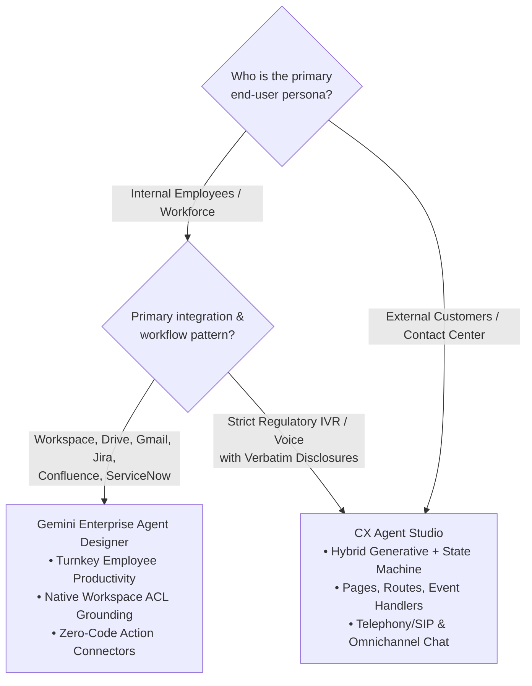
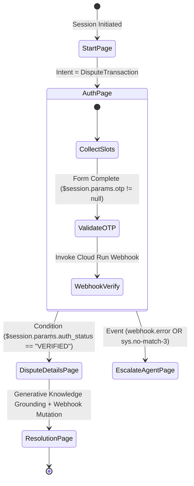
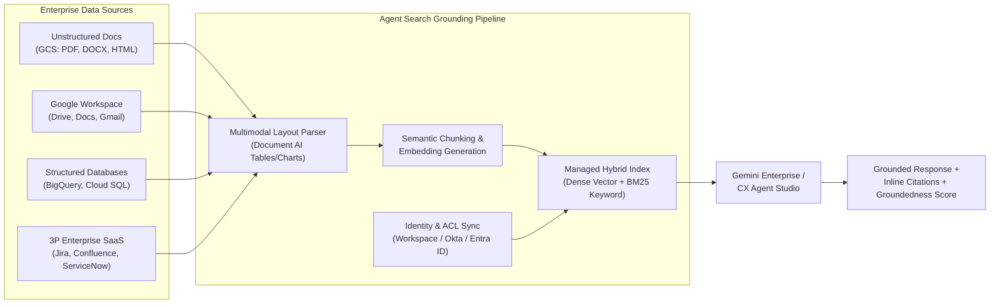

# Section 1: Building Agents Using Low-Code Tools (Domain 1 — 13%)

Domain 1 of the Google Cloud Certified Professional Agentic Architect (PAA) exam evaluates your ability to architect, ground, and govern enterprise agents using Google Cloud's low-code and hybrid generative platforms: **Gemini Enterprise Agent Designer** and **CX Agent Studio**. While code-first frameworks like the Agent Development Kit (ADK) provide unconstrained programmatic control, enterprise architecture frequently demands rapid time-to-value, citizen-developer accessibility, or legally auditable finite state machines for regulated customer interactions.

This module covers Sub-Objectives **1.1** (Conversational State Machines & Tool Selection) and **1.2** (System Instruction Engineering, Agent Search Grounding & Multimodal Ingestion).

---

## 1. Architectural Decision Matrix: Gemini Enterprise Agent Designer vs. CX Agent Studio

A foundational exam skill is immediately distinguishing when to prescribe **Gemini Enterprise Agent Designer** versus **CX Agent Studio**.



### Comprehensive Platform Comparison Matrix

| Architectural Dimension | Gemini Enterprise Agent Designer | CX Agent Studio |
| :--- | :--- | :--- |
| **Target User Persona** | Internal employees, knowledge workers, HR/IT/Sales ops teams. | External customers calling/chatting with contact centers (B2C/B2B). |
| **Primary Interface & Channels** | Workspace side panels (Docs, Gmail, Chat), internal portals, Slack/Teams. | Omnichannel contact center: Telephony (SIP/PSTN voice IVR), Web Chat, SMS. |
| **Execution & Control Paradigm** | Goal-oriented generative reasoning with declarative action connectors. | **Hybrid Deterministic + Generative State Machine**: explicit **Pages**, **Routes**, **Event Handlers** + Generative Fallback. |
| **Compliance & Determinism** | Moderate determinism (guided by instructions). Not for verbatim scripts. | **High / Auditable Determinism**: Guarantees verbatim legal disclosures, PCI payment capture, strict state transitions. |
| **Identity & Access Control (ACLs)** | Native Workspace identity propagation; automatically enforces per-user Drive/Jira ACLs. | Session-based authentication (OAuth 2.0 token passing via session parameters to backend fulfillment webhooks). |
| **Enterprise Grounding Engine** | Native integration with **Agent Search** across Workspace, SharePoint, Jira, ServiceNow. | Native integration with **Agent Search** data stores for knowledge base Q&A alongside structured webhook fulfillment. |
| **Typical Exam Scenario** | *"Department leads build internal onboarding assistants grounded on HR Drive folders and Jira tickets with zero code."* | *"A retail bank requires an omnichannel voice/chat virtual agent that verifies caller identity, reads a regulatory script, and processes wire transfers via Cloud Run."* |

---

## 2. Sub-Objective 1.1: Designing State-Based Workflows in CX Agent Studio

When an enterprise contact center handles millions of customer interactions—such as disputed credit card charges, insurance claim filings, or flight rebookings—purely open-ended LLM generation poses unacceptable operational risk. Hallucinating a refund policy or skipping a mandatory identity verification step violates regulatory mandates. **CX Agent Studio** solves this by embedding generative AI inside a formal **Finite State Machine (FSM)** architecture.

### Core Primitives of the CX Agent Studio State Machine



#### 1. Flows and Pages (State Nodes)
* **Flows** partition complex enterprise domains into modular sub-graphs (e.g., `Authentication Flow`, `Billing Dispute Flow`, `Technical Troubleshooting Flow`). This allows separate engineering teams to version and test domain workflows independently.
* **Pages** represent discrete, stateful nodes within a Flow. At any given millisecond of a conversation, exactly one Page is the **Active Page**.
* Each Page defines:
  * **Entry Fulfillment:** Static text, SSML voice synthesis, or a webhook call triggered immediately when the user lands on the Page (e.g., *"Welcome to Fraud Protection. Let's verify your account."*).
  * **Form Parameters (Slot Filling):** The structured data fields that must be collected while on this Page before transitioning forward.
  * **Transition Routes:** Outbound edges evaluated on every user turn to determine the next target Page or Flow.
  * **Event Handlers:** Exception-handling traps scoped to that Page or Flow.

#### 2. Form Parameters and Deterministic Slot Filling
When a Page requires structured inputs (e.g., `transaction_date`, `merchant_name`, `dispute_amount`, `card_last_four`), **Form Parameters** manage the extraction lifecycle automatically:
* **Entity Extraction:** Maps user utterances to system entities (`@sys.date`, `@sys.currency`, `@sys.number-sequence`) or custom regex/synonym entities.
* **Multi-Slot Capture (One-Shot vs. Multi-Turn):** If a user says, *"I want to dispute a $45.00 charge at Acme Corp from yesterday,"* the engine extracts `dispute_amount = 45.00`, `merchant_name = Acme Corp`, and `transaction_date` simultaneously, skipping redundant prompts. It then prompts **only** for the missing required parameter (`card_last_four`).
* **Parameter Reprompt Handlers:** If the user provides an invalid format (e.g., providing 3 digits when 4 are required for `card_last_four`), parameter-level `sys.no-match` handlers trigger targeted reprompts (Attempt 1: *"Please enter the exact 4 digits on the back of your card."*; Attempt 2: *"I still didn't catch those 4 digits. Let me transfer you to a specialist."*).
* **Parameter Redaction & Security:** Sensitive form parameters (such as SSNs, PINs, or CVVs) can be marked with **Redact in Logs** enabled. This ensures that raw values are masked (`****`) in **Cloud Logging**, conversation transcripts, and BigQuery export tables.

#### 3. Transition Routes & Deterministic Evaluation Order
Transition Routes govern how the conversation moves from the Active Page to a target Page or Flow. A Transition Route can be triggered by:
1. **An Intent Match:** The user's natural language utterance matches a trained intent or generative intent description (e.g., `intent.cancel_card`).
2. **A Condition Evaluation:** A boolean expression evaluating session or page parameters (e.g., `$page.params.status = "FINAL"` AND `$session.params.dispute_amount > 500`).
3. **Combined Intent + Condition:** Both an intent match and a boolean parameter check must evaluate to true.

> [!IMPORTANT]
> **Exam Precision — Transition Route Evaluation Hierarchy:** When multiple Transition Routes exist on an Active Page, CX Agent Studio evaluates them in a strict deterministic priority order:
> 1. **Intent + Condition Routes** (Most specific: user expressed intent AND state condition is met).
> 2. **Intent-Only Routes** (User expressed a recognized intent digression).
> 3. **Condition-Only Routes** (Evaluated automatically once all required Form Parameters on the Page are filled—i.e., `$page.params.status = "FINAL"`).
> 4. **Flow-Level Routes** (Inherited fallback routes defined on the parent Flow).

#### 4. Event Handlers: Resilience, Digressions & Human Escalation
Event Handlers catch non-standard conversational events, system failures, and user timeouts.
* **Conversational Mismatch Events (`sys.no-match-default`, `sys.no-match-1`, `sys.no-match-2`):** Triggered when the user's utterance matches no active Intent and cannot fill the active Form Parameter. Rather than failing with a robotic error, modern CX Agent Studio configurations bind `sys.no-match` to **Generative Fallback** grounded on **Agent Search**, allowing the agent to answer an unexpected policy question and then seamlessly re-prompt for the active Form slot.
* **Silence / Timeout Events (`sys.no-input-default`):** Triggered primarily in voice/telephony channels when the caller remains silent past the configured DTMF/speech timeout window.
* **Webhook & Integration Events (`webhook.error`, `webhook.timeout`):** Triggered when a backend Cloud Run fulfillment service returns an HTTP 5xx error or exceeds the configured timeout (default 5 seconds, configurable up to 30 seconds).
* **Deterministic Human Handoff Pattern:** When `webhook.error` occurs or `sys.no-match-3` is reached, the Event Handler executes a **Live Agent Handoff** action. Crucially, the handler packages the entire `$session.params` dictionary and a generative conversation summary into the CCaaS (Contact Center as a Service) transfer payload so the human representative sees full context without asking the customer to repeat themselves.

#### 5. Webhook Fulfillment Architecture on Cloud Run
When a Page or Transition Route requires mutating external enterprise state (e.g., issuing a refund in Cloud SQL or creating a ticket in Salesforce), CX Agent Studio invokes a **Webhook Fulfillment** endpoint hosted on **Cloud Run**.
* **Request Payload Contract:** CX Agent Studio sends a structured JSON POST request containing `detectIntentResponseId`, `intentInfo`, `pageInfo`, `sessionInfo.parameters` (the current dictionary of all collected variables), and `text` / `transcript`.
* **Response & State Mutation Contract:** The Cloud Run microservice processes the business logic and returns a JSON response containing `sessionInfo.parameters` with new or updated key-value pairs (e.g., `{"auth_status": "VERIFIED", "customer_tier": "PLATINUM", "credit_limit": 15000}`). CX Agent Studio merges these returned parameters immediately into `$session.params`, which immediately triggers downstream **Condition Routes** (`$session.params.customer_tier = "PLATINUM"`).
* **Security & Authentication:** Never use public unauthenticated webhooks. Configure CX Agent Studio to authenticate to Cloud Run using **Service Account OIDC Identity Tokens** (`roles/run.invoker`) and deploy the Cloud Run service with `Ingress: Internal and Cloud Load Balancing` or inside a **VPC Service Controls (VPC-SC)** perimeter via Serverless VPC Access / Direct VPC Egress.

---

## 3. Sub-Objective 1.2: System Instructions, Agent Search Grounding & Multimodal Ingestion

Whether building an internal employee assistant in **Gemini Enterprise Agent Designer** or configuring a generative agent node inside **CX Agent Studio**, the quality and safety of the agent depend on three pillars: **System Instructions Engineering**, **Agent Search Grounding**, and **Multimodal Data Ingestion**.

### Pillar 1: Engineering Production System Instructions

In Google Cloud low-code platforms, System Instructions define the cognitive operating envelope of the underlying foundation model (such as Gemini 1.5 Pro or Gemini 1.5 Flash). A well-engineered system instruction template is structured into five distinct functional blocks:

```markdown
# 1. ROLE & PERSONA DEFINITION
You are the Senior Enterprise IT & Security Operations Assistant for Acme Global Corp. Your tone is concise, authoritative, objective, and empathetic.

# 2. OPERATIONAL SCOPE & BOUNDARIES (GUARDRAILS)
- You are authorized ONLY to assist employees with IT hardware requests, VPN troubleshooting, software license provisioning, and security policy inquiries.
- If an employee asks about HR compensation, legal disputes, or stock insider trading, politely decline and direct them to the HR Portal (`hr.internal.acme.com`).
- NEVER invent, guess, or extrapolate command-line flags or IP addresses not explicitly present in the retrieved Agent Search knowledge chunks.

# 3. CHAIN-OF-THOUGHT (CoT) REASONING DIRECTIVE
Before generating your final response to the user, silently execute a structured reasoning sequence:
1. Identify the user's core technical intent and operating system environment (macOS, Linux, Windows).
2. Evaluate the retrieved Agent Search context passages for exact version matches.
3. Check if the requested action requires elevated administrative privileges. If yes, flag that IT Manager approval will be triggered.
4. Formulate a step-by-step resolution citing exact document titles and section numbers.

# 4. OUTPUT FORMATTING CONTRACT
Always format troubleshooting steps as numbered Markdown lists. Place terminal commands inside fenced bash code blocks. Append source citations in bracketed format `[Source: Document Title, Page X]`.

# 5. FEW-SHOT EXEMPLARS (INPUT -> REASONING -> OUTPUT)
[User Input]: "My macOS corporate VPN keeps dropping every 10 minutes with error code ERR_TLS_HANDSHAKE."
[Internal Reasoning]: OS is macOS. Error is ERR_TLS_HANDSHAKE. Retrieved doc 'GlobalProtect-macOS-v6.2-Runbook.pdf' page 4 states this occurs when the system keychain certificate expires. Fix requires running `gp-cert-renew.sh`.
[Agent Response]:
To resolve `ERR_TLS_HANDSHAKE` on macOS, renew your corporate device keychain certificate:
1. Open Terminal and run:
   ```bash
   sudo /usr/local/acme/bin/gp-cert-renew.sh --force
   ```
2. Restart the GlobalProtect client from the menu bar.
[Source: GlobalProtect-macOS-v6.2-Runbook.pdf, Page 4]
```

#### Why Few-Shot and Chain-of-Thought (CoT) Matter on the Exam
* **Few-Shot Exemplars:** Including 3 to 5 high-quality input/output examples directly inside the system instructions is the **lowest-cost, lowest-latency method** to enforce consistent JSON schema output, specific citation formatting, or domain-specific jargon—without incurring the cost and maintenance overhead of supervised model weight fine-tuning.
* **Chain-of-Thought (CoT) Prompting:** Instructing the model to decompose complex queries step-by-step before producing the final answer dramatically reduces hallucination rates on multi-condition enterprise policies (e.g., calculating eligibility for international travel reimbursement based on employee band, trip duration, and destination tier).

> [!WARNING]
> **Critical Architectural Distinction — Instructions vs. Deterministic Security:** While negative constraints in System Instructions (*"Never reveal executive salaries"*) reduce accidental disclosure, they are **probabilistic**. If an exam scenario states that an agent must *guarantee zero leakage* of confidential HR documents to unauthorized employees, System Instructions alone are **wrong**. You must enable **Identity-Aware ACL Enforcement** inside **Agent Search** and/or **Sensitive Data Protection (Cloud DLP)** via **Model Armor**.

---

### Pillar 2: Enterprise Grounding with Agent Search

**Agent Search** (built on Vertex AI Search / Enterprise Knowledge Engine) is Google Cloud's managed turnkey retrieval and grounding engine designed to connect low-code and custom agents to enterprise knowledge repositories without requiring engineers to manage custom vector databases or embedding pipelines.



#### Key Architectural Capabilities of Agent Search
1. **Unified Data Store Connectors:** Agent Search ingests three distinct data paradigms out of the box:
   * **Unstructured Data Stores:** PDFs, Microsoft Word (`.docx`), PowerPoint (`.pptx`), HTML, and raw text stored in **Cloud Storage** buckets or **Google Drive**.
   * **Structured Data Stores:** Relational tables and analytical schemas imported directly from **BigQuery**, **Cloud SQL**, or **Spanner**, allowing natural language querying over product catalogs, inventory tables, or customer records.
   * **Third-Party SaaS Connectors:** Pre-built managed sync connectors for **Jira**, **Confluence**, **ServiceNow**, **Salesforce**, **SharePoint**, and **Slack** that support both full initial crawls and incremental change-data-capture (CDC) synchronization.
2. **Managed Hybrid Search (Semantic + Keyword):** Unlike basic vector databases that rely purely on dense cosine similarity (which often fails on exact part numbers, SKUs, or legal statute codes like `ISO-27001-A.9.4`), Agent Search automatically combines **Dense Semantic Embeddings** with **Sparse Keyword Matching (BM25)** and neural cross-encoder re-ranking.
3. **Document-Level Access Control List (ACL) Enforcement:** This is one of the most heavily tested features on the exam. When an employee queries an internal agent created in **Gemini Enterprise Agent Designer**, Agent Search inspects the user's authenticated Google Workspace / Cloud Identity token. During retrieval, the index filters out any document chunk whose ACL does not grant read permission to that specific user principal—ensuring an intern and a VP receive different, strictly authorized answers from the exact same agent.
4. **Automatic Citation & Groundedness Verification:** Every answer synthesized by Agent Search includes verifiable inline citations pointing to the exact source URI, document title, and page number. Furthermore, administrators can configure a **Groundedness Threshold**: if the retrieved passages do not contain sufficient factual support to answer the user's question above the confidence threshold, the agent deterministically responds with a configured fallback (*"I cannot find verified company policy on that topic"*) rather than hallucinating from pre-training weights.

---

### Pillar 3: Multimodal Data Ingestion Pipeline

Enterprise knowledge rarely exists as clean plain text. Engineering manuals contain intricate wiring diagrams, financial reports embed multi-column balance sheet tables, and customer support tickets include smartphone photos of damaged hardware or voice recordings. Low-code agents on Google Cloud leverage a native **Multimodal Data Ingestion Pipeline** to parse, index, and reason across heterogeneous media.

| Media Modality | Ingestion & Parsing Mechanism | Architectural Best Practice & Exam Guidance |
| :--- | :--- | :--- |
| **Complex PDFs, Tables & Scanned Diagrams** | **Agent Search Layout Parser** (powered by Document AI Layout Parser + Gemini Multimodal Vision). | Standard text-only OCR destroys table row/column relationships. Enable the **Layout Parser** in Agent Search data store settings so multi-column tables are converted into structured Markdown/HTML tables with header-cell context preserved in every chunk. |
| **Embedded Charts, Schematics & Visual Figures** | **Multimodal Image Description & Visual Embedding** during document ingestion. | When ingesting technical PDFs containing flowcharts or architecture diagrams, enable **Image Annotation / Visual Indexing**. The ingestion pipeline generates dense semantic descriptions of embedded figures so queries like *"What happens if Valve B fails in the cooling diagram?"* retrieve the exact diagram page. |
| **Audio Recordings & Call Center Logs** | **Cloud Speech-to-Text V2 (Chirp Universal Speech Model)** + Speaker Diarization. | For audio archives (`.wav`, `.mp3`, `.flac`) in Cloud Storage, ingest via Speech-to-Text V2 with **Speaker Diarization** (`Speaker 1: Customer`, `Speaker 2: Agent`) and word-level timestamps before indexing into Agent Search so citations link to exact audio timestamps (`04:12 - 04:45`). |
| **Video Training Assets & Webinars** | **Multimodal Video Ingestion** (Frame Sampling at 1 FPS + Audio Track Transcription). | Long-form MP4 training videos stored in Cloud Storage are processed by extracting both the spoken audio transcript and visual keyframe descriptions (slides shown on screen). Agents can answer questions like *"Which slide in the Q3 Town Hall showed the EMEA revenue target?"* with a direct timestamp link. |
| **Real-Time User Image / Audio Uploads** | Native **Gemini 1.5 Multimodal Input** in CX Agent Studio / Agent Designer chat sessions. | End-users can upload a live photo (e.g., a broken router blinking an amber LED light) or speak directly into the chat widget. Gemini 1.5 processes the raw image/audio tokens natively in its context window alongside retrieved troubleshooting manuals from Agent Search. |

---

## 4. Domain 1 Exam Traps & Architectural Anti-Patterns

> [!CAUTION]
> **Exam Trap #1 — The "Text-Only OCR on Financial/Technical PDFs" Distractor:**
> * **Scenario:** An agent grounded on 5,000 PDF engineering manuals and financial quarterly tables frequently hallucinates numbers because table rows are split mid-sentence across fixed 500-character chunks.
> * **Trap Option:** Increase chunk size to 4,000 characters or write a custom Python script using `PyPDF2` to extract raw text.
> * **Winning Answer:** Re-configure the **Agent Search** data store to use the **Document AI Layout Parser** with **layout-aware chunking**, which preserves structural boundaries (tables, lists, headings) intact within each chunk.

> [!CAUTION]
> **Exam Trap #2 — The "Unconstrained Generative IVR for Regulated Disclosures" Distractor:**
> * **Scenario:** A healthcare insurer needs a voice virtual agent to collect member IDs, verify date of birth via REST API, and read a legally mandated HIPAA privacy statement verbatim before discussing claim status.
> * **Trap Option:** Build a single freeform generative agent in **Gemini Enterprise Agent Designer** with a system prompt instructing it to *"Always read the HIPAA privacy statement word-for-word."*
> * **Winning Answer:** Architect the solution in **CX Agent Studio** using a dedicated **Authentication Page** with **Form Parameters** (`member_id`, `dob`), a **Cloud Run Webhook** for deterministic verification, and a static **Entry Fulfillment** text/SSML response on the subsequent Page to guarantee 100% verbatim delivery of the HIPAA disclosure.

> [!CAUTION]
> **Exam Trap #3 — The "Global Service Account for Employee Search" Distractor:**
> * **Scenario:** An enterprise deploys an internal HR assistant in **Gemini Enterprise Agent Designer** connected to Google Drive. During testing, a junior engineer asks about upcoming layoffs and receives confidential executive slide decks stored in a restricted Drive folder.
> * **Trap Option:** Add a negative constraint to the System Instructions: *"If the user is not an executive, do not summarize documents containing the word layoff."*
> * **Winning Answer:** Enable **Document-Level Access Control List (ACL) enforcement** and **End-User Identity Propagation** in the **Agent Search** data store connector so retrieval queries are filtered cryptographically against the authenticated user's Google Workspace identity.

> [!CAUTION]
> **Exam Trap #4 — The "Fine-Tuning for Output Formatting" Distractor:**
> * **Scenario:** An IT helpdesk agent built in CX Agent Studio needs to format all troubleshooting responses as a 3-bullet summary followed by a Jira ticket tag (`[CAT: NETWORK]`). Currently, its formatting is inconsistent.
> * **Trap Option:** Export 10,000 historical tickets, curate a supervised training dataset, and run a weekly **Supervised Fine-Tuning (SFT)** job on Gemini 1.5 Pro in Vertex AI.
> * **Winning Answer:** Add **Few-Shot Exemplars** (3–5 input/output examples demonstrating the exact 3-bullet format and tag structure) and an explicit **Output Formatting Contract** directly inside the agent's **System Instructions**.

> [!CAUTION]
> **Exam Trap #5 — The "Webhook Timeout Blocking Conversational Flow" Distractor:**
> * **Scenario:** A CX Agent Studio virtual agent invokes a legacy ERP webhook that occasionally takes 45 seconds to respond during peak hours, causing voice calls to drop silently.
> * **Trap Option:** Increase the CX Agent Studio webhook timeout setting to 120 seconds and ask the caller to wait on hold in silence.
> * **Winning Answer:** Decouple the long-running ERP operation: configure the **Cloud Run Webhook** to immediately enqueue the task into **Cloud Tasks / Pub/Sub** and return an immediate intermediate response to CX Agent Studio (`{"status": "PROCESSING"}`), transitioning the state machine to a holding Page that plays periodic progress prompts or offers an asynchronous SMS callback once the job completes.
