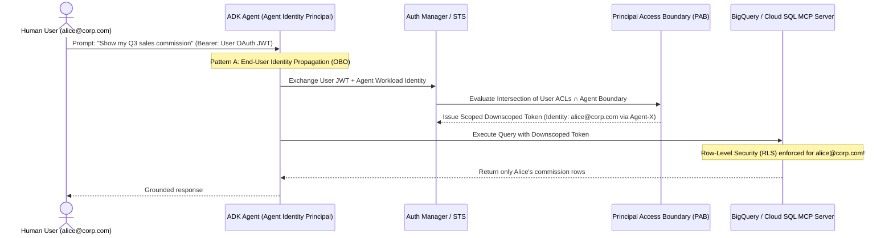

# Section 3B: Enterprise Knowledge, RAG Engine, Vector Search & MCP Servers

Foundation models possess vast parametric knowledge frozen at their pre-training cutoff, but they lack awareness of proprietary enterprise data, live transactional databases, and real-time SaaS ticket states. To eliminate hallucinations and enable autonomous action over private enterprise assets, Google Cloud Agentic Architects deploy a three-tier grounding and tool-integration architecture:

1. **Unstructured Knowledge Grounding**: Managed **Vertex AI RAG Engine** and **Vector Search 1.0** with hybrid dense+sparse retrieval and layout-aware document parsing.
2. **Unified Discovery & Zero-Trust Identity**: **Agent Retrieval** for multi-source semantic routing, **Agent Registry** for enterprise capability discovery, and **Agent Identity** for cryptographic principal enforcement.
3. **Standardized Tool Interoperability**: **Model Context Protocol (MCP) Servers** connecting agents to structured relational databases (**Cloud SQL**, **BigQuery**, **Spanner**) and third-party SaaS applications (**ServiceNow**, **Salesforce**, **Jira**).

---

## 1. Vertex AI RAG Engine Architecture

**Vertex AI RAG Engine** (`vertexai.preview.rag`) is a fully managed data orchestration framework that automates the end-to-end Retrieval-Augmented Generation lifecycle: ingestion from enterprise sources (Google Drive, Cloud Storage, Confluence, SharePoint), layout-aware parsing, intelligent chunking, vector embedding generation, index storage, and cross-encoder reranking.

```mermaid
flowchart LR
    subgraph Ingestion ["1. Ingestion & Parsing"]
        Sources[(GCS / Drive /<br/>SharePoint / Jira)] --> Parser[Document AI<br/>Layout Parser]
        Parser --> Chunker[Hierarchical /<br/>Semantic Chunker]
    end

    subgraph Indexing ["2. Embedding & Vector Storage"]
        Chunker --> Embed[text-embedding-005<br/>Task: RETRIEVAL_DOCUMENT]
        Embed --> Index[(Vector Search 1.0 /<br/>RagCorpus Managed DB)]
    end

    subgraph Retrieval ["3. Query & Reranking Pipeline"]
        Query([User Query]) --> QEmbed[text-embedding-005<br/>Task: RETRIEVAL_QUERY]
        QEmbed --> HybridSearch[Hybrid Dense + Sparse<br/>Top-K Retrieval (K=50)]
        Index --> HybridSearch
        HybridSearch --> Reranker[Vertex AI Ranking API<br/>Cross-Encoder (Top-N=5)]
        Reranker --> Agent[ADK LlmAgent<br/>Grounded Prompt]
    end
```

### 1.1 Document Parsing & Chunking Strategies

Naive character-count splitting destroys structural context—severing table headers from rows or splitting legal clauses mid-sentence. Architects select parsing strategies based on document topology:

| Chunking & Parsing Strategy | Technical Mechanism | Strengths | Failure Modes & Trade-offs | Optimal Enterprise Use Case |
| :--- | :--- | :--- | :--- | :--- |
| **Fixed-Size Token Chunking with Overlap** | Splits raw text every $N$ tokens (`chunk_size=512`) with sliding window overlap (`chunk_overlap=100`). | Fast, zero compute overhead during ingestion, predictable context window consumption. | Destroys HTML/PDF tables, splits code blocks, separates headings from content. | Plain-text transcripts, chat logs, simple markdown READMEs. |
| **Document AI Layout Parser (Layout-Aware)** | Uses vision-language layout models to identify structural elements (headings, tables, lists) and converts tables into self-contained Markdown blocks. | Preserves table headers across row splits; keeps logical sections intact. | Higher ingestion latency and Document AI per-page processing cost. | Complex PDFs, SEC 10-K filings, insurance policies, engineering schematics. |
| **Hierarchical Parent-Child Chunking** | Creates small **Child Chunks** (128 tokens) for high-precision vector similarity matching, linked via metadata ID to larger **Parent Chunks** (1,024–2,048 tokens). | Combines high retrieval precision (child embedding) with rich generative context (parent window returned to LLM). | Requires ~2x storage footprint and parent-lookup resolution step. | Technical manuals, legal contracts, multi-topic standard operating procedures (SOPs). |
| **Semantic Chunking** | Computes sentence-to-sentence embedding cosine similarity and inserts boundaries when semantic drift exceeds a threshold percentile. | Ensures every chunk represents a cohesive semantic concept. | Variable chunk sizes; requires embedding calls during chunking. | Long-form research papers, unformatted transcripts, regulatory statutes. |

### 1.2 Embedding Model Optimization (`text-embedding-005` & Multimodal)

Selecting the correct embedding model and task-type configuration directly impacts retrieval recall:

- **Asymmetric Task-Type Optimization**: Google's `text-embedding-005` (and multilingual `text-multilingual-embedding-002`) supports asymmetric embeddings. Architects **must** set `task_type="RETRIEVAL_DOCUMENT"` when embedding corpus chunks during ingestion, and `task_type="RETRIEVAL_QUERY"` when embedding user queries at runtime. This projects short question-style queries into the same latent vector neighborhood as answer-style document passages.
- **Matryoshka Representation Learning (Dimensionality Reduction)**: `text-embedding-005` outputs 768-dimensional dense vectors trained with Matryoshka loss, concentrating critical semantic information in leading dimensions. Architects can truncate vectors to **256 or 512 dimensions** (`output_dimensionality=256`), reducing Vector Search RAM and index costs by 66% while retaining >98% retrieval accuracy.
- **Multimodal Embeddings (`multimodalembedding@001`)**: Projects text, images, and video segments into a **shared 1408-dimensional vector space**, enabling cross-modal retrieval where text queries retrieve relevant high-resolution schematics directly without OCR.

### 1.3 Two-Stage Retrieval & Cross-Encoder Reranking

Bi-encoder vector search is fast ($O(\log N)$ via approximate nearest neighbors), but compressing a 500-word passage into a single vector loses fine-grained token interactions. Production RAG architectures implement a **Two-Stage Retrieval Pipeline**:
1. **Stage 1: High-Recall Candidate Retrieval (Bi-Encoder + BM25)**: Retrieve top $K=50$ candidate chunks from Vector Search 1.0 in <15ms.
2. **Stage 2: High-Precision Reranking (Vertex AI Ranking API)**: Pass the query and 50 candidates into the **Vertex AI Ranking API** (`semantic-ranker-512@latest`). The ranker is a **Cross-Encoder** transformer processing query and document *jointly* with full cross-attention across every token pair, scoring relevance from `0.0` to `1.0`. The top $N=5$ passages are injected into the `LlmAgent` prompt.

---

## 2. Vertex AI Vector Search 1.0 Deep Dive

When enterprises outgrow default managed RAG storage—requiring billions of vectors, sub-10ms p99 latency, custom metadata pre-filtering, or real-time streaming updates—architects deploy **Vertex AI Vector Search 1.0** directly.

### 2.1 ScaNN Architecture & Index Tuning Parameters

Vector Search 1.0 is powered by Google Research's **ScaNN (Scalable Nearest Neighbors)** algorithm, which outperforms standard HNSW (Hierarchical Navigable Small World) implementations in memory efficiency and high-throughput recall. ScaNN combines **Tree-based Space Partitioning** (clustering vectors into Voronoi cells) with **Anisotropic Vector Quantization** (compressing vectors while penalizing parallel error more heavily than orthogonal error to preserve inner-product ranking).

Architects tune two primary ScaNN hyperparameters during index creation:

1. **`leaf_node_embedding_count`** (Clustering Granularity): Defines the target number of vectors stored per leaf node (cluster) in the tree.
   - *Lower value (e.g., 500)*: Creates more, smaller clusters. Increases index build time and memory overhead slightly, but enables faster search with higher recall per searched leaf.
   - *Higher value (e.g., 2,000)*: Creates fewer, larger clusters. Faster build times, lower memory footprint.
2. **`leaf_nodes_to_search_percent`** (Recall vs. Latency Dial): Defines the percentage of total tree clusters inspected during a query.
   - *Increasing this parameter (e.g., from 5% to 15%)* **increases Recall** (accuracy) at the direct cost of **higher Query Latency (QPS reduction)**.
3. **Distance Metric Selection**:
   - Use **`DOT_PRODUCT_DISTANCE`** when using normalized embeddings (like `text-embedding-005`, which are unit-normalized to length 1.0). Mathematically equivalent to Cosine Similarity but executes significantly faster on AVX-512 / TPU SIMD hardware by avoiding square-root division.
   - Use **`COSINE_DISTANCE`** only if vectors are not pre-normalized.
   - Use **`SQUARED_L2_DISTANCE`** (Euclidean) for spatial/image feature clustering where vector magnitude carries signal.

### 2.2 Hybrid Search (Dense Semantic + Sparse Lexical BM25/SPLADE)

Pure dense vector search frequently fails on **exact keyword, SKU, part number, legal citation, or error code queries**. For example, if a user asks about error code `"ERR_SSL_VERSION_OR_CIPHER_MISMATCH_0x8009"`, a dense embedding model may retrieve general SSL troubleshooting articles rather than the exact hex error code.

Vector Search 1.0 natively supports **Hybrid Search** within a single index endpoint:
- **Dense Vector**: 768-dim float array capturing conceptual semantics.
- **Sparse Vector**: High-dimensional dictionary of `{token_dimension_id: weight}` generated via BM25, TF-IDF, or neural **SPLADE** encoders capturing exact lexical token presence.
- **Reciprocal Rank Fusion (RRF)**: At query time, Vector Search executes both dense and sparse lookups concurrently and merges the ranked lists using RRF or configurable alpha-blending ($\alpha \cdot \text{Score}_{\text{dense}} + (1 - \alpha) \cdot \text{Score}_{\text{sparse}}$):

$$\text{RRF\_Score}(d \in D) = \sum_{m \in \{\text{dense}, \text{sparse}\}} \frac{1}{k + \text{rank}_m(d)}$$

Where $k$ is a smoothing constant (typically $k=60$). This guarantees that exact SKU/error-code matches surface at Rank 1 while preserving semantic comprehension for natural language questions.

### 2.3 Metadata Filtering (Restricts) & Pre-Filtering Security

In multi-tenant enterprise RAG systems, retrieving documents across tenant boundaries is a critical security failure. Vector Search 1.0 enforces **Single-Stage Pre-Filtering** using **Restricts** (categorical string namespaces) and **Numeric Restricts** (int/float range comparisons).

- **Categorical Restricts**: Each vector datapoint is tagged with namespaces such as `{"namespace": "department", "allow_tokens": ["finance", "executive"], "deny_tokens": ["contractors"]}`.
- **Numeric Restricts**: Tag datapoints with numerical attributes such as `{"namespace": "created_timestamp", "value_int": 1726531200}` or `{"namespace": "confidentiality_level", "value_int": 3}`.
- **Architectural Advantage over Post-Filtering**: If an architect retrieves Top-10 vectors via ANN and *then* filters out unauthorized documents in Python application code (**Post-Filtering**), and 9 of the 10 documents belong to another tenant, the agent receives only 1 result (Recall collapse). Vector Search 1.0 evaluates Restricts **during tree traversal (Pre-Filtering)**, guaranteeing that all $K=10$ returned neighbors strictly satisfy the user's ACL entitlements.

### 2.4 Streaming vs. Batch Index Updates

Architects must choose between two index update modes based on freshness SLAs and budget:

- **Batch Update Index**: Rebuilds the ScaNN tree structure asynchronously from Cloud Storage files (`BatchUpdateIndex`). Takes 30 minutes to several hours depending on vector count. Lowest infrastructure cost; ideal for static knowledge bases updated nightly or weekly.
- **Streaming Update Index (`UpsertDatapoints` / `RemoveDatapoints`)**: Exposes a real-time gRPC/REST endpoint allowing immediate insertion, mutation, or deletion of vectors. New documents become searchable within **milliseconds to seconds**. Internally, Vector Search buffers streaming writes in an uncompacted dynamic delta buffer and periodically triggers background tree compaction to prevent ScaNN recall degradation. Essential for real-time news feeds, live inventory catalogs, and active customer support tickets.

---

## 3. Agent Retrieval, Agent Registry & Agent Identity

As enterprise agent ecosystems scale from isolated chatbots to hundreds of specialized domain agents and data stores, architects must implement standardized discovery, routing, and zero-trust identity layers.

### 3.1 Agent Retrieval & Semantic Query Routing

When an enterprise agent faces heterogeneous data silos—unstructured PDFs in Cloud Storage, structured transactional tables in BigQuery, and live operational records in Salesforce—dumping all sources into a single vector index creates noisy retrieval.

**Agent Retrieval** (powered by Vertex AI Search & Enterprise Knowledge Engine) acts as an intelligent **Semantic Query Router and Decomposer**:
1. **Intent & Source Classification**: Evaluates whether a prompt requires unstructured semantic search, structured SQL generation, or live REST tool invocation.
2. **Multi-Hop Query Decomposition**: If a user asks, *"Compare our Q3 cloud infrastructure spend against the budget caps defined in the 2026 Master Services Agreement,"* Agent Retrieval decomposes the prompt into two parallel sub-queries:
   - *Sub-query A (Unstructured RAG Engine)*: Retrieve budget cap tables from the 2026 MSA PDF corpus.
   - *Sub-query B (Structured BigQuery Tool)*: Execute a SQL aggregation over billing export tables for Q3 spend.
3. **Dynamic Context Synthesis**: Synthesizes retrieved facts with explicit source citations (`[Source: MSA_2026.pdf, Page 14]`) before generating the final answer.

### 3.2 Agent Registry: Enterprise Capability Discovery

In large organizations, different business units deploy independent agents (e.g., HR Onboarding Agent, IT Provisioning Agent, Legal Procurement Agent). Without central governance, teams duplicate effort and orchestrator agents cannot dynamically discover available specialists.

**Google Cloud Agent Registry** provides a centralized, governed catalog for all internal and third-party agents and MCP tool servers:
- **Standardized Metadata & Capability Indexing**: Stores machine-readable agent descriptors including supported input/output MIME types, OpenAPI/A2A endpoint URLs, owner team metadata, and SLA tiers.
- **Semantic Agent Discovery**: Orchestrator agents query the Agent Registry at runtime (*"Find an approved internal agent capable of provisioning a Cloud SQL read-replica in production"*) to dynamically bind and invoke the verified specialist agent.
- **Lifecycle & Version Governance**: Enforces deprecation policies, canary traffic routing (`v1.2` vs `v2.0`), and environment promotion gates across Dev, Staging, and Production.

### 3.3 Agent Identity & Cryptographic Access Control

A critical enterprise security vulnerability occurs when an agent executes all database queries and API calls using a single, overly permissive **God-Mode Service Account**. If a low-privilege user tricks the agent via prompt injection into querying executive payroll tables, the God-Mode Service Account succeeds because IAM only sees the agent's identity, not the human user's identity.

**Google Cloud Agent Identity** enforces Zero-Trust security through two distinct authentication patterns:



1. **End-User Identity Propagation (On-Behalf-Of / OBO Flow)**:
   - When a human user interacts with an agent, the user's OAuth 2.0 / OIDC identity token is propagated through the ADK runner to downstream data connectors and MCP servers.
   - Downstream systems (such as **BigQuery Row-Level Security**, **Vertex AI Search ACLs**, or **Salesforce OAuth**) evaluate permissions against the **authenticated human user**, ensuring the agent can never retrieve or modify data the user couldn't access directly.
2. **Principal Access Boundary (PAB) & Least-Privilege Agent Identity**:
   - Every deployed agent receives a dedicated cryptographic **Agent Identity Principal** (backed by Workload Identity Federation).
   - **Principal Access Boundaries (PAB)** define an absolute ceiling on what resources the agent principal can ever access across the Google Cloud organization, even if a downstream token or IAM role accidentally grants broader permissions. Effectively, effective permissions equal $\text{Permissions}(\text{User}) \cap \text{PAB}(\text{Agent})$.

---

## 4. Model Context Protocol (MCP) Servers on Google Cloud

The **Model Context Protocol (MCP)** is an open standard (built on JSON-RPC 2.0) that standardizes how AI models and agents connect to external data sources and tools. Instead of writing bespoke Python wrapper functions for every database and SaaS API ($M \text{ agents} \times N \text{ tools}$ integration explosion), architects deploy standardized **MCP Servers** that expose three core primitives:
- **Resources**: Read-only data streams (e.g., database table schemas, file contents, log streams) addressed via URI schemes (`postgres://host/db/table/schema`).
- **Prompts**: Reusable, parameterized prompt templates and workflows stored on the server.
- **Tools**: Executable actions (e.g., `execute_sql`, `create_jira_issue`, `update_servicenow_incident`) with strict JSON Schema input validation.

### 4.1 Transport Topologies: `stdio` vs. `SSE / Streamable HTTP`

Architects must configure the correct MCP transport layer based on deployment topology:

1. **Standard Input/Output (`stdio` transport)**:
   - The MCP client (e.g., `Claude Code`, local `ADK` runner, or `Antigravity CLI`) spawns the MCP server as a local child subprocess and communicates via `stdin`/`stdout` pipes.
   - *Use Case*: Local developer workstations, IDE extensions, and single-container sandboxed sidecars. **Cannot be used across network boundaries or serverless multi-instance autoscalers.**
2. **Server-Sent Events / Streamable HTTP (`SSE` / `HTTP POST` transport)**:
   - The MCP server runs as a remote microservice (deployed on **Cloud Run** or **GKE**) exposing an HTTPS endpoint for client requests and a persistent streaming response channel for server-to-client notifications.
   - *Use Case*: Enterprise production deployments on **Vertex AI Agent Engine**, multi-tenant shared tool gateways, and cross-VPC microservices secured by Google Cloud IAM and OAuth 2.0.

### 4.2 First-Party Google Cloud Database MCP Servers (GenAI Toolbox for Databases)

Connecting LLM agents directly to relational databases (`Cloud SQL for PostgreSQL/MySQL`, `AlloyDB`, `Cloud Spanner`, `BigQuery`) presents severe operational risks: connection pool exhaustion from serverless spikes, SQL injection via unvalidated LLM strings, and credential exposure.

Google Cloud provides the **GenAI Toolbox for Databases**—a production-hardened, open-source MCP server specifically engineered for Google Cloud databases:

```python
from google.adk.agents import LlmAgent
from google.adk.tools.mcp_tool.mcp_toolset import MCPToolset, SseServerParams

# Connect ADK Agent to a Remote Google Cloud SQL / BigQuery MCP Server deployed on Cloud Run
database_mcp_tools = MCPToolset(
    connection_params=SseServerParams(
        url="https://genai-db-toolbox-prod-uc.a.run.app/sse",
        headers={"Authorization": "Bearer $(gcloud auth print-identity-token)"}
    )
)

data_analyst_agent = LlmAgent(
    name="EnterpriseDataAnalyst",
    model="gemini-2.5-pro",
    instruction="""You are a Senior Financial Data Analyst. Use the authorized MCP database tools
    to query Cloud SQL and BigQuery. Always inspect table schemas before executing aggregations.""",
    tools=[database_mcp_tools]
)
```

#### Key Architectural Capabilities of Google Cloud Database MCP Servers:
- **Parameterized Pre-Verified SQL Templates**: Instead of giving the LLM raw `execute_arbitrary_sql(query: str)` permissions (which enables SQL injection or accidental `DELETE` queries), architects define parameterized SQL tools in the MCP server's `tools.yaml` (e.g., `get_customer_orders_by_date(customer_id: str, start_date: date)`). The LLM supplies only strongly-typed parameters, which the MCP server binds safely via prepared statements.
- **Connection Pooling & IAM Database Authentication**: Manages persistent connection pools (PgBouncer/HikariCP) and authenticates to Cloud SQL / AlloyDB using **automatic IAM database authentication** with short-lived cryptographic tokens, eliminating static database passwords.
- **OpenTelemetry Observability**: Automatically exports OpenTelemetry traces and metrics for every tool call, capturing exact SQL execution latency and row counts in **Cloud Trace**.

### 4.3 Integrating Third-Party SaaS MCP Servers (ServiceNow, Salesforce, Jira)

For enterprise SaaS integration (`ServiceNow`, `Salesforce`, `Jira`, `Workday`, `SAP`), Google Cloud provides two architectural patterns to expose SaaS actions as MCP tools:

1. **Vertex AI Integration Connectors + Apigee MCP Bridge**:
   - Leverages Google Cloud's **100+ pre-built Integration Connectors** (which handle SaaS-specific OAuth token refresh, pagination, rate-limit backoff, and payload transformation) and wraps them as an enterprise MCP Server endpoint published in **Vertex AI API Registry**.
   - Enforces enterprise API governance via **Apigee API Management**, applying spike arrest policies, quota limits per agent identity, and payload threat protection before requests reach Salesforce or ServiceNow.
2. **Direct Containerized 3P MCP Servers on Cloud Run**:
   - Deploys vendor-provided or open-source MCP servers (e.g., `@modelcontextprotocol/server-github`, `mcp-server-jira`, `mcp-server-servicenow`) inside VPC-connected **Cloud Run** services with Secret Manager injection for API keys and **Sensitive Data Protection (DLP)** inspection interceptors.

---

## 5. Architectural Comparison: Enterprise Grounding Mechanisms

| Grounding Mechanism | Primary Data Modality | Query Latency | Freshness SLA | Best Suited Enterprise Scenario |
| :--- | :--- | :--- | :--- | :--- |
| **Vertex AI RAG Engine** | Unstructured documents (PDF, DOCX, HTML, Confluence) | 200ms – 800ms (with reranking) | Minutes (automated sync from GCS/Drive) | Turnkey corporate policy Q&A, HR handbook assistants, legal contract summarization. |
| **Vector Search 1.0 (Custom ScaNN)** | High-scale embeddings (10M – 10B+ items) + structured metadata | **< 10ms – 20ms** | **Sub-second** (`StreamingUpdate` API) | Real-time e-commerce catalog search, high-QPS recommendation engines, multi-tenant SaaS with complex ACL restricts. |
| **Google Cloud Database MCP Server** | Structured transactional & analytical tables (`Cloud SQL`, `BigQuery`, `Spanner`) | 50ms – 2,000ms (query dependent) | **Real-time ACID / Transactional** | Live inventory lookups, financial ledger reconciliation, customer account balance verification. |
| **3P SaaS MCP Server (via Connectors)** | Live SaaS application objects (`ServiceNow`, `Salesforce`, `Jira`) | 200ms – 1,500ms (external API bound) | **Real-time SaaS API** | Autonomous IT ticket creation, CRM lead status updates, automated DevOps incident remediation. |

---

## 6. Exam Traps & Anti-Patterns (Must-Know for PAA Exam)

> [!CAUTION]
> **Exam Trap 1: Using Post-Filtering for Multi-Tenant Security in Vector Search**
> *Scenario*: A SaaS platform stores documents for 5,000 clients in one Vector Search index. To prevent data leakage, the developer retrieves Top-20 nearest neighbors and filters out chunks where `chunk.tenant_id != current_user.tenant_id` in Python (`after_tool_callback`).
> *Why it's wrong*: This is **Post-Filtering**. If the user belongs to a small tenant (0.01% of vectors), all Top-20 neighbors returned by global ANN search will belong to larger tenants, yielding `0 results` after Python filtering.
> *Correct Architecture*: Configure **Metadata Restricts (`allow_tokens: [tenant_id]`)** inside the Vector Search query request (**Pre-Filtering** during ScaNN tree traversal), guaranteeing all 20 returned neighbors belong strictly to `current_user.tenant_id`.

> [!WARNING]
> **Exam Trap 2: Using Pure Dense Embeddings for Part Numbers, SKUs, or Error Codes**
> *Scenario*: A maintenance agent uses `text-embedding-005` with Vector Search for repair manuals. Technicians complain searching exact valve numbers like `"VLV-9942-X8B"` returns manuals for different valves (`"VLV-8810-A1"`).
> *Why it's wrong*: Dense embeddings capture continuous semantics and struggle with arbitrary alphanumeric strings, hex codes, and exact SKUs lacking linguistic meaning.
> *Correct Architecture*: Enable **Hybrid Search (Dense + Sparse Vectors)** in Vector Search 1.0 using BM25/SPLADE sparse embeddings combined via **Reciprocal Rank Fusion (RRF)**, or pair retrieval with **Vertex AI Ranking API** cross-encoder reranking.

> [!WARNING]
> **Exam Trap 3: Exposing Raw `execute_sql` Tools to LLMs Against Production Databases**
> *Scenario*: An architect builds an ADK agent connected to Cloud SQL PostgreSQL by creating a `FunctionTool` accepting raw SQL strings generated by the LLM (`cursor.execute(sql_string)`).
> *Why it's wrong*: Even with read-only credentials, an LLM vulnerable to indirect prompt injection can execute cartesian join DoS queries (`CROSS JOIN`), exfiltrate sensitive columns via `UNION SELECT`, or bypass application logic.
> *Correct Architecture*: Deploy the **Google Cloud GenAI Toolbox for Databases (MCP Server)** configured with **parameterized SQL tool templates** (`tools.yaml`) and enforce **End-User Identity Propagation (OBO)** with database Row-Level Security (RLS).

> [!CAUTION]
> **Exam Trap 4: Mismatched `task_type` in Embedding Generation**
> *Scenario*: A team embeds 1M PDF chunks using `text-embedding-005` with default parameters (`RETRIEVAL_QUERY` or unspecified) for both document indexing and search queries, resulting in poor recall.
> *Why it's wrong*: Asymmetric retrieval requires distinct vector projections for short questions vs. long answers.
> *Correct Architecture*: Specify **`task_type="RETRIEVAL_DOCUMENT"`** during corpus indexing, and **`task_type="RETRIEVAL_QUERY"`** when embedding runtime search queries.
