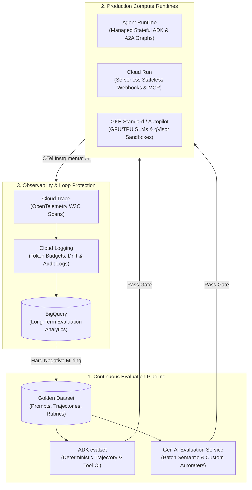
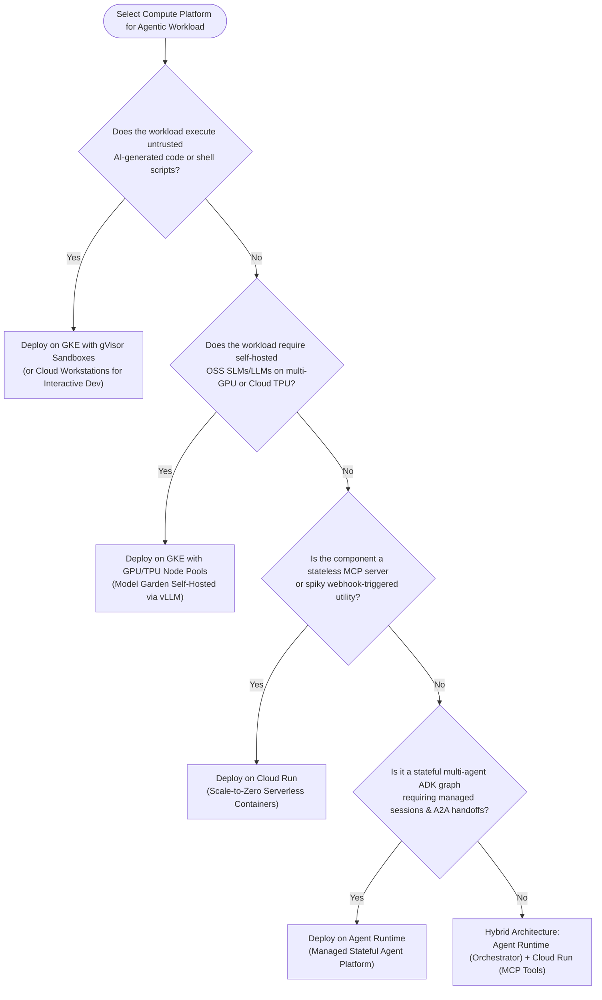

# Section 4: Evaluating, Deploying & Observing Agentic Workflows

## 1. Architectural Foundations of Agentic Evaluation & Deployment

Unlike traditional deterministic microservices—where a fixed input payload yields a predictable, schema-bound output—autonomous agentic workflows exhibit **non-deterministic reasoning paths**, dynamic tool selection, and multi-turn state mutations. When an agent built with the **Agent Development Kit (ADK)** processes a request, it may invoke **Model Context Protocol (MCP)** tools, delegate sub-tasks via **Agent2Agent (A2A)** handoffs, retrieve context from **RAG Engine**, and synthesize a response. Minor updates to system instructions, model versions, or retrieved context chunks can alter the entire execution trajectory.

Domain 4 of the **Google Cloud Professional Agentic Architect (PAA)** exam accounts for **22% of the exam weight**. It tests your ability to architect quality assurance, continuous evaluation pipelines, compute topologies, and observability across three core pillars:

1. **Pre-Deployment & Continuous Evaluation**: Verifying final response quality and intermediate tool-execution trajectories before production promotion.
2. **Runtime Compute Architecture**: Selecting between **Agent Runtime**, **Cloud Run**, and **Google Kubernetes Engine (GKE)** based on statefulness, hardware acceleration, sandboxing, and cost.
3. **Production Observability & Anomaly Remediation**: Instrumenting reasoning loops with **Cloud Trace** and **Cloud Logging** to detect cyclic loops, latency bottlenecks, context drift, and token anomalies.



---

## 2. Evaluation Frameworks: `ADK evalset` vs. `Gen AI Evaluation Service`

Evaluating an autonomous agent requires inspecting two distinct dimensions: **Trajectory Correctness** (did the agent take the right steps and call the right tools with valid parameters?) and **Semantic Output Quality** (is the final answer grounded, accurate, safe, and aligned with domain rubrics?). Google Cloud provides two complementary frameworks designed for different stages of the software delivery lifecycle.

### 2.1 `ADK evalset`: Deterministic Trajectory & Tool-Execution CI Testing

The **Agent Development Kit (`ADK`)** includes a developer-centric evaluation harness invoked via `adk eval` or within Python `pytest` suites using **`ADK evalset`**. Designed for **fast, deterministic pre-commit and CI/CD execution**, `ADK evalset` treats an agent's reasoning loop as a white-box state machine. It records the sequence of intermediate thoughts, tool calls, tool arguments, subagent handoffs, and state updates, comparing them against declared expected trajectories.

Key capabilities include:
- **Mocked & Sandboxed Tool Execution**: External MCP servers or Cloud SQL databases are replaced with deterministic mocks during CI runs, executing in milliseconds without external API fees or live database mutations.
- **Strict Trajectory Assertions**: Asserts exact tool ordering (`exact_match`), subset inclusion (`in_order` or `any_order`), or negative assertions (verifying restricted tools like `execute_wire_transfer` were never called when risk thresholds were exceeded).
- **JSON Schema Argument Validation**: Validates that LLM-generated tool arguments strictly adhere to OpenAPI schemas (verifying date formats, bounds, and auth scopes).

### 2.2 `Gen AI Evaluation Service`: Cloud-Scale Batch & Semantic Evaluation

The **Agent Platform Gen AI Evaluation Service** is a managed, cloud-scale evaluation engine built into Vertex AI / Agent Platform. Designed for **large-scale batch evaluation, pre-production release gating, and continuous production sampling**, it executes parallelized jobs across golden datasets using calibrated **LLM-as-a-Judge autoraters** alongside computation metrics (ROUGE, BLEU, Embedding Cosine Similarity).

Key capabilities include:
- **Managed RAG & Groundedness Triad**: Automatically scores **Context Relevance**, **Groundedness / Faithfulness** (verifying every factual claim is supported by retrieved context without hallucination), and **Answer Relevance**.
- **Multi-Turn Conversation Evaluation**: Assesses coherence, persona consistency, state retention, and goal completion across extended dialogues.
- **Custom Autorater Orchestration**: Configures domain-specific evaluation prompts, rubrics, and judge models (e.g., evaluating clinical trial summaries against FDA 21 CFR Part 11 or wealth chats against SEC rules).

### 2.3 Architectural Comparison Matrix: `ADK evalset` vs. `Gen AI Evaluation Service`

| Architectural Dimension | `ADK evalset` (ADK Evaluation Tooling) | `Gen AI Evaluation Service` (Agent Platform) |
| :--- | :--- | :--- |
| **Primary Use Case** | Local development, pre-commit hooks, CI/CD unit & integration testing of agent trajectories. | Pre-production release gating, model migration benchmarking (Gemini Pro vs. Flash), nightly batch runs, production drift monitoring. |
| **Execution Environment** | Local workstation, Cloud Build CI runners, or ephemeral container sandboxes. | Fully managed serverless batch infrastructure on Google Cloud Agent Platform. |
| **Primary Focus** | **White-box Trajectory & Tool Execution**: Tool selection, argument schemas, subagent handoff order, step counts. | **Black-box & Grey-box Semantic Quality**: Groundedness, factual completeness, tone alignment, safety, multi-turn coherence. |
| **Tooling Dependency** | Runs with mocked tools or lightweight staging MCP servers for deterministic speed. | Evaluates end-to-end outputs generated against full staging/production RAG pipelines or logged historical traces. |
| **Evaluation Metrics** | Trajectory Precision, Trajectory Recall, Exact Match, Schema Validation Pass Rate, Step Budget Compliance. | Pointwise Likert Scores (1–5), Pairwise Win-Rate %, Groundedness Score, Summarization Quality, Custom Rubric Pass %. |
| **Latency & Cost Profile** | Sub-second to seconds; minimal token cost. | Minutes to hours for thousands of rows; incurs LLM judge inference tokens managed via batch quotas. |

> [!TIP]
> **Exam Best Practice — The Dual-Gate CI/CD Strategy**: On the PAA exam, never treat `ADK evalset` and `Gen AI Evaluation Service` as mutually exclusive. Enforce a **Two-Stage Quality Gate**:
> 1. **Stage 1 (Pull Request Gate)**: Run `ADK evalset` on every commit in Cloud Build to verify 100% trajectory precision and zero tool schema regressions in under 60 seconds.
> 2. **Stage 2 (Staging Promotion Gate)**: Trigger a managed **Gen AI Evaluation Service** batch job against a 500-prompt Golden Dataset to verify semantic groundedness $\ge 99\%$ before blue/green promotion to production.

---

## 3. Golden Dataset Curation & Trajectory Metrics

An evaluation pipeline is only as trustworthy as the reference benchmark against which it measures performance: the **Golden Dataset**.

### 3.1 Anatomy of an Enterprise Golden Dataset

Because agents interact with stateful environments and multi-step tools, each record in an enterprise golden dataset encapsulates five structural elements:
1. **Input Context & Session State (`user_input` & `initial_state`)**: Multi-modal prompt, historical conversation turns, authenticated user identity claims (`Principal Access Boundary` context), and session variables in **Agent Platform Memory Bank**.
2. **Golden Retrieval Context (`reference_chunks`)**: Document identifiers and text passages from **RAG Engine** or **Agent Search** required to answer accurately.
3. **Expected Tool Trajectory (`golden_trajectory`)**: Ordered list of expected tool invocations, required arguments, and subagent delegation hops.
4. **Reference Answer (`golden_response`)**: Expert-verified ideal response, mandatory factual assertions (`must_contain_facts`), and forbidden statements (`must_not_contain`).
5. **Domain Evaluation Rubric (`rubric_criteria`)**: Specific domain rules used by LLM autoraters to grade outputs.

#### Hard Negative Mining Lifecycle
Whenever **Cloud Trace** or human feedback flags a production failure, hallucination, or human-in-the-loop (HITL) rejection, that anonymized trace is exported to BigQuery, sanitized via **Sensitive Data Protection (DLP)**, labeled by a domain reviewer, and appended to the Golden Dataset.

### 3.2 Mathematical Trajectory Evaluation Metrics

When scoring an agent's execution path against a `golden_trajectory`, binary pass/fail matching is often too brittle—especially for parallel or graph workflows. Architects evaluate trajectories using three metrics:

#### 1. Trajectory Exact Match ($EM_{traj}$)
Measures whether the executed tool sequence $T_{actual} = [t_1, \dots, t_n]$ is identical in length, ordering, and parameters to $T_{golden} = [g_1, \dots, g_m]$:

$$\text{Exact Match} = \begin{cases} 1 & \text{if } n = m \text{ and } \forall i \in \{1..n\}, \; t_i = g_i \\ 0 & \text{otherwise} \end{cases}$$

*Use Case*: Strict sequential compliance workflows (`verify_identity` $\rightarrow$ `check_sanctions` $\rightarrow$ `execute_trade`) where out-of-order execution is a regulatory violation.

#### 2. Trajectory Precision ($P_{traj}$)
Measures the proportion of tools invoked by the agent that were necessary and present in the golden trajectory:

$$\text{Trajectory Precision} = \frac{|T_{actual} \cap T_{golden}|}{|T_{actual}|}$$

*Interpretation*: Low precision indicates redundant looping, hallucinated tool invocations, or exploratory thrashing.

#### 3. Trajectory Recall ($R_{traj}$)
Measures the proportion of mandatory golden tools that the agent successfully executed:

$$\text{Trajectory Recall} = \frac{|T_{actual} \cap T_{golden}|}{|T_{golden}|}$$

*Interpretation*: In safety-critical domains (such as Apex BioHealth clinical verification), any recall $< 100\%$ on mandatory verification tools must fail the build.

```python
# Defining an ADK evalset Trajectory Assertion
from google.adk.evaluation import EvalSet, EvalCase, ToolCallAssertion, TrajectoryEvaluator

eval_case = EvalCase(
    case_id="finserve_high_value_rebalance_001",
    user_input="Rebalance my growth portfolio by selling $75,000 of NVDA and buying Treasury ETFs.",
    initial_state={"client_id": "C-98122", "risk_tier": "MODERATE", "kyc_verified": True},
    expected_trajectory=[
        ToolCallAssertion(tool_name="fetch_portfolio_holdings", required_args={"client_id": "C-98122"}),
        ToolCallAssertion(tool_name="simulate_tax_impact", required_args={"sale_amount": 75000, "ticker": "NVDA"}),
        ToolCallAssertion(tool_name="trigger_hitl_approval", required_args={"threshold_exceeded": True, "amount": 75000})
    ],
    forbidden_tools=["execute_ledger_trade_immediately"]
)

evaluator = TrajectoryEvaluator(matching_mode="IN_ORDER_SUBSET", min_recall=1.0, min_precision=0.8)
result = evaluator.evaluate(agent=finserve_supervisor_agent, eval_set=EvalSet([eval_case]))
assert result.passed, f"Trajectory validation failed: Recall={result.recall}"
```

---

## 4. Custom LLM-as-a-Judge Autoraters & Rubric Calibration

When evaluating open-ended synthesis—such as clinical dossier summaries or multi-language news localization—lexical metrics like BLEU or ROUGE fail because semantically identical answers use varied vocabulary. Enterprise architects rely on **Custom LLM-as-a-Judge Autoraters** executed via the **Gen AI Evaluation Service**.

### 4.1 Pointwise vs. Pairwise Evaluation Paradigms

1. **Pointwise Evaluation (Absolute Scoring)**:
   - Evaluates a single agent output $(Prompt, Context, Response)$ in isolation against a structured grading rubric, outputting an integer score (1 to 5) or binary Pass/Fail alongside a structured Chain-of-Thought critique.
   - *When to Use*: Production SLA compliance tracking, continuous monitoring, and absolute quality gates (e.g., *"Every published article must score $\ge 4.5/5.0$ on Factual Groundedness"*).
2. **Pairwise Evaluation (Relative Win-Rate Comparison)**:
   - Presents the judge LLM with the same input and two candidate responses—**Response A** (baseline Gemini 1.5 Pro) and **Response B** (candidate fine-tuned Gemini 1.5 Flash)—to determine whether A wins, B wins, or ties.
   - *When to Use*: Model migration benchmarking, A/B prompt optimization, and cost-optimization studies (verifying that switching a routine lookup agent to an SLM does not degrade win-rate).

### 4.2 Mitigating Judge Biases & Calibration Architecture

Uncalibrated LLM judges exhibit cognitive biases that corrupt evaluation pipelines. Architects implement four calibration techniques:
- **Position Bias Mitigation (Bidirectional A/B Swapping)**: LLM judges disproportionately favor whichever response appears first. The Gen AI Evaluation Service runs **bidirectional passes**: evaluating $(A, B)$ in pass 1 and $(B, A)$ in pass 2. Inconsistent selections are flagged as ties.
- **Verbosity & Formatting Bias Control**: Rubrics explicitly instruct the judge to penalize fluff and grade strictly on atomic factual verification rather than length or markdown formatting.
- **Critique-First Chain-of-Thought (CoT) Grading**: Never prompt an autorater to output a score token first (`Score: 4`). Structure the JSON schema so the judge generates `step_by_step_critique` *before* generating `final_score`, ensuring the score is conditioned on explicit reasoning.
- **Human Alignment Calibration (Cohen's Kappa $\kappa$)**: Validate custom autoraters against a human-annotated gold set (100–200 traces graded by domain experts). Tune few-shot rubric examples until inter-annotator agreement between the LLM judge and human experts achieves **Cohen's Kappa $\kappa \ge 0.80$**.

---

## 5. Production Compute Selection: `Agent Runtime` vs. `Cloud Run` vs. `GKE`

Once an agentic workflow passes evaluation, architects must select the optimal Google Cloud compute runtime based on statefulness, execution duration, hardware accelerators, sandbox isolation, and traffic patterns.

### 5.1 Deep Dive into Google Cloud Agentic Runtimes

#### 1. Agent Runtime (formerly Vertex AI Agent Engine)
**Agent Runtime** is Google Cloud's purpose-built, fully managed runtime environment engineered specifically for deploying stateful multi-agent systems developed with **ADK**, LangGraph, or CrewAI.
- **Architectural Strengths**: Natively manages long-lived agent execution loops, asynchronous **Agent2Agent (A2A)** handoffs, built-in integration with **Agent Platform Memory Bank** and **managed sessions**, automatic OpenTelemetry trace emission to **Cloud Trace**, and native IAM integration with **Agent Identity**.
- **Optimal Workloads**: Complex hierarchical or cyclic multi-agent workflows (e.g., FinServe Global's Supervisor $\rightarrow$ Portfolio/Tax/Compliance subagent mesh) where managing session state and routing infrastructure manually would create operational toil.

#### 2. Cloud Run
**Cloud Run** is a serverless container platform that scales stateless containers from zero to thousands of instances in seconds based on HTTP/gRPC concurrency or Pub/Sub streams.
- **Architectural Strengths**: Instant scale-to-zero cost efficiency and rapid deployment of stateless microservices.
- **Architectural Constraints**: Designed for stateless cycles (up to 60-minute request timeout). In-memory state is lost across instance scaling unless externalized to **Memorystore for Redis**, **Firestore**, or **Agent Platform Memory Bank**.
- **Optimal Workloads**: Hosting custom **MCP servers** (wrapping internal REST APIs or Cloud SQL databases), webhook-driven single-turn agents, or asynchronous Pub/Sub worker agents with spiky traffic.

#### 3. Google Kubernetes Engine (GKE Standard & Autopilot)
**GKE** provides managed Kubernetes orchestration with granular control over node pools, hardware accelerators (NVIDIA L4, A100, H100 GPUs and Cloud TPU v5e/v5p), kernel-level security sandboxes (**GKE Sandbox with gVisor**), and service mesh networking.
- **Architectural Strengths**:
  - **Hardware Acceleration & Self-Hosted Models**: Mandatory when hosting open-source Small Language Models (SLMs) or fine-tuned weights (e.g., Llama 3, Gemma 2) imported from **Model Garden** using vLLM to achieve sub-second edge latency (<800ms p99) without per-token SaaS fees.
  - **Untrusted Code Execution Sandboxing**: Mandatory when running autonomous coding agents (**Antigravity** or **Claude Code on Google Cloud**) that compile and execute untrusted, AI-generated code or shell scripts. **gVisor** intercepts syscalls to prevent container escape.
- **Optimal Workloads**: High-throughput, ultra-low-latency edge dispatch meshes (AeroLogistics Fleet), self-hosted SLM clusters, and isolated multi-tenant coding sandboxes.

### 5.2 Compute Platform Selection Matrix

| Decision Criterion | `Agent Runtime` (Managed Agent Platform) | `Cloud Run` (Serverless Containers) | `GKE` (Kubernetes Engine) |
| :--- | :--- | :--- | :--- |
| **Operational Model** | Fully managed agent-native PaaS; zero session plumbing. | Serverless container PaaS; automatic scaling and patching. | Container orchestrator; highest infrastructure control. |
| **Session & State Management** | **Native Managed Stateful**: Out-of-the-box Managed Sessions & Memory Bank. | **Stateless by Default**: Must externalize state to Redis, Firestore, or Memory Bank. | **Configurable Stateful/Stateless**: Supports local NVMe caches, StatefulSets, or Redis. |
| **Multi-Agent Graph & A2A Support** | Native runtime orchestration for cyclic graphs, DAGs, and A2A handoffs. | Requires custom orchestration code or Cloud Workflows. | Supports custom distributed ray/actor meshes. |
| **GPU / TPU Accelerators** | Consumes SaaS LLM endpoints (Gemini / Model Garden MaaS) via API. | Supports NVIDIA L4 GPUs for lightweight serverless inference. | **Full Hardware Matrix**: NVIDIA H100/A100/L4 GPUs and Multi-slice Cloud TPUs. |
| **Security Sandboxing for Code Exec** | Managed multi-tenant isolation for Python agent logic. | Standard serverless container isolation. | **GKE Sandbox (gVisor)** & Kata Containers; strict NetworkPolicies. |
| **Scaling & Cost Profile** | Managed instance scaling optimized for active sessions. | **Scale-to-Zero**: Ideal for spiky workloads; zero idle cost. | Always-on node pools or Autopilot pod billing; cost-effective at sustained high utilization. |



---

## 6. Observability, Reasoning Loop Diagnostics & Drift Detection

When an autonomous agent fails in production, it rarely throws a clean HTTP 500 error. Instead, it may silently enter an **infinite reasoning loop**, hallucinate plausible tool parameters, or burn thousands of dollars in LLM tokens.

### 6.1 Distributed Tracing with `Cloud Trace` & OpenTelemetry

Architects instrument multi-agent workflows across **Agent Runtime**, **Cloud Run**, and **GKE** using **OpenTelemetry (OTel)** integrated with **Google Cloud Trace**, enforcing **W3C Trace Context propagation** (`traceparent` headers) across every boundary:
1. **Root Span (`AgentSessionInvocation`)**: Captures user wall-clock latency, session ID, authenticated identity hash, and total cost.
2. **Child Span (`LLMReasoningTurn`)**: Captures prompt template version, model ID, input/output token counts, temperature, time-to-first-token (TTFT), and finish reason (`STOP`, `MAX_TOKENS`, `SAFETY`).
3. **Child Span (`MCPToolExecution`)**: Captures target MCP server URI, tool name, serialized JSON arguments, duration, and status code.
4. **Child Span (`A2ASubagentHandoff`)**: Captures cross-agent delegation payloads, target agent ID in **Agent Registry**, and handoff latency.

#### Identifying Latency Bottlenecks in Cloud Trace
- **High Time-to-First-Token (TTFT) in `LLMReasoningTurn`**: Indicates a bloated system prompt or excessive RAG payload (>100k tokens). *Remediation*: Implement **Vertex AI Context Caching** or prune retrieval chunks via reranking.
- **Sequential Staircase across `MCPToolExecution` Spans**: Indicates sequential tool calling (`get_weather` then `get_fuel`). *Remediation*: Enable **Parallel Function Calling** in Gemini or refactor into an ADK `ParallelAgent` fan-out node.
- **Cold-Start Delay on `A2ASubagentHandoff`**: Indicates downstream Cloud Run MCP servers experiencing cold starts. *Remediation*: Configure minimum instances (`min-instances >= 1`) on latency-critical services.

### 6.2 Diagnosing & Breaking Infinite Agent Reasoning Loops

A classic production pathology is **Agent Reasoning Loops** (cyclic tool thrashing). For example, AeroLogistics Fleet's routing agent calls `calculate_drone_route(sector=7)`, receives `{"error": "Airspace closed"}`, and repeatedly invokes the exact same tool with identical parameters until timing out.

Architects enforce four defensive layers to guarantee loop termination:
1. **Hard Step Budgets (`max_iterations`)**: Configure a hard ceiling on reasoning turns within ADK (e.g., `max_iterations=5`). If reached without completion, the runtime terminates the loop and triggers a fallback handler.
2. **Repeated Tool-Call Circuit Breakers**: Implement an ADK execution middleware hook that hashes `(tool_name, canonical_json_args)`. If the same hash is invoked more than $N=2$ times within a turn, the middleware blocks the call and injects a synthetic guardrail prompt: *"SYSTEM GUARDRAIL: You called `calculate_drone_route` with identical arguments twice. Select an alternative tool or escalate."*
3. **Dynamic Model Escalation**: If an edge SLM fails tool schema validation on turn 2, dynamically escalate the subsequent turn to **Gemini 1.5 Pro** or execute a deterministic heuristic.
4. **Tool Timeout Deadlines**: Enforce strict per-tool timeouts (e.g., 300ms) via **Agent Gateway**.

### 6.3 Detecting Concept Drift, Hallucinations & Token Anomalies with `Cloud Logging`

**Google Cloud Logging** and **Cloud Monitoring** provide macro-level statistical monitoring across millions of invocations:
- **Concept & Retrieval Drift Detection**: Log retrieved vector similarity scores (`top_k_cosine_distance`) to Cloud Logging and export to **BigQuery**. Track rolling 7-day average similarity; a sudden drop (e.g., $0.84 \rightarrow 0.68$) indicates users are asking about new topics missing from **RAG Engine**.
- **Token Budget Protection**: Configure Cloud Monitoring Log-Based Metrics on `jsonPayload.usageMetadata.totalTokenCount` with per-session quotas enforced in **Agent Gateway** and automated alerts on output-to-input token ratio spikes.
- **Automated Sampling**: Stream a 1% sample of production traces (plus 100% of traces with latency $>5\text{s}$ or steps $>4$) into nightly **Gen AI Evaluation Service** batch jobs to monitor production groundedness.

---

## 7. Exam Traps & Architectural Anti-Patterns

> [!WARNING]
> **Exam Trap 1: Using `Gen AI Evaluation Service` as a Synchronous Inline Runtime Filter**
> - **The Trap**: Calling `Gen AI Evaluation Service` inline within the synchronous chat request path to block hallucinations before returning a response.
> - **Why It Fails**: The Gen AI Evaluation Service is an asynchronous batch orchestrator designed for datasets and multi-metric LLM judge passes; invoking it inline adds seconds of latency and violates sub-2-second SLAs.
> - **The Correct Architecture**: Deploy **Model Armor** and **Sensitive Data Protection (DLP)** inline via **Agent Gateway** for low-latency runtime guardrails. Reserve the **Gen AI Evaluation Service** for offline CI/CD gating and asynchronous production sampling.

> [!CAUTION]
> **Exam Trap 2: Deploying Stateful Multi-Turn ADK Graphs on Stateless Cloud Run Without External Memory**
> - **The Trap**: Deploying a multi-turn ADK agent that stores conversation state in local Python variables (`self.history = []`) on **Cloud Run** with autoscaling (`max-instances=50`). Users report context loss on turn 3.
> - **Why It Fails**: Cloud Run load-balances HTTP requests across stateless container instances; subsequent turns hit different containers with empty local memory.
> - **The Correct Architecture**: Migrate the stateful multi-agent graph to **Agent Runtime** (native session persistence), or configure ADK to persist state into **Agent Platform Memory Bank** and **Memorystore for Redis**.

> [!IMPORTANT]
> **Exam Trap 3: Relying Solely on Trajectory Exact Match for Parallel or Graph Workflows**
> - **The Trap**: Evaluating a parallel supply-chain agent querying Weather, Inventory, and Carrier APIs simultaneously using strict ordered **Trajectory Exact Match** in `ADK evalset`, causing flaky 50% CI failure rates.
> - **Why It Fails**: Asynchronous parallel execution resolves in non-deterministic network order (`[Weather, Inventory]` vs. `[Inventory, Weather]`).
> - **The Correct Architecture**: Configure `ADK evalset` to use **Unordered Set Matching (`ANY_ORDER`)** or evaluate **Trajectory Precision and Recall** ($\ge 1.0$) for parallel fan-out blocks, reserving strict ordered matching (`IN_ORDER`) for causal dependencies.
