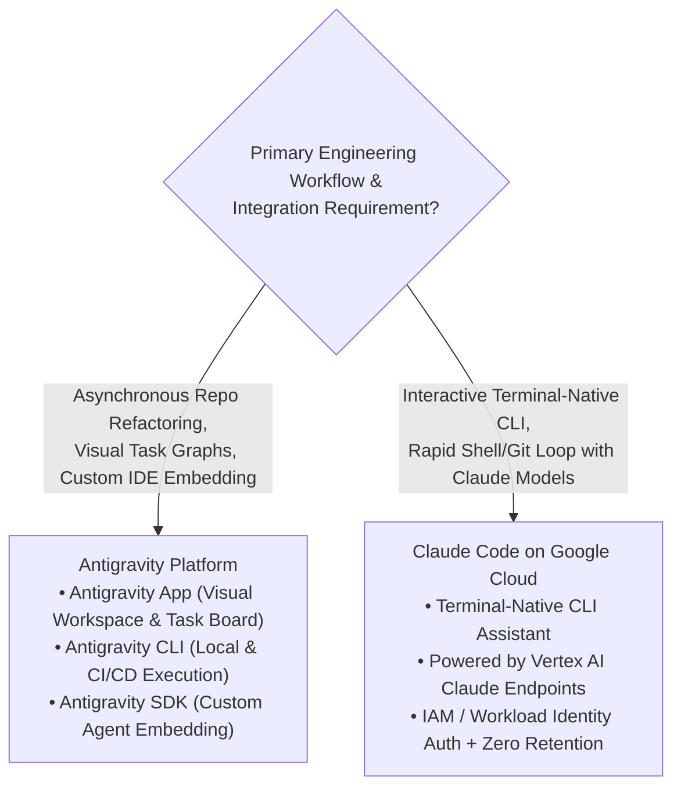
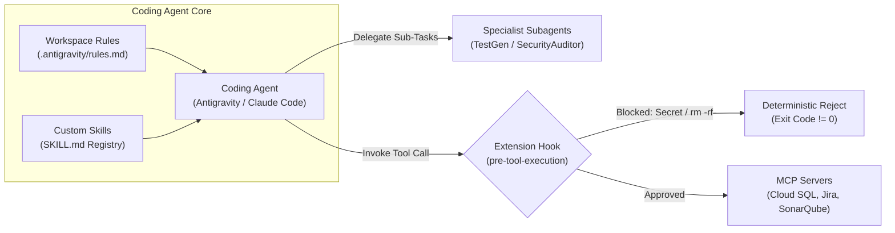

# Section 2: Using Coding Agents for Application Development (Domain 2 — 17%)

Domain 2 of the Google Cloud Certified Professional Agentic Architect (PAA) exam tests your architectural mastery of autonomous and assistive **Coding Agents** across the enterprise Software Development Lifecycle (SDLC). Modern software engineering has evolved beyond passive single-line autocomplete into autonomous multi-file refactoring, automated test synthesis, repository-scale dependency migrations, and CI/CD self-healing pipelines.

This module covers Sub-Objectives **2.1** (`Antigravity` vs. `Claude Code on Google Cloud` Architecture), **2.2** (Customizing Coding Agents via MCP Servers, `SKILL.md`, Rules, Extension Hooks & Subagents), and **2.3** (Isolated Execution Sandboxes on `GKE` & `Cloud Workstations`, plus Enterprise Governance via `Agents CLI`).

---

## 1. Sub-Objective 2.1: Antigravity vs. Claude Code on Google Cloud

Google Cloud provides two premier agentic coding platforms tailored to distinct engineering workflows and organizational governance models: **Antigravity** (Google Cloud's flagship multi-modal, repo-scale agentic development platform available via App, CLI, and SDK) and **Claude Code on Google Cloud** (Anthropic's terminal-native coding agent powered by Vertex AI enterprise endpoints).



### Comprehensive Platform Architecture Comparison

| Architectural Dimension | Antigravity (App, CLI, SDK) | Claude Code on Google Cloud |
| :--- | :--- | :--- |
| **Core Modality & Experience** | Multi-surface platform: **App** (visual multi-agent task canvas, diff review, architecture graph), **CLI** (terminal execution), and **SDK** (programmatic embedding). | **Terminal-native CLI** (`claude`) optimized for interactive command-line developer loops, rapid file edits, bash execution, and git workflows. |
| **Underlying Foundation Models** | Native integration with Google's frontier **Gemini 1.5 Pro / Gemini 2.0** coding models and multi-model ensembles via Vertex AI. | Powered by **Anthropic Claude 3.5 / 3.7 Sonnet** hosted natively on **Google Cloud Vertex AI** regional endpoints. |
| **Asynchronous Task Execution** | Native background worker fleet: can spawn 10+ parallel autonomous subagents to refactor 50 microservices overnight and open pull requests asynchronously. | Primarily synchronous interactive session loop within the developer's active terminal shell (or single-job headless invocation in CI). |
| **Extensibility & Embedding** | **Antigravity SDK** allows platform engineering teams to embed autonomous coding agents into internal developer portals (Backstage) or automated incident remediation bots. | Extensible via local/remote **Model Context Protocol (MCP)** servers, project instructions (`CLAUDE.md`), and bash shell hooks. |
| **Enterprise Security Boundary** | Runs within Google Cloud IAM, VPC Service Controls (VPC-SC), Customer-Managed Encryption Keys (CMEK), and Cloud Audit Logs. | **Vertex AI Enterprise Privacy Guarantee**: Requests route via Vertex AI APIs using Google Cloud IAM (`roles/aiplatform.user`), **Zero Data Retention** by Anthropic, and Private Service Connect (PSC). |
| **Typical Exam Scenario** | *"A platform engineering team wants to build an automated self-healing pipeline that embeds a coding agent via SDK to analyze PagerDuty stack traces, refactor broken microservices across 12 repos, and submit PRs."* | *"Senior backend engineers want a terminal-native interactive coding agent powered by Anthropic's latest Sonnet model that executes local unit tests and git commits while keeping all code inside their GCP project's VPC-SC boundary."* |

---

## 2. Sub-Objective 2.2: Customizing Coding Agents (MCP, Skills, Hooks & Subagents)

Out-of-the-box foundation models lack knowledge of your organization's proprietary internal libraries, database schemas, security policies, and deployment scripts. Domain 2 heavily tests how architects customize and constrain coding agents using five standardized mechanisms: **MCP Servers**, **Custom Skills (`SKILL.md`)**, **Rules**, **Extension Hooks**, and **Subagents**.



### 1. Model Context Protocol (MCP) Servers for Coding Agents
The **Model Context Protocol (MCP)** provides a universal, open JSON-RPC 2.0 standard for connecting coding agents to external context repositories and developer tools without writing brittle, model-specific plugin wrappers.
* **Local `stdio` Transport:** The coding agent spawns the MCP server as a local child process communicating over standard input/output (`stdin`/`stdout`). Ideal for local developer tools (e.g., querying a local SQLite database, inspecting local Docker containers, or parsing ASTs).
* **Remote `SSE` / `Streamable HTTP` Transport:** The coding agent connects over HTTPS to centralized enterprise MCP servers hosted on **Cloud Run** or **GKE**.
* **High-Value Enterprise Coding MCP Integrations:**
  * **Database Schema & Staging Query MCP Server:** Connects to **Cloud SQL** or **BigQuery** staging environments in read-only mode so the coding agent can inspect live table schemas, foreign keys, and query execution plans (`EXPLAIN ANALYZE`) before generating ORM migrations.
  * **Issue Tracker & Architecture Docs MCP Server:** Connects to **Jira**, **Linear**, or **Confluence** so the agent can read acceptance criteria from `JIRA-4491` and update ticket status upon opening a pull request.
  * **Static Analysis & Vulnerability MCP Server:** Exposes **SonarQube**, **Snyk**, or **Artifact Analysis** findings so the agent can autonomously fetch CVE reports and upgrade vulnerable dependencies in `package.json` or `pom.xml`.

### 2. Custom Skills (`SKILL.md`) — Dynamic Procedural Knowledge
While MCP servers provide *tools and data access*, **Custom Skills** (`SKILL.md`) package *reusable domain-specific engineering procedures and bash workflows*.
* **Architectural Problem Solved:** If you cram 50 pages of company-specific runbooks (how to generate gRPC protobuf stubs, how to run database migrations, how to deploy to staging) into the global system prompt, you consume thousands of tokens on every turn and degrade reasoning accuracy (*context window pollution*).
* **The `SKILL.md` Pattern:** Skills are stored as modular Markdown files inside a repository directory (e.g., `.agent/skills/` or shared enterprise skill registries). Each `SKILL.md` file contains YAML frontmatter declaring its `name`, `description`, and trigger keywords, followed by deterministic step-by-step instructions, required bash commands, and verification checks.
* **Dynamic On-Demand Loading:** During reasoning, the coding agent scans only the lightweight skill names and descriptions. When tasked with *"Add a new field to the Billing gRPC service,"* the agent dynamically loads `skills/grpc-protobuf-compile/SKILL.md` into its active context, executes the exact `buf generate` and linter commands specified in the skill, verifies the output, and unloads the skill when finished.

### 3. Project Rules & Repository Invariants
Project rules (defined in `.antigravity/rules.md`, `.cursorrules`, or `CLAUDE.md` at the repository root) establish persistent architectural invariants that apply across all files in the workspace:
* Coding style conventions (e.g., *"Use Python 3.12 type annotations everywhere; prefer `pydantic.BaseModel` v2 over dataclasses"*).
* Architectural boundaries (e.g., *"Controllers in `api/routes/` must never import directly from `db/models/`; always call `services/` layer"*).
* Testing mandates (e.g., *"Every new public function must include pytest unit tests using `unittest.mock.AsyncMock` with $\ge 90\%$ branch coverage"*).

### 4. Extension Hooks: Deterministic Security & Quality Guardrails
This is one of the highest-yield exam concepts in Domain 2. **Extension Hooks** are deterministic shell scripts or binaries executed automatically by the coding agent runtime at specific lifecycle checkpoints.

| Hook Lifecycle Checkpoint | Execution Trigger | Primary Enterprise Use Case & Security Enforcement |
| :--- | :--- | :--- |
| **`pre-tool-execution`** | Fires *immediately before* the agent executes any bash command, file write, or MCP tool call. | **Deterministic Command Blocking:** Inspects the proposed command string. If the agent attempts to execute `rm -rf /`, `gcloud projects delete`, `kubectl delete ns prod`, or modify `.env` files, the hook returns a non-zero exit code (`exit 1`), immediately aborting execution and returning an error message to the agent. |
| **`post-tool-execution`** | Fires *immediately after* a file edit or bash tool completes. | **Automated Formatting & Linting:** Automatically runs `ruff format`, `gofmt`, or `eslint --fix` on modified files and feeds any compiler/linter errors back into the agent's observation loop for immediate self-correction. |
| **`pre-commit`** | Fires when the agent attempts to create a `git commit`. | **Secret Scanning & SAST Enforcement:** Runs **TruffleHog**, **Gitleaks**, or **Semgrep** across staged diffs. If a hardcoded AWS key, GCP Service Account JSON, or high-severity SQL injection vulnerability is detected, the commit is deterministically rejected. |
| **`post-commit` / `pre-push`** | Fires prior to pushing branches to remote Git repositories. | **Mandatory Unit Test Verification:** Executes the local test suite (`pytest` or `go test ./...`). Prevents the agent from pushing broken code or opening unverified Pull Requests. |

> [!WARNING]
> **Critical Exam Rule — Hooks vs. System Prompts:** Never rely on Workspace Rules or System Prompts (*"Please do not commit API keys or run destructive commands"*) as your primary security control. LLMs can be tricked via indirect prompt injection (e.g., a malicious comment hidden inside an open-source library file). **Extension Hooks (`pre-tool-execution` and `pre-commit`) execute deterministically outside the LLM** and cannot be bypassed by prompt hallucinations.

### 5. Subagent Delegation & Context Isolation
When tackling massive engineering tasks—such as upgrading a 200-file Java 8 application to Java 21—a single coding agent thread will rapidly exhaust its context window with compiler logs and file diffs. Both **Antigravity** and advanced coding architectures solve this via **Subagent Delegation**:
* **Supervisor / Planner Agent:** Analyzes the high-level goal, inspects the repository dependency graph, and decomposes the migration into 15 independent module tasks.
* **Worker Subagents:** The Supervisor spawns ephemeral, isolated subagents (e.g., `Subagent-Auth-Module`, `Subagent-Payment-Module`). Each subagent receives *only* the files and instructions relevant to its assigned module, executes edits and local unit tests in its own isolated context window, and returns a concise summary diff to the Supervisor.
* **Reviewer / Verification Subagent:** A dedicated critic subagent inspects the combined diffs against security rules and integration tests before finalizing the Pull Request.

---

## 3. Sub-Objective 2.3: Isolated Execution Sandboxes (GKE & Cloud Workstations) & Governance

Allowing an autonomous coding agent to generate and execute arbitrary code (`python -c ...`, `npm install`, `bash script.sh`) introduces severe infrastructure risks: container escape exploits, cryptocurrency mining malware in hallucinated packages (*slopsquatting*), accidental deletion of cloud resources, and intellectual property exfiltration. Architects must isolate agent code execution inside hardened sandboxes.

```mermaid
flowchart TD
    subgraph Enterprise VPC & VPC Service Controls Perimeter
        subgraph Cloud Workstations (Interactive Dev & Agent IDE)
            CW["Cloud Workstation VM<br/>• Zero Public IP (IAP Ingress Only)<br/>• Persistent Home Disk<br/>• Pre-baked Container Image"]
        end

        subgraph GKE Cluster (Headless CI/CD & Autonomous Execution)
            NP["Kubernetes NetworkPolicy<br/>(Deny Egress except Artifact Proxy;<br/>Block Metadata 169.254.169.254)"]
            POD["Agent Execution Pod<br/>• RuntimeClass: gvisor (GKE Sandbox)<br/>• Read-Only Root Filesystem<br/>• Keyless Workload Identity"]
            NP --> POD
        end

        AR["Artifact Registry<br/>(Private Approved Packages)"]
        CW & POD -->|Private Google Access| AR
    end
```

### Pattern 1: Sandboxing Untrusted Agent Execution on Google Kubernetes Engine (GKE)

When running headless coding agents at scale (such as an Antigravity worker fleet executing untrusted LLM-generated unit tests or evaluating third-party pull requests), standard Docker/containerd containers are **insufficient** because standard containers share the underlying host node's Linux kernel. A single kernel vulnerability (`CVE` in syscall handling) allows an escaped container process to compromise the entire GKE node.

To achieve defense-in-depth isolation on GKE, implement four mandatory controls:
1. **GKE Sandbox (gVisor) or Kata Containers:**
   * Configure the Kubernetes Pod specification with `runtimeClassName: gvisor`.
   * **gVisor** inserts an application kernel (`runsc`) written in memory-safe Go between the container process and the host Linux kernel. It intercepts and implements over 200 Linux system calls in user space, drastically reducing the host kernel attack surface.
   * For workloads requiring full hardware-level virtualization isolation, use **Kata Containers** (lightweight micro-VMs per pod).
2. **Strict Kubernetes NetworkPolicies:**
   * Apply a default-deny egress `NetworkPolicy` to the agent execution namespace.
   * **Explicitly block access to the GKE Metadata Server (`169.254.169.254`)** so malicious agent-executed code cannot steal node or pod IAM credentials.
   * Allow egress **only** to an internal **Artifact Registry** remote repository proxy (preventing the agent from downloading arbitrary malware from public PyPI/npm or exfiltrating source code to external pastebins).
3. **Filesystem & SecurityContext Hardening:**
   * Enforce `readOnlyRootFilesystem: true`, `runAsNonRoot: true`, and `allowPrivilegeEscalation: false`.
   * Mount an ephemeral `emptyDir` volume with strict memory/storage quotas (`sizeLimit: 2Gi`) for `/tmp` and workspace compilation scratch space, which is cryptographically wiped the moment the pod terminates.
4. **Keyless Workload Identity Federation:**
   * Never mount static Service Account JSON keys inside sandbox pods. If the coding agent needs to read test fixtures from a staging Cloud Storage bucket, bind a minimally scoped Kubernetes Service Account to a Google Cloud IAM role using **Workload Identity Federation for GKE**.

---

### Pattern 2: Secure Interactive Developer & Agent Environments on Cloud Workstations

When human engineers collaborate interactively with coding agents (**Antigravity App/CLI** or **Claude Code on Google Cloud**) on highly sensitive proprietary repositories, running code on unmanaged local laptops creates unacceptable data loss prevention (DLP) risks (source code stored on local unencrypted SSDs, public Wi-Fi eavesdropping, unpatched local OS environments). **Google Cloud Workstations** provides the enterprise-grade solution.

#### Architectural Security Controls of Cloud Workstations
1. **VPC Service Controls (VPC-SC) & Zero Public IPs:**
   * Cloud Workstations run inside your organization's private VPC network within a **VPC Service Controls perimeter**.
   * Provision workstation clusters with **Disable Public IP Addresses** enabled. Workstations have zero direct internet exposure.
   * Developers connect from their browser or local VS Code client exclusively through **Identity-Aware Proxy (IAP)** TCP forwarding over TLS, authenticated via Google Cloud Identity and BeyondCorp Enterprise Context-Aware Access policies (verifying device posture, corporate OS certificate, and IP geo-location).
2. **Data Exfiltration Prevention:**
   * Because the workstation sits inside a VPC-SC perimeter with restricted egress, neither a compromised coding agent nor a rogue insider can `curl` or `git push` proprietary source code to external GitHub accounts or unauthorized cloud storage buckets.
   * Clipboard copy/paste and local file download permissions can be disabled via Workstation IAM policies.
3. **Ephemeral Compute + Persistent Home Disks:**
   * Workstation VMs automatically shut down after a configurable idle timeout (e.g., 60 minutes) to eliminate idle compute costs.
   * A **Persistent Disk** is mounted to `/home/user`, preserving the developer's Git repositories, Antigravity/Claude Code session state, and local build caches across VM restarts.
4. **Standardized Pre-Baked Container Images:**
   * Platform engineering teams define custom Workstation container images stored in **Artifact Registry**. These images come pre-configured with approved **MCP servers**, corporate root CA certificates, pre-installed `pre-commit` **Extension Hooks**, and the **Agents CLI**—guaranteeing that 100% of developers operate with identical security guardrails from day one.

---

### Pattern 3: Enterprise Governance & Scaling with `Agents CLI`

As an enterprise scales from 10 developers experimenting with coding agents to 5,000 engineers running thousands of autonomous agent tasks daily, centralized governance becomes critical. The **`Agents CLI`** is Google Cloud's unified command-line control plane for scaffolding, invoking, testing, and governing agents across local workstations and CI/CD pipelines.

#### Human Mode vs. Agent Mode in `Agents CLI`
A frequently tested exam distinction is how `Agents CLI` adapts its behavior based on execution context:

| Execution Mode | Invocation Syntax | Architectural Behavior & Output Contract | Primary Use Case |
| :--- | :--- | :--- | :--- |
| **Human Mode (Interactive)** | `gcloud agents run` or `agents chat --interactive` | Renders rich ANSI terminal colors, interactive spinners, multi-line Markdown formatting, and prompts the human user on `stdin` (`[y/N]`) before executing high-impact file mutations or shell commands. | Local developer debugging, interactive pair-programming in **Cloud Workstations**, and exploratory code refactoring. |
| **Agent Mode (Headless / Machine)** | `agents run --agent-mode --output=json` (or `--non-interactive`) | **Disables all interactive TTY prompts** (never blocks waiting for human keyboard input). Emits deterministic, schema-validated **JSON payloads** containing `status`, `trajectory_steps`, `files_modified`, `token_usage`, and `exit_code`. Automatically applies pre-configured policy profiles. | **CI/CD Pipelines** (Cloud Build, GitHub Actions, GitLab CI), automated PR code review bots, nightly dependency upgrade crons, and parent-agent-to-subagent invocation. |

#### Enterprise Governance Capabilities via `Agents CLI`
1. **Centralized Policy & Quota Enforcement:** Platform administrators define organization-wide policy manifests (`agent-policy.yaml`) enforced by `Agents CLI` and **Agent Gateway**. Policies cap maximum token consumption per developer/team per day, restrict model selection to approved Vertex AI endpoints, and enforce mandatory MCP server allowlists.
2. **Automated CI/CD Self-Healing Pipelines:** In a Cloud Build pipeline, if a unit test or integration test fails on a Pull Request, a pipeline step invokes:
   ```bash
   agents run --agent-mode \
     --task="Analyze pytest failure in test_billing.py and generate minimal patch" \
     --max-turns=5 \
     --sandbox=gvisor \
     --output=json > patch_report.json
   ```
   If `patch_report.json` reports `"status": "SUCCESS"`, the pipeline automatically commits the fix to a suggestion branch and posts the diff as a PR comment for human engineer review.
3. **Comprehensive Auditability:** Every tool invocation, bash command executed, file modified, and MCP query performed via `Agents CLI` emits structured audit logs to **Cloud Logging**, tagging each event with the authenticated developer's principal identity and the specific **Agent Identity** token.

---

## 4. Domain 2 Exam Traps & Architectural Anti-Patterns

Master these five high-probability Domain 2 traps before exam day:

> [!CAUTION]
> **Exam Trap #1 — The "System Prompt Secret Protection" Distractor:**
> * **Scenario:** An engineering organization notices that developers using coding agents occasionally commit `.env` files or hardcoded GCP service account keys into Git repositories. They want a 100% deterministic solution to block secret commits.
> * **Trap Option:** Add a high-priority rule to `.antigravity/rules.md` and `CLAUDE.md` stating: *"CRITICAL SECURITY RULE: Never stage or commit files containing API keys, passwords, or `.env` extensions."*
> * **Winning Answer:** Implement a deterministic **`pre-commit` Extension Hook** (integrating secret scanners like TruffleHog or Gitleaks) inside the workstation image and repository configuration that inspects staged diffs and returns a non-zero exit code (`exit 1`) to block the commit outside the LLM.

> [!CAUTION]
> **Exam Trap #2 — The "Standard Docker Container for Untrusted Code Evaluation" Distractor:**
> * **Scenario:** A SaaS platform builds an autonomous grading agent that executes untrusted Python code submitted by external job applicants and LLM coding agents to verify benchmark performance.
> * **Trap Option:** Run the untrusted Python scripts inside standard multi-tenant **Cloud Run** containers or standard **GKE** pods using the default `runc` container runtime.
> * **Winning Answer:** Execute all untrusted code inside **GKE Sandbox pods (`runtimeClassName: gvisor`)** or **Kata Containers** with a strict **Kubernetes NetworkPolicy** blocking egress to the metadata server (`169.254.169.254`) and internal networks, combined with `readOnlyRootFilesystem: true`.

> [!CAUTION]
> **Exam Trap #3 — The "Hanging CI/CD Pipeline" Distractor:**
> * **Scenario:** A DevOps team integrates `Agents CLI` into a Cloud Build pipeline to automatically generate unit tests whenever a new microservice is merged. However, the Cloud Build jobs consistently time out after 60 minutes without producing any logs.
> * **Trap Option:** Increase the Cloud Build machine type to `e2-highcpu-32` and extend the build timeout to 4 hours.
> * **Winning Answer:** The CLI was invoked in default interactive **Human Mode**, causing it to hang indefinitely waiting for TTY confirmation (`[y/N]`) on `stdin`. Pass the **`--agent-mode` (`--non-interactive --output=json`)** flag so the agent executes headlessly and emits structured JSON.

> [!CAUTION]
> **Exam Trap #4 — The "External SaaS API Keys for Claude Code" Distractor:**
> * **Scenario:** A regulated financial institution wants its 500 software engineers to use **Claude Code** in their terminals, but corporate compliance strictly forbids source code from leaving their Google Cloud VPC perimeter or being stored by third-party AI vendors.
> * **Trap Option:** Purchase retail Anthropic API keys, store them in Secret Manager, and instruct developers to set `export ANTHROPIC_API_KEY=...` on their corporate laptops.
> * **Winning Answer:** Deploy **Claude Code on Google Cloud** configured to route all inference requests through regional **Vertex AI Claude endpoints** inside a **VPC Service Controls (VPC-SC)** perimeter, authenticating via keyless Google Cloud IAM (**Workload Identity**) inside **Cloud Workstations** with zero public IPs.

> [!CAUTION]
> **Exam Trap #5 — The "Monolithic Context Stuffing of Company Runbooks" Distractor:**
> * **Scenario:** An enterprise has 80 distinct internal engineering workflows (how to create Kafka topics, how to rotate Vault secrets, how to scaffold Terraform modules). When all 80 runbooks are pasted into the coding agent's global rules file, token costs skyrocket by 800% and the agent frequently confuses commands between workflows.
> * **Trap Option:** Fine-tune a custom Gemini 1.5 Pro model on the 80 runbooks every Friday.
> * **Winning Answer:** Refactor the 80 monolithic runbooks into modular **Custom Skills (`SKILL.md`)** with descriptive YAML frontmatter headers so the coding agent dynamically loads *only* the specific skill required for the active task on demand.
