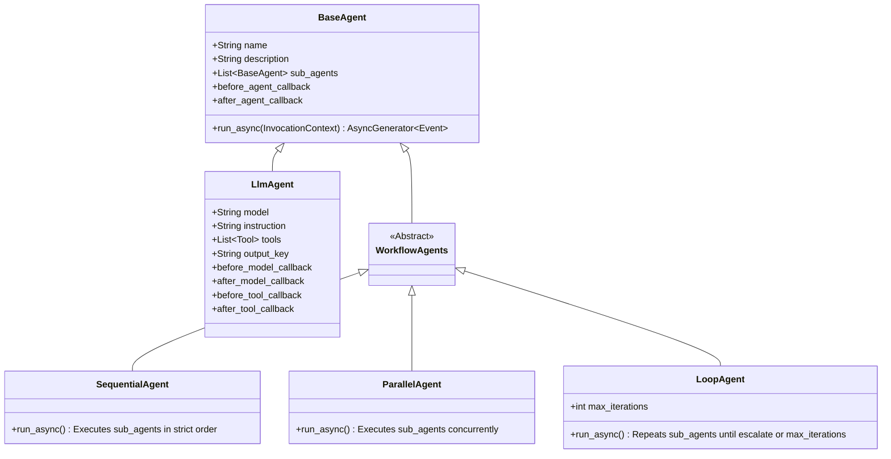
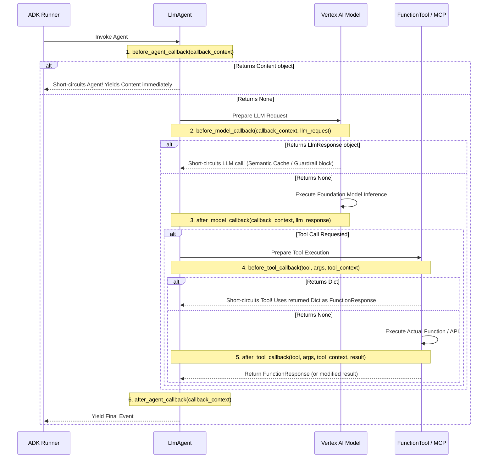
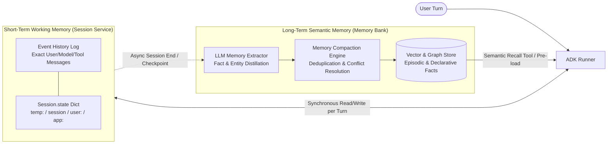

# Section 3A: Custom Agents with ADK, Model Garden & Memory Bank

Domain 3 of the Google Cloud Certified Professional Agentic Architect (PAA) examination accounts for **33% of total exam weight**—the single largest domain on the test. While low-code tools like `Gemini Enterprise Agent Designer` and `CX Agent Studio` provide rapid time-to-value for standard workflows, mission-critical systems require deterministic control over execution graphs, fine-grained state mutation, custom lifecycle interception, and heterogeneous model routing.

This module establishes the architectural foundation for building code-first autonomous systems on Google Cloud using the **Agent Development Kit (ADK)**, selecting foundation models from **Vertex AI Model Garden**, persisting multi-tiered context in the **Agent Platform Memory Bank**, and operationalizing agent lifecycles using the **Agents CLI** across interactive development and headless CI/CD pipelines.

---

## 1. Agent Development Kit (ADK) Core Architecture & Primitives

The **Google Cloud Agent Development Kit (ADK)** is an open-source, code-first framework engineered for building, composing, evaluating, and deploying production-grade multi-agent systems. ADK treats agents as **strongly-typed, event-driven state machines** with explicit execution boundaries, deterministic orchestrators, and rich lifecycle hooks.

### 1.1 The ADK Agent Class Hierarchy

At the root of the ADK object model is `BaseAgent`, defining the execution contract for any node in an agentic graph. Every agent receives an `InvocationContext` and yields a stream of `Event` objects asynchronously (`AsyncGenerator[Event, None]`).



Architects must master four primary concrete agent primitives:

1. **`LlmAgent` (alias `Agent`)**: The cognitive workhorse of ADK. It wraps a foundation model (`gemini-2.5-pro` or a Model Garden endpoint), system instructions, tool declarations, structured output schemas (`response_schema`), and model-level callbacks. `LlmAgent` implements the **ReAct (Reason + Act)** loop natively: inspecting conversation history and session state, invoking the model, parsing tool calls (`FunctionCall`), executing corresponding functions or MCP tools, feeding `FunctionResponse` payloads back to the model, and yielding the final response.
2. **`SequentialAgent`**: A deterministic orchestrator executing `sub_agents` in strict sequential order ($A_1 \rightarrow A_2 \rightarrow \dots \rightarrow A_n$). Crucially, `SequentialAgent` **does not invoke an LLM to decide routing**. It passes the shared `InvocationContext` and `Session.state` across steps. If sub-agent $A_1$ writes its result to `state["draft_sql"]` via `output_key`, sub-agent $A_2$ immediately references `{draft_sql}` in its system instruction.
3. **`ParallelAgent`**: A concurrent orchestrator executing `sub_agents` simultaneously via `asyncio.gather`. All branches receive a read view of `InvocationContext` and write to isolated keys in `Session.state`. This is the canonical primitive for **scatter-gather architectures**, such as running simultaneous compliance checks (Legal, Security, Financial Audit) over a document before aggregating results in a downstream `SequentialAgent`.
4. **`LoopAgent`**: An iterative orchestrator repeating `sub_agents` in sequence until either:
   - A sub-agent explicitly triggers an escalation signal (`EventActions(escalate=True)`).
   - The loop reaches its configured `max_iterations` safety ceiling.
   `LoopAgent` powers **Generator-Critic (Self-Reflection)** workflows, iterative code compilation/debugging cycles, and multi-step refinement tasks.

### 1.2 State Management & Scope Prefixes (`Session.state`)

State management in ADK eliminates race conditions, prevents context window pollution, and enforces strict data lifecycle boundaries. Every active conversation is encapsulated in a `Session` object containing a dictionary-like `state` store (`session.state`).

ADK enforces **Scope Prefixes** on state keys to govern persistence and visibility:

| State Prefix | Scope & Lifespan | Visibility Boundary | Production Backend | Primary Architectural Use Cases |
| :--- | :--- | :--- | :--- | :--- |
| **`temp:`** (`temp:raw_payload`) | **Single Invocation (Turn)** | Current turn only; purged when `run_async` completes. | In-Memory (`InvocationContext`) | Passing large intermediate JSON payloads or raw SQL results between sub-agents within a single turn without bloating persistent storage. |
| **Unprefixed** (`current_cart_id`) | **Session Lifespan** | All turns within the specific `session_id`. | `VertexAiSessionService` | Tracking multi-turn task progress, wizard step indices, or structured outputs persisted via `output_key`. |
| **`user:`** (`user:currency`) | **User Lifespan (Cross-Session)** | Shared across **all sessions** belonging to the same `user_id`. | `Agent Platform Memory Bank` | Persisting user preferences, timezones, RBAC tier metadata, and long-term profile attributes. |
| **`app:`** (`app:feature_flags`) | **Application Lifespan (Global)** | Shared globally across **all users and sessions** for the app. | Distributed Config Cache | Storing system-wide configuration constants, global rate-limit counters, or shared reference metadata. |

#### Dynamic Instruction Interpolation & `output_key` Routing

By enclosing a state key in curly braces (e.g., `{user:preferred_currency}` or `{temp:schema}`), ADK dynamically interpolates the current value from `session.state` at runtime right before constructing the LLM prompt. Setting `output_key="final_analysis"` on an `LlmAgent` automatically captures the agent's response and writes it directly to `session.state["final_analysis"]`.

```python
from google.adk.agents import LlmAgent, SequentialAgent
from google.adk.tools import FunctionTool

def fetch_customer_schema(dataset_id: str) -> dict:
    """Retrieves table definitions and DDL for a given BigQuery dataset."""
    return {"tables": ["orders", "customers"], "ddl": "CREATE TABLE orders (id STRING, amount FLOAT64)..."}

schema_agent = LlmAgent(
    name="SchemaInspector",
    model="gemini-2.5-flash",
    instruction="Fetch schema for dataset {target_dataset} and summarize primary keys.",
    tools=[FunctionTool(fetch_customer_schema)],
    output_key="temp:schema_summary"
)

sql_generator_agent = LlmAgent(
    name="SqlGenerator",
    model="gemini-2.5-pro",
    instruction="""Using schema summary: {temp:schema_summary}
    Write an optimized GoogleSQL query for request: {user_query}.
    Use currency: {user:preferred_currency}.""",
    output_key="generated_sql"
)

text_to_sql_pipeline = SequentialAgent(
    name="TextToSqlPipeline",
    sub_agents=[schema_agent, sql_generator_agent]
)
```

### 1.3 Tool Definitions & Execution Semantics

ADK provides a unified tool abstraction bridging native Python functions, OpenAPI specifications, Google Cloud connectors, and Model Context Protocol (MCP) servers.

- **Docstring & Type Reflection**: Wrapping a function with `FunctionTool(my_func)` inspects its signature, Python type annotations, and docstring to synthesize an OpenAPI JSON Schema declaration compatible with Gemini's tool-calling API.
- **ToolContext Injection**: Declaring `tool_context: ToolContext` in a tool function instructs ADK to inject the active execution context at runtime without exposing it to the LLM schema. Through `tool_context`, tools read/mutate `tool_context.state`, trigger loop termination (`tool_context.actions.escalate = True`), or initiate agent handoffs (`tool_context.actions.transfer_to_agent = "SpecialistAgent"`).

### 1.4 The Six Lifecycle Callbacks (Interceptors)

ADK provides six callback hooks for enterprise compliance, security auditing, guardrailing, and semantic caching. Understanding **how returning a value vs returning `None` alters control flow** is heavily tested on the PAA exam.



#### Callback Control Flow Rules:
1. **`before_agent_callback(callback_context)`**: Runs before agent logic starts. Returning `None` proceeds normally; returning a `types.Content` object **bypasses entire agent execution** and immediately yields that `Content` (used for RBAC checks at agent boundaries).
2. **`after_agent_callback(callback_context)`**: Runs after the agent completes all turns to inspect or modify final output.
3. **`before_model_callback(callback_context, llm_request)`**: Runs prior to invoking the model endpoint. Mutating `llm_request` in-place and returning `None` dynamically injects instructions or safety rules. Returning an `LlmResponse` object **bypasses the LLM network call entirely** (used for **Semantic Caching** or **Input Guardrailing**).
4. **`after_model_callback(callback_context, llm_response)`**: Runs after receiving model output to sanitize responses or redact hallucinated URLs before tool dispatch.
5. **`before_tool_callback(tool, args, tool_context)`**: Runs before tool execution. Mutating `args` in-place and returning `None` sanitizes parameters (e.g., enforcing `LIMIT 100` on SQL queries). Returning a `dict` **skips actual tool execution** and feeds the dictionary back to the LLM as a simulated `FunctionResponse` (used for CI/CD mocking, dry-run mode, or blocking unauthorized `DROP TABLE` commands).
6. **`after_tool_callback(tool, args, tool_context, tool_response)`**: Runs after tool execution to truncate massive API payloads before entering context windows or log audit trails to Cloud Logging.

---

## 2. Foundation Model Selection in Vertex AI Model Garden

Architecting high-performance agentic systems requires matching the cognitive complexity of each node in an agent graph to the optimal foundation model. Deploying a frontier model like `Gemini 2.5 Pro` for trivial classification steps results in unacceptable latency (Time-to-First-Token) and inflated costs.

### 2.1 LLM vs. SLM (Small Language Models) in Agent Topologies

In multi-agent architectures, architects apply **Heterogeneous Model Routing**:

- **Frontier Large Language Models (LLMs)** (`Gemini 2.5 Pro`, `Claude 3.7 Sonnet` on Vertex AI): Deep multi-step reasoning capabilities, native multimodal understanding (audio, video, PDFs, code repositories), huge context windows (up to 2M tokens), and zero-shot complex tool orchestration. Used for Root Orchestrators, Complex Planners, Deep Code Synthesizers, Multi-Document Legal/Financial Reasoners, and Ambiguity Resolvers.
- **Small Language Models (SLMs)** (`Gemini 2.5 Flash`, `Gemini 2.5 Flash-Lite`, `Gemma 3 4B/12B/27B`, `Llama 3.3 8B`): High token generation velocity (150–400+ tokens/sec), sub-200ms TTFT, 10x–30x lower inference cost per million tokens, and compact memory footprints. Used for Intent Routers, Guardrail Evaluators, Entity Extractors, JSON Format Converters, High-Volume RAG Summarizers, and Worker Sub-agents executing narrow tools.

### 2.2 Proprietary First-Party vs. Open-Weights (OSS) Models

Vertex AI Model Garden provides unified access to over 200+ first-party, partner, and open-source models:

| Evaluation Dimension | Google First-Party (`Gemini 2.5 Pro / Flash / Flash-Lite`) | Partner MaaS (`Claude 3.7 Sonnet`, `Mistral Large`) | Open-Weights / OSS (`Gemma 3`, `Llama 3.3 70B`, `DeepSeek-R1`) |
| :--- | :--- | :--- | :--- |
| **Deployment Model** | Managed Serverless API (MaaS) & Provisioned Throughput | Managed Serverless API (Model-as-a-Service) | Self-Hosted Vertex AI Endpoints or **GKE with vLLM / TensorRT-LLM** |
| **Context Window** | Up to **2,000,000 tokens** (Gemini 2.5 Pro) | Up to 200,000 tokens | Typically 32k – 128k tokens (KV-cache GPU VRAM bound) |
| **Native Multimodality** | Text, image, audio, video, and PDF layout ingestion | Text & Image | Text or dual-modality (Vision-Language variants like Gemma 3) |
| **Fine-Tuning Control** | Supervised Fine-Tuning (SFT) via adapter layers | Managed prompt caching & fine-tuning | **Full Weight Access**: LoRA, QLoRA, full fine-tuning, quantization (FP8/AWQ) |
| **Air-Gapped Isolation** | Zero data retention opt-out, CMEK, VPC-SC, Regional Endpoints | Regional processing guarantees via Vertex AI SLA | **Complete Air-Gapped Control**: Runs inside isolated VPC/GKE clusters |
| **Billing Structure** | Pay-per-token or reserved **Provisioned Throughput (GSUs)** | Pay-per-token via Google Cloud billing | **Compute-Hour Billing**: Pay for underlying A100/H100/TPU VMs 24/7 |

### 2.3 Model Serving Endpoints: Serverless vs. Provisioned Throughput vs. Self-Hosted

1. **Managed Serverless Endpoints (Pay-as-you-go MaaS)**: Ideal for spiky workloads and prototypes. Subject to shared regional quota limits (RPM/TPM), risking `429 Too Many Requests` errors during traffic bursts.
2. **Vertex AI Provisioned Throughput**: Guarantees dedicated inference capacity measured in **Generative AI Scale Units (GSUs)**. Eliminates noisy-neighbor latency variance and guarantees deterministic TTFT SLAs. Supports **Dynamic Shared Quota (DSQ)** overflow so burst traffic beyond reserved GSUs spills over into pay-as-you-go capacity.
3. **Self-Hosted Custom Endpoints (Vertex AI Prediction / GKE Inference Gateway)**: Required for custom-tuned OSS models (`Gemma 3 27B`, `Llama 3.3 70B`) with custom LoRA adapters or air-gapped regulatory mandates. Deployed on dedicated accelerators (`NVIDIA L4`, `A100`, `H100`, or `Cloud TPU v5e`) using **vLLM** (PagedAttention + continuous batching). Incurs continuous hourly compute charges 24/7 regardless of traffic volume; only cost-effective when sustained utilization exceeds ~60–70% continuous GPU saturation.

---

## 3. Agent Platform Memory Bank & Managed Sessions

Enterprise context must be managed across two distinct temporal horizons: **Short-Term Conversational Working Memory** and **Long-Term Semantic Episodic Memory**. Google Cloud's **Agent Platform Memory Bank** provides a managed, multi-tiered memory architecture natively integrated with ADK and Vertex AI Agent Engine.

### 3.1 Short-Term Session State vs. Long-Term Memory Bank



1. **Short-Term Working Memory (`SessionService`)**: Implemented locally via `InMemorySessionService` or in production via `VertexAiSessionService`. Stores verbatim chronological transcripts (`Event` objects) alongside `Session.state`. Passing a 500-turn raw transcript into every LLM call degrades reasoning accuracy ("lost-in-the-middle"), inflates input token costs quadratically ($O(N^2)$), and breaches context limits.
2. **Long-Term Episodic & Semantic Memory (`MemoryBankService`)**: Implemented via `VertexAiMemoryBankService`. Transforms ephemeral transcripts into **persistent, queryable knowledge entities and user memories** surviving across independent sessions via an asynchronous **Distillation Pipeline** extracting atomic **Declarative Facts** (*"User manages a $4M Cloud SQL budget"*) and **Episodic Memories** (*"On 2026-08-12, user resolved a deadlock in shard-04 via read-replica failover"*).

### 3.2 Cross-Session Entity Tracking, Compaction & Conflict Resolution

If a user states in Session 1, *"My default region is us-central1,"* and in Session 14 states, *"We migrated all infrastructure to europe-west4; never deploy to US regions again,"* a naive append-only RAG memory system retrieves both contradictory statements.

The **Agent Platform Memory Bank** resolves this via **Automated Memory Compaction and Reconciliation**:

1. **Semantic Deduplication**: Candidate facts are embedded and compared against existing memories for the `user_id` via cosine similarity. Identical facts refresh `last_verified_timestamp` without duplicating records.
2. **Temporal Conflict Resolution (Upsert/Supersede)**: When a new fact contradicts an existing memory within the same semantic domain, the reconciliation LLM evaluates temporal precedence. The older conflicting memory is **overwritten in-place** or marked as `historical_superseded` with a temporal validity window (`valid_from` / `valid_to`), ensuring active prompts receive only current ground truth.
3. **Hierarchical Summarization (Rolling Window Compaction)**: Once active session history exceeds $N$ turns (e.g., 20 turns), older turns are summarized into a dense `system_summary` block injected at the head of context, while verbatim raw events are archived to cold storage (`BigQuery` / `Cloud Storage`) and pruned from active memory.

### 3.3 TTL Policies, GDPR Right-to-be-Forgotten & Privacy Isolation

- **Cryptographic Tenant Isolation**: Every operation enforces mandatory scoping by `(app_name, user_id)`. An agent executing under `alice@corp.com` can never retrieve memories belonging to `bob@corp.com`.
- **Granular Time-To-Live (TTL) Policies**: Independent expirations govern each tier: 24-hour to 30-day inactivity TTLs for ephemeral session state, rolling 90-day TTLs for episodic troubleshooting logs, and indefinite retention for core `user:` profile attributes.
- **GDPR / CCPA Deterministic Purge**: Administrative purge APIs (`delete_user_memories(user_id)`) perform a **synchronous hard delete** across both document stores and vector index shards, guaranteeing zero residual data leakage.

---

## 4. Operating the Agents CLI (`adk` / `agents-cli`)

Google Cloud provides the **Agents CLI** (`adk`) supporting two operational modes: **Interactive Human Mode** for iterative debugging, and **Headless CI/CD Automation Agent Mode** for deterministic testing, evaluation, and GitOps deployment.

### 4.1 Interactive Human Mode (Local Development & TUI Debugging)

- **`adk web` (Interactive Developer UI Server)**: Launches a local FastAPI server and browser workbench (port `8000`) featuring the **Live Execution Graph**, **Event & Trace Inspector** (chronological `LlmRequest`, `FunctionCall`, `FunctionResponse`, and `LlmResponse` payloads with latency breakdowns), and **Live State Diff Viewer** (real-time mutations to `session.state`).
- **`adk run <agent_module_path>` (Interactive Terminal REPL)**: Starts an interactive shell session with hot-reloading on source file edits.

### 4.2 Headless CI/CD Automation Mode (DevOps & GitOps Pipelines)

| CLI Command & Flags | Operational Purpose | Input Artifacts | Output & CI/CD Exit Behavior |
| :--- | :--- | :--- | :--- |
| **`adk eval <agent_path> <evalset.json> --headless --output-format=json`** | Batch evaluation against a golden dataset (`ADK evalset`) measuring trajectory match and response quality. | Agent directory + `evalset.json` (test cases, expected tool calls, reference responses). | Emits JSON metrics (`trajectory_exact_match`, `rouge_l`, `llm_judge_score`). Returns **Exit Code 0** if thresholds pass; **Exit Code 1** on regressions. |
| **`adk run <agent_path> --prompt="..." --headless --json`** | Executes a non-interactive turn and streams structured JSON events to `stdout`. | Prompt string or JSON input file (`--input-file=payload.json`). | Outputs structured `NDJSON` containing tool invocations, final output, and token usage for smoke testing. |
| **`adk deploy agent_engine --project=... --region=... <agent_path>`** | Packages ADK code, dependencies, and sub-agent hierarchy, deploying as a managed **Vertex AI Agent Engine** service. | Local ADK project directory + `requirements.txt`. | Provisions managed container infrastructure, configures `VertexAiSessionService` and `MemoryBank`, and returns the production HTTPS URI. |
| **`adk deploy cloud_run --project=... --region=... <agent_path>`** | Containerizes the ADK agent with Uvicorn/FastAPI and deploys directly to serverless **Cloud Run**. | Local ADK project directory + optional `Dockerfile`. | Configures autoscaling (`min-instances`, `max-instances`), IAM service account bindings, and returns the Cloud Run HTTPS URL. |

---

## 5. Architectural Decision Tree: Custom Agent Design

```
[Start: Enterprise Agent Requirement]
   │
   ├─► Fixed, deterministic sequence of steps ($A \rightarrow B \rightarrow C$)?
   │      ├─► YES: Use ADK `SequentialAgent`. Pass intermediate data via `output_key` and `temp:` state keys.
   │      └─► NO: Proceed to next check.
   │
   ├─► Multiple independent analyses or tool calls needed simultaneously?
   │      ├─► YES: Use ADK `ParallelAgent` for scatter-gather execution.
   │      └─► NO: Proceed to next check.
   │
   ├─► Iterative refinement needed until a quality rubric or compiler check passes?
   │      ├─► YES: Use ADK `LoopAgent` with explicit `max_iterations` and a Critic sub-agent
   │      │        triggering `tool_context.actions.escalate = True` when satisfied.
   │      └─► NO: Use standard `LlmAgent` with dynamic sub-agent routing or tool calling.
   │
   ├─► Foundation Model Selection:
   │      ├─► Complex orchestration, ambiguity resolution, or >100k multimodal context? ──► `Gemini 2.5 Pro`
   │      ├─► High-speed classification, routing, JSON extraction, or worker tasks? ──► `Gemini 2.5 Flash / Flash-Lite`
   │      └─► Air-gapped weight ownership mandate? ──► OSS `Gemma 3` / `Llama 3.3` on GKE / Custom Endpoints with vLLM.
   │
   └─► State & Memory Persistence:
          ├─► Single-turn scratchpad data? ──► `temp:key_name`
          ├─► Multi-turn conversation state? ──► Unprefixed `key_name` (`VertexAiSessionService`)
          ├─► Cross-session episodic recall? ──► `user:key_name` + `Memory Bank`
          └─► CI/CD regression testing? ──► `adk eval --headless` in Cloud Build / GitHub Actions.
```

---

## 6. Exam Traps & Anti-Patterns (Must-Know for PAA Exam)

> [!CAUTION]
> **Exam Trap 1: Using an `LlmAgent` as an Orchestrator for Deterministic Pipelines**
> *Scenario*: A 3-step compliance pipeline extracts PDF text, translates it, and checks a regulatory checklist. A candidate suggests a supervisor `LlmAgent` instructed: *"First call Agent 1, then Agent 2, then Agent 3."*
> *Why it's wrong*: Using an LLM to enforce fixed sequential order wastes tokens, adds 500–2,000ms inference latency per step, and risks hallucinated out-of-order execution.
> *Correct Architecture*: Always use **`SequentialAgent(sub_agents=[agent_1, agent_2, agent_3])`**. Reserve `LlmAgent` routing strictly for dynamic branching where execution paths cannot be predetermined.

> [!WARNING]
> **Exam Trap 2: Confusing Callback Return Values (`None` vs. Object Return)**
> *Scenario*: An input guardrail in `before_model_callback` detects a Social Security Number, logs a warning, and returns `None`.
> *Why it's wrong*: Returning `None` from `before_model_callback` instructs ADK to **proceed normally and invoke the LLM**!
> *Correct Architecture*: To short-circuit the LLM call, `before_model_callback` must return a valid **`LlmResponse`** object (e.g., a polite refusal). Similarly, to bypass tool execution in `before_tool_callback`, return a **`dict`** representing the mocked `FunctionResponse`.

> [!WARNING]
> **Exam Trap 3: Context Window Bloat via Unscoped State Keys**
> *Scenario*: A data agent fetches a 5MB JSON payload during a `SequentialAgent` run and stores it in `session.state["raw_api_data"]`. After 10 turns, database latency spikes and Vertex AI session service throws payload limit errors.
> *Why it's wrong*: Unprefixed state keys persist across all turns for the session lifetime and serialize to the database after every event.
> *Correct Architecture*: Always prefix large intermediate payloads with **`temp:`** (`session.state["temp:raw_api_data"]`). Keys prefixed with `temp:` exist strictly in memory inside the active `InvocationContext` and are garbage-collected when the turn completes.

> [!CAUTION]
> **Exam Trap 4: Deploying Self-Hosted OSS Models for Low-Volume Spiky Workloads**
> *Scenario*: An internal HR chatbot receives 50 queries/day during business hours. To save API costs, the team deploys `Llama 3.3 70B` on a Vertex AI Custom Endpoint backed by 2x NVIDIA A100 GPUs.
> *Why it's wrong*: Self-hosted Vertex AI Custom Endpoints bill continuously per compute-hour 24/7/365, costing thousands of dollars monthly even while sitting 99.9% idle overnight and on weekends.
> *Correct Architecture*: Use **Managed Serverless MaaS (`Gemini 2.5 Flash` or `Flash-Lite`)** where billing is strictly pay-per-token and scales to zero cost during idle periods.
