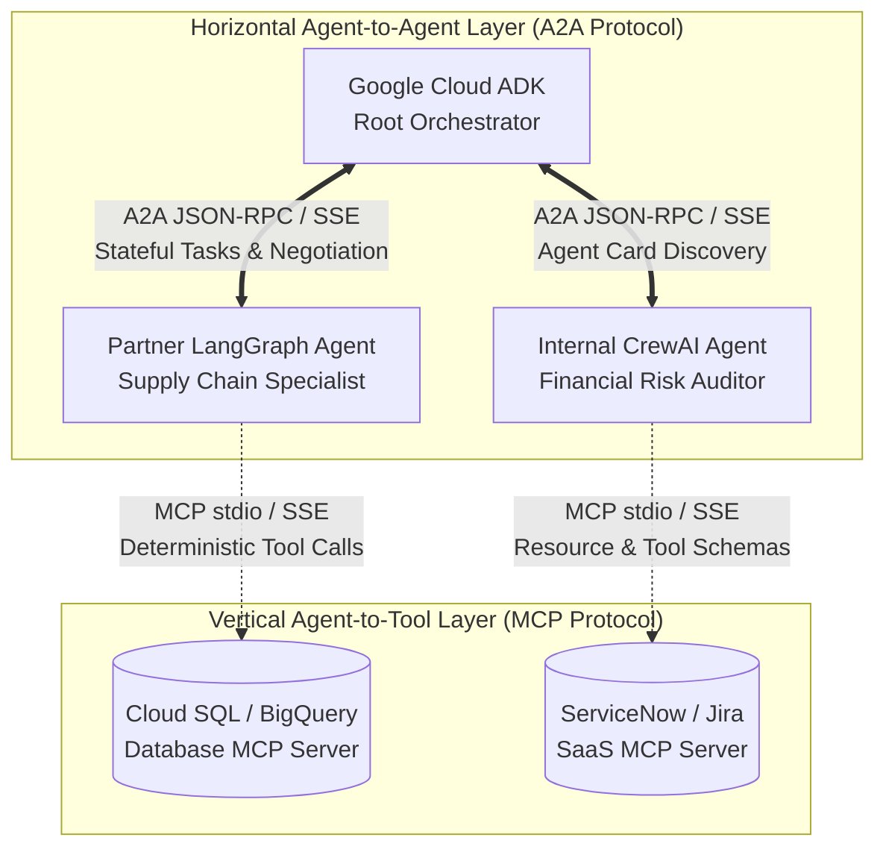

# Section 3C: Multi-Agent Orchestration & Agent2Agent (A2A) Protocol

A monolithic agent equipped with 50+ tools and a 10,000-word system instruction inevitably suffers from tool selection confusion, attention dilution ("lost-in-the-middle"), high latency, and brittle failure modes. To engineer resilient enterprise systems on **Vertex AI Agent Engine (Agent Runtime)**, architects decompose complex domains into specialized **Multi-Agent Topologies** and connect heterogeneous agent ecosystems across organizational boundaries using the open **Agent2Agent (A2A) Protocol**.

This module covers the architectural patterns for orchestrating multi-agent workflows (Sequential, Parallel, Hierarchical, and Cyclic/DAG graphs), preventing infinite reasoning loops, managing state handoffs, and implementing the full A2A protocol specification (`/.well-known/agent.json`, Task lifecycles, SSE streaming, push notifications, and A2A vs. MCP architectural boundaries).

---

## 1. Multi-Agent Topologies & Design Patterns

When decomposing an enterprise workflow across multiple agents on Google Cloud, architects choose among four foundational orchestration topologies based on execution dependencies, latency budgets, and determinism requirements.

```mermaid
flowchart TB
    subgraph Sequential ["1. Sequential Pipeline (Deterministic)"]
        S1[Agent A: Parser] -->|State Handoff| S2[Agent B: Validator] -->|State Handoff| S3[Agent C: Formatter]
    end

    subgraph Parallel ["2. Parallel Scatter-Gather (Concurrent)"]
        P_In([Input Document]) --> P1[Legal Agent]
        P_In --> P2[Security Agent]
        P_In --> P3[Finance Agent]
        P1 & P2 & P3 --> P_Agg[Aggregator Agent]
    end

    subgraph Hierarchical ["3. Hierarchical Supervisor-Worker (Dynamic)"]
        Sup[Supervisor LlmAgent] -->|Dynamic Delegation| W1[Billing Worker]
        Sup -->|Dynamic Delegation| W2[Tech Support Worker]
        Sup -->|Dynamic Delegation| W3[Refund Worker]
    end

    subgraph Cyclic ["4. Cyclic / Reflection Graph (Iterative)"]
        Gen[Generator Agent] -->|Draft Artifact| Crit[Critic / Evaluator Agent]
        Crit -->|Feedback & Rubric Score < 0.9| Gen
        Crit -->|Escalate / Score >= 0.9| Out([Final Approved Output])
    end
```



### 1.1 Architectural Comparison of Multi-Agent Topologies

| Topology Pattern | ADK Implementation Primitive | Routing Mechanism | Latency Profile | Context & State Sharing | Primary Enterprise Use Case |
| :--- | :--- | :--- | :--- | :--- | :--- |
| **Sequential Pipeline** | `SequentialAgent` | **Hardcoded Deterministic** ($A_1 \rightarrow A_2 \rightarrow A_3$) | Additive ($\sum T_i$) | Shared `Session.state`; upstream agents write to `output_key` consumed by downstream templates. | Multi-stage ETL, document ingestion $\rightarrow$ translation $\rightarrow$ PII redaction $\rightarrow$ database commit. |
| **Parallel Scatter-Gather** | `ParallelAgent` + downstream `LlmAgent` | **Concurrent Fan-Out** (`asyncio.gather`) | Bounded by slowest branch ($\max(T_i) + T_{\text{agg}}$) | Concurrent read of `InvocationContext`; isolated write keys (`state["legal_review"]`, `state["sec_review"]`). | Multi-disciplinary compliance audits, competitive pricing checks across multiple suppliers. |
| **Hierarchical Supervisor-Worker** | Root `LlmAgent` with `sub_agents=[...]` or Agent-as-Tool wrappers | **Dynamic LLM Reasoning** (`transfer_to_agent` or tool call) | Variable (Router TTFT + selected worker execution) | Supervisor passes scoped task instructions or delegates active session control to specialist sub-agent. | Enterprise IT Helpdesk triage routing requests across Network, IAM, Hardware, and SaaS sub-agents. |
| **Cyclic / Reflection Graph** | `LoopAgent` wrapping Generator + Critic `sub_agents` | **Iterative Conditional Loop** until `escalate=True` or `max_iterations` | Multiplicative ($K \times (T_{\text{gen}} + T_{\text{crit}})$) | Mutates draft artifact and critique history in `temp:` state across loop iterations. | Automated code generation with compiler verification, legal contract drafting with rubric validation. |

### 1.2 Implementing Hierarchical Delegation vs. Agent-as-a-Tool in ADK

In ADK, a Supervisor agent can interact with Worker agents using two distinct control-flow mechanisms:

1. **Full Control Transfer (`transfer_to_agent` / Peer Handoff)**:
   - When a root `LlmAgent` declares `sub_agents=[billing_agent, tech_agent]`, ADK automatically exposes a built-in transfer mechanism.
   - When the root agent transfers control to `billing_agent`, **`billing_agent` takes over the active conversation loop** and interacts directly with the user for subsequent turns until the task concludes or transfers back.
   - *Best For*: Conversational customer support where a user needs to have a multi-turn dialogue with a specialist agent (e.g., completing a multi-step identity verification wizard).
2. **Agent-as-a-Tool (`AgentTool` Sub-routine Invocation)**:
   - Wraps a sub-agent inside an `AgentTool(agent=sql_specialist_agent)` and passes it into the Supervisor's `tools=[...]` list.
   - When invoked, the Supervisor calls `sql_specialist_agent` as a **synchronous sub-routine**: the specialist executes its internal turns, returns its final answer to the Supervisor as a `FunctionResponse`, and **control never leaves the Supervisor**. The human user only ever speaks to the Supervisor persona.
   - *Best For*: Executive synthesis assistants where the root orchestrator queries multiple specialist research agents behind the scenes and presents a unified, cohesive report to the user.

---

## 2. Loop Prevention, Cycle Guardrails & State Handoffs

Autonomous cyclic graphs and hierarchical multi-agent trees introduce severe operational risks in production: **Infinite Reasoning Loops** (where Agent A transfers to Agent B, which transfers back to Agent A indefinitely, burning thousands of dollars in API tokens) and **Context Window Poisoning** (where raw tool trace noise from Sub-Agent 1 degrades reasoning in Sub-Agent 5).

### 2.1 Five Defense-in-Depth Guardrails Against Infinite Reasoning Loops

Architects must implement deterministic circuit breakers at both the ADK framework layer and the infrastructure gateway layer:

1. **Hard Iteration Ceilings (`max_iterations`)**: Every ADK `LoopAgent` must specify an explicit integer bound (e.g., `max_iterations=3`). If the Critic agent fails to emit `EventActions(escalate=True)` within 3 cycles, `LoopAgent` terminates execution deterministically and yields the best-effort draft alongside a timeout warning flag.
2. **Semantic Trajectory & State Hashing (Cycle Detection)**: In `before_model_callback` or `before_agent_callback`, compute a cryptographic hash of `(active_agent_name, tool_call_name, canonical_json(tool_args))`. Store recent hashes in `session.state["temp:trajectory_hashes"]`. If an identical hash appears $\ge 2$ times within the same turn, intercept the call and inject a system directive: *"SYSTEM WARNING: You have already invoked tool X with identical parameters. Do not repeat this call; synthesize an answer with available data or escalate."*
3. **Maximum Hop Depth Counter (`max_transfer_hops`)**: Track agent-to-agent handoffs in `session.state["temp:hop_count"]`. Increment the counter in `before_agent_callback`. If `hop_count > 5`, short-circuit execution and trigger a **Human-in-the-Loop (HITL)** escalation.
4. **Token & Dollar Budget Circuit Breakers**: Enforce per-invocation token budgets via **Agent Gateway** or ADK usage accumulators (`callback_context.usage_metadata.total_token_count`). If a single user request consumes $> 50,000$ output tokens across sub-agents, abort the run immediately (`HTTP 429 Budget Exceeded`).
5. **Deterministic Fallback & Escalation Routing**: When a loop or failure ceiling is reached, the agent executes a deterministic fallback path—emitting a structured ticket payload to **ServiceNow/Jira via MCP** and transferring the live session to a human operator queue in **CX Agent Studio**.

### 2.2 State Handoff Contracts & Context Window Pruning

Passing the entire raw multi-agent conversation transcript (including every intermediate thought trace, failed SQL query, and 50KB JSON tool response) to every sub-agent causes **Context Window Pollution** and quadratic token inflation.

Architects enforce **Clean State Handoff Contracts**:
- **Context Isolation (`include_contents="none"`)**: When invoking a worker sub-agent whose task depends solely on a structured input variable (e.g., validating a JSON schema), configure the sub-agent to ignore prior chat history and read strictly from interpolated state keys (`{temp:candidate_json}`).
- **Structured Pydantic Handoff Schemas**: Enforce strict input/output boundaries between sequential agents using `response_schema=MyPydanticModel`. Agent A guarantees its output conforms to the schema, writing validated JSON to `session.state["stage_1_output"]`, which Agent B consumes deterministically.

---

## 3. The Agent2Agent (A2A) Interoperability Protocol

While ADK orchestrates sub-agents running within a single Python runtime process, modern enterprise architectures span multi-cloud boundaries, independent business units, and heterogeneous frameworks (e.g., an **ADK** orchestrator on Google Cloud collaborating with a **LangGraph** supply-chain agent on AWS, a **CrewAI** marketing agent, and a **ServiceNow** native agent).

To solve cross-platform agent interoperability, Google Cloud and industry partners established the open **Agent2Agent (A2A) Protocol**.

### 3.1 A2A vs. MCP: The Fundamental Architectural Boundary

A frequent point of confusion on the PAA exam is distinguishing when to use **Model Context Protocol (MCP)** versus **Agent2Agent (A2A)**. They are complementary standards operating at different layers of the agentic stack:



| Architectural Dimension | Model Context Protocol (MCP) | Agent2Agent Protocol (A2A) |
| :--- | :--- | :--- |
| **Integration Direction** | **Vertical (Agent $\rightarrow$ Tool / Data Resource)** | **Horizontal / Hierarchical (Agent $\leftrightarrow$ Autonomous Agent)** |
| **Target Counterparty** | Deterministic APIs, databases, file systems, code sandboxes. Counterparty has **no internal reasoning or agency**. | Autonomous cognitive peers possessing their own LLM reasoning loops, memory, private tools, and multi-step planning. |
| **Interaction Paradigm** | Stateless request/response function execution (`tools/call`, `resources/read`). | **Stateful Task Lifecycle** (`tasks/send`, `tasks/sendSubscribe`) supporting multi-turn clarification, negotiation, and long-running background jobs. |
| **Schema Transparency** | **White-Box Input Schema**: Client agent must know exact function parameter names and types (`sql_query: str`). | **Opaque Black-Box Implementation**: Client agent sends high-level natural language or multimodal goals; specialist agent decides *how* to solve it internally without exposing private tools or prompts. |
| **Discovery Mechanism** | Server capabilities handshake (`initialize` response listing tools/resources). | **Agent Card** published at standard HTTP URI: **`/.well-known/agent.json`**. |

### 3.2 Agent Discovery & The Agent Card Specification (`/.well-known/agent.json`)

Every A2A-compliant agent server publishes a standardized JSON metadata document called an **Agent Card** at the well-known HTTPS endpoint `https://<agent-domain>/.well-known/agent.json`.

Orchestrator agents fetch this card dynamically to discover the remote agent's identity, supported capabilities, security requirements, and specialized **Skills**:

```json
{
  "name": "EnterpriseProcurementSpecialist",
  "description": "Autonomous agent that evaluates vendor contracts, checks ERP budget availability, and negotiates purchase orders.",
  "url": "https://procurement-agent.corp.example.com/a2a/v1",
  "version": "2.1.0",
  "provider": {
    "organization": "Acme Global Supply Chain",
    "url": "https://procurement.corp.example.com"
  },
  "capabilities": {
    "streaming": true,
    "pushNotifications": true,
    "stateTransitionHistory": true
  },
  "authentication": {
    "schemes": ["OAuth2", "Bearer"],
    "credentials": "https://auth.corp.example.com/oauth2/token"
  },
  "defaultInputModes": ["text/plain", "application/pdf", "application/json"],
  "defaultOutputModes": ["text/plain", "application/json"],
  "skills": [
    {
      "id": "vendor-contract-audit",
      "name": "Vendor Contract Risk Audit",
      "description": "Audits vendor PDF contracts against corporate indemnification and SLA standards.",
      "tags": ["legal", "procurement", "audit"],
      "examples": ["Audit the attached Master Services Agreement for liability cap violations."]
    }
  ]
}
```

### 3.3 The A2A Task Lifecycle & State Machine

Unlike synchronous REST APIs that block until completion or time out after 60 seconds, A2A models all interactions around a stateful **`Task`** object identified by a unique `id` and optional `sessionId` (grouping related tasks into an ongoing conversation).

```mermaid
stateDiagram-v2
    [*] --> submitted : Client calls tasks/send or tasks/sendSubscribe
    submitted --> working : Remote Agent begins cognitive processing
    working --> input_required : Remote Agent needs clarification / missing parameters from client
    input_required --> working : Client sends follow-up message with same Task ID
    working --> completed : Task succeeded; Artifacts emitted
    working --> failed : Unrecoverable error / policy rejection
    submitted --> canceled : Client calls tasks/cancel
    working --> canceled : Client calls tasks/cancel
    input_required --> canceled : Client calls tasks/cancel
    completed --> [*]
    failed --> [*]
    canceled --> [*]
```



#### Core A2A Task States:
- **`submitted`**: Task received and queued by the remote agent server.
- **`working`**: Remote agent is actively executing reasoning turns, querying internal MCP servers, or running sub-agents.
- **`input-required`**: Crucial agentic state! If the remote procurement agent realizes it cannot complete the audit without knowing the target jurisdiction, it transitions the task to `input-required` and returns a message asking: *"Which legal jurisdiction governs this contract: Delaware or Germany?"* The client orchestrator can automatically answer the question (or prompt the human user) by sending a subsequent `tasks/send` request referencing the **exact same `task.id`**.
- **`completed` / `failed` / `canceled`**: Terminal states. Upon reaching `completed`, the task payload includes structured **`Artifact`** objects (e.g., generated PDFs, JSON reports, code diffs) composed of typed **`Part`** elements (`TextPart`, `FilePart`, `DataPart`).

### 3.4 Synchronous Polling, SSE Streaming & Asynchronous Push Notifications

A2A supports three communication modes tailored to workload duration:

1. **Synchronous Request / Response (`tasks/send`)**:
   - Client sends a JSON-RPC 2.0 POST request (`method: "tasks/send"`). Suitable for fast tasks completing in $< 10$ seconds.
2. **Real-Time Streaming via Server-Sent Events (`tasks/sendSubscribe`)**:
   - Client initiates a streaming HTTP connection (`method: "tasks/sendSubscribe"`). The remote agent streams incremental `TaskStatusUpdateEvent` (reasoning status updates, e.g., *"Inspecting Clause 14..."*) and `TaskArtifactUpdateEvent` (streaming text or partial JSON chunks) in real time over SSE. Essential for low-latency UI responsiveness.
3. **Asynchronous Webhook Push Notifications (`tasks/pushNotification/set`)**:
   - Enterprise workflows frequently span hours or days (e.g., waiting for a human VP to approve a $500K purchase order or running a 4-hour BigQuery ML training job). Holding an HTTP/SSE connection open for 8 hours is an anti-pattern that breaks across load balancers and serverless container restarts.
   - *Architecture*: The client orchestrator registers a callback webhook URL via `tasks/pushNotification/set` along with a cryptographic bearer/HMAC token. Both client and server can close their HTTP connections and scale down to zero. When the remote task transitions to `completed` or `input-required` hours later, the remote A2A server sends an authenticated HTTP POST webhook notification back to the client orchestrator's endpoint to wake it up.

### 3.5 Cross-Organization Security & Identity in A2A

When an ADK agent in Organization A (`acme.com`) invokes an A2A supplier agent in Organization B (`supplier.io`), zero-trust security is enforced across three layers:

1. **Transport & Perimeter Security**: All A2A traffic runs strictly over TLS 1.3 / mTLS, fronted by **Google Cloud Armor**, **Apigee**, or **Agent Gateway** for DDoS mitigation, rate limiting, and schema validation.
2. **Cryptographic Federation (OAuth 2.0 / OIDC)**: The client agent inspects the remote `AgentCard.authentication` block, authenticates via **Google Cloud Auth Manager** or Workload Identity Federation to obtain a scoped OAuth 2.0 JWT bearer token, and injects it into the A2A HTTP `Authorization` header.
3. **Data Boundary Scrubbing (Sensitive Data Protection / Model Armor)**: Because A2A requests cross organizational trust boundaries, an outgoing interceptor (`before_tool_callback` or **Agent Gateway DLP filter**) scans outgoing `Message` and `Part` payloads via **Cloud Sensitive Data Protection (DLP)** to redact internal PII, customer SSNs, or proprietary source code before transmission to external partner agents.

---

## 4. Architectural Decision Tree: Selecting Topologies & Protocols

```
[Start: Multi-Component Enterprise AI Requirement]
   │
   ├─► Are you connecting an Agent to a deterministic Database, API, or File System?
   │      └─► YES: Use **Model Context Protocol (MCP)** (`MCPToolset` over SSE or stdio).
   │               Do NOT use A2A for dumb tools lacking autonomous reasoning.
   │
   ├─► Are you connecting an Agent to another Autonomous Agent?
   │      ├─► Both agents are written in Python ADK within the same codebase / container runtime?
   │      │      ├─► Fixed sequential pipeline? ──► ADK `SequentialAgent`
   │      │      ├─► Concurrent independent checks? ──► ADK `ParallelAgent`
   │      │      ├─► Iterative generator-critic refinement? ──► ADK `LoopAgent` (with `max_iterations`)
   │      │      └─► Dynamic routing by LLM supervisor? ──► ADK `LlmAgent` (`sub_agents` or `AgentTool`)
   │      │
   │      └─► Agents run across separate microservices, different clouds (GCP/AWS/Azure),
   │          different frameworks (ADK + LangGraph/CrewAI), or external partner organizations?
   │             └─► Use **Agent2Agent (A2A) Protocol**:
   │                    ├─► Publish `/.well-known/agent.json` Agent Cards.
   │                    ├─► Sub-30 second interactive tasks? ──► `tasks/sendSubscribe` (SSE Streaming).
   │                    └─► Long-running jobs (>5 mins / human approval)? ──► `tasks/pushNotification/set` (Webhooks).
```

---

## 5. Exam Traps & Anti-Patterns (Must-Know for PAA Exam)

> [!CAUTION]
> **Exam Trap 1: Using MCP Instead of A2A for Cross-Framework Multi-Agent Delegation**
> *Scenario*: A global bank has an existing Fraud Investigation Agent built in LangGraph deployed on AWS and a new Customer Support Orchestrator built in Google Cloud ADK on Vertex AI Agent Engine. The bank wants the ADK orchestrator to delegate complex multi-turn fraud investigations to the AWS agent, including back-and-forth clarification questions. A candidate suggests wrapping the AWS agent as an MCP Server using `resources/read`.
> *Why it's wrong*: MCP is designed for stateless, tool-level function calls and passive data resources where the client dictates exact parameters. It lacks native semantics for stateful task lifecycles (`input-required` clarification states), multi-turn negotiation, asynchronous webhook push notifications, and black-box autonomous task execution.
> *Correct Architecture*: Expose the AWS LangGraph agent as an **A2A Server** publishing an **Agent Card at `/.well-known/agent.json`** and connect the Google Cloud ADK orchestrator as an **A2A Client** using stateful `tasks/sendSubscribe` or push notifications.

> [!WARNING]
> **Exam Trap 2: Holding Open SSE Connections for Multi-Hour Human-in-the-Loop Tasks**
> *Scenario*: An ADK orchestrator invokes a remote A2A Legal Approval Agent via `tasks/sendSubscribe` (Server-Sent Events). The legal workflow requires a human General Counsel to review the contract, which takes an average of 6 hours. The engineering team configures their Cloud Run timeout to 3,600 seconds and tries to keep the SSE stream open.
> *Why it's wrong*: Cloud Run, GKE Ingress load balancers, and corporate firewalls terminate idle or long-lived HTTP connections (Cloud Run max request timeout is 60 minutes). Furthermore, holding serverless instances open for hours wastes compute billing waiting on I/O.
> *Correct Architecture*: Use **A2A Push Notifications (`tasks/pushNotification/set`)**. The client registers a webhook callback URL and disconnects immediately. When the General Counsel approves the contract 6 hours later, the remote A2A server sends an authenticated HTTP POST webhook to resume the orchestrator workflow.

> [!WARNING]
> **Exam Trap 3: Deploying Unbounded `LoopAgent` Topologies Without Escalation Conditions**
> *Scenario*: An architect creates a `LoopAgent(sub_agents=[code_writer, unit_test_runner])` to automatically write and fix Python code until all unit tests pass. They deploy it to production without setting `max_iterations` or trajectory cycle detection. When encountering an environment bug, the agent loops 400 times overnight, incurring $1,200 in Gemini 2.5 Pro token charges.
> *Why it's wrong*: Without a deterministic ceiling, LLM generator-critic loops can get stuck oscillating between two flawed code versions indefinitely.
> *Correct Architecture*: Always configure a strict **`max_iterations` bound** (e.g., `max_iterations=5`) on every `LoopAgent` and implement trajectory state hashing in `before_model_callback` to break cycles and escalate to Human-in-the-Loop (HITL) when progress stalls.

> [!CAUTION]
> **Exam Trap 4: Forwarding Full Unfiltered Conversation Transcripts Across Deep Multi-Agent Trees**
> *Scenario*: A root Supervisor agent orchestrates 6 sequential sub-agents. Each sub-agent retrieves 15,000 tokens of raw API documentation and appends it to the shared conversation history. By the time Sub-Agent 6 executes, the prompt contains 90,000 tokens of irrelevant upstream tool traces, causing high latency and hallucinated instructions.
> *Why it's wrong*: Unbounded transcript accumulation across multi-agent handoffs causes severe context window bloat ("lost-in-the-middle") and unnecessary token cost multiplication.
> *Correct Architecture*: Enforce **Scoped State Handoffs**. Store raw API scratchpad data in **`temp:`** state keys, extract validated structured summaries into dedicated `output_key` variables, and configure downstream specialist sub-agents with isolated context views (`include_contents="none"` or pruned history) so each agent receives only the clean data required for its specific role.
