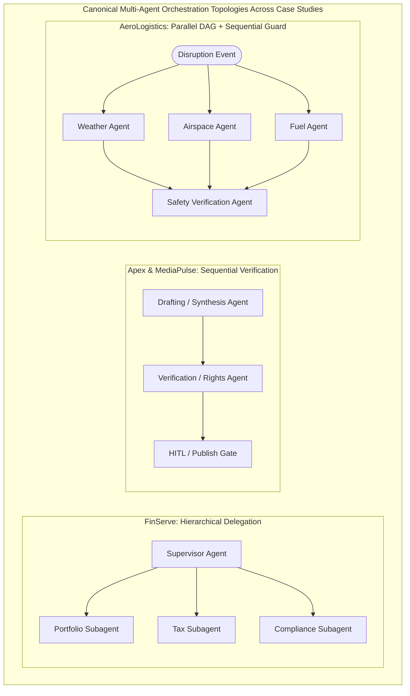

# Enterprise Agentic Case Studies Deep-Dive & Architecture Blueprints

## Master Cross-Case Architectural Matrix

The **Google Cloud Professional Agentic Architect (PAA)** exam features six enterprise case studies representing roughly 30–35% of exam questions. Review the master architectural comparison below to see how Google Cloud's 28 in-scope agentic services map across industry verticals.

| Enterprise Case Study | Core Agentic Topology | Primary Compute & Models | Key Data & Retrieval Stack | Security, Governance & Evaluation Anchor |
| :--- | :--- | :--- | :--- | :--- |
| **1. FinServe Global** *(Wealth & Banking)* | **Hierarchical ADK Mesh** (Supervisor $\rightarrow$ Portfolio, Tax, Compliance subagents) | **Agent Runtime**; Gemini 1.5 Pro / Flash | Cloud SQL (PostgreSQL RLS), BigQuery, **Memory Bank**, Managed Sessions | **HITL** trades >$50k; **PAB** + **Agent Identity** + **Auth Manager (OAuth 2.0)**; **Model Armor** + **DLP**; **ADK evalset**. |
| **2. Cymbal OmniRetail** *(Retail & Supply Chain)* | **Dual Edge/Core**: **CX Agent Studio** (B2C) + **ADK Graph & A2A** (B2B 3PL) | **Agent Runtime**, Cloud Run; Dynamic routing (**SLMs** vs. **Gemini 1.5 Pro**) | **Agent Search**, **RAG Engine**, **Vector Search 1.0** (Hybrid + Rerank), Redis | **Agent2Agent (A2A)** external 3PLs; **MCP Servers** internal DBs; **Agent Registry**; **Cloud Trace**. |
| **3. Apex BioHealth** *(Clinical Trials & Pharma)* | **Sequential + Parallel Verification** (Synthesis $\rightarrow$ Verification Agent) | **Agent Runtime** inside **VPC Service Controls (VPC-SC)** | **RAG Engine** & **Agent Retrieval** over CMEK Cloud Storage (DICOM, WAV, PDF) | **Sensitive Data Protection (DLP)** surrogate tokens; IRB **PAB** scoping; **Gen AI Evaluation Service**. |
| **4. DevVelocity Cloud** *(Autonomous SWE)* | **Coding Agent Mesh**: **Antigravity** & **Claude Code** + Subagents | **GKE (gVisor Sandboxes)** & **Cloud Workstations** | Custom **MCP Servers** (API schemas, Cloud SQL test DBs, Jira, Cloud Logging) | **Skill Registry** (`SKILL.md`, Plugins, Hooks, Rules); **Agents CLI**; **Agent Mode** vs. **Human Mode**; **Model Armor**. |
| **5. AeroLogistics Fleet** *(Autonomous Cargo Dispatch)* | **Cyclic & DAG Graph Workflow** (Parallel Weather/Fuel/Airspace + Safety) | **GKE with GPU/TPUs** (Self-hosted fine-tuned **SLMs**) + Multi-region **Cloud Run** | Pub/Sub (500k events/s), BigQuery, **Memorystore for Redis**, **Memory Bank** | Sub-800ms p99 SLA; Hard step budgets (`max_iterations`), circuit breakers; **Agent Gateway** load shedding; **Cloud Trace**. |
| **6. MediaPulse Network** *(Global News & Broadcast)* | **Multi-Stage Sequential Pipeline** (Research $\rightarrow$ Draft $\rightarrow$ Fact/Rights $\rightarrow$ Localize) | **Agent Runtime** + **Gemini Enterprise** workflows | **Agent Search** verified archive, **RAG Engine**, Cloud Storage (4K video) | **MCP Servers** + **Auth Manager** for 3P SaaS (CMS, Slack); Syndicate **PAB** isolation; **Model Armor**; **HITL**. |

---

## Case Study 1: FinServe Global

### 1.1 Executive Summary & Architectural Vision
**FinServe Global** ($450B AUM wealth management firm) is replacing static Dialogflow bots and monolithic Java/GKE portals with an autonomous wealth advisory platform on **Agent Development Kit (ADK)** and **Agent Runtime**. The hierarchical multi-agent mesh delivers 24/7 portfolio analysis across 5 million retail clients while enforcing sub-2-second latency, SEC/FINRA/GDPR auditability, and mandatory human advisor approval for high-value trades.

### 1.2 Requirement-to-GCP-Service Blueprint

| Business / Technical Requirement | Target Google Cloud Service & Configuration | Architectural Rationale |
| :--- | :--- | :--- |
| Orchestrate market research, portfolio, tax, and compliance subagents. | **ADK (`HierarchicalAgent`)** on **Agent Runtime**. | Managed stateful orchestration with built-in delegation and session affinity. |
| Prevent unauthorized autonomous trades >$50,000 or derivatives. | Deterministic **Human-in-the-Loop (HITL)** via ADK `before_tool_callback` + **Firestore / Memory Bank**. | Serializes state before trade execution; resumes only upon receiving a signed Advisor JWT. |
| Enforce zero-trust account isolation on Cloud SQL PostgreSQL ledgers. | **Agent Identity** + **Auth Manager (OAuth 2.0 RFC 8693)** + **Principal Access Boundary (PAB)** + PostgreSQL **RLS**. | Propagates user identity across subagents; PAB intersects with IAM ($Allow \cap PAB$). |
| Block prompt injection, jailbreaks, and PII/PCI leakage. | **Agent Gateway** with inline **Model Armor** and **Sensitive Data Protection (DLP)**. | Centralizes ingress/egress inspection, rate limiting, and real-time redaction/tokenization. |
| Persist long-term financial goals vs. ephemeral chat state. | **Agent Platform Memory Bank** (long-term profile) + **Managed Sessions** (active turn state). | Separates durable wealth goals from active conversation buffers. |
| Continuously validate trajectory accuracy and compliance. | **ADK evalset** (CI trajectory assertions) + **Gen AI Evaluation Service** custom compliance autoraters. | Enforces a dual-gate CI/CD pipeline verifying tool recall and groundedness before promotion. |

### 1.3 Target Architecture & Security Governance Model
When an authenticated client initiates chat, **Agent Gateway** terminates mTLS, inspects prompts via **Model Armor**, and exchanges the client's JWT via **Auth Manager** for an On-Behalf-Of actor token. A session-scoped **PAB policy** locks the **Agent Identity** of Supervisor, Portfolio, Tax, and Compliance subagents strictly to the client's `client_id`. Trades exceeding $50,000 halt at a deterministic hook, freezing session state in **Memory Bank** until a licensed advisor submits a signed approval JWT.

### 1.4 Top Exam Traps — FinServe Global
> [!WARNING]
> - **Trap 1 (HITL Implementation)**: Never rely on LLM instructions (*"Ask the user or advisor to type APPROVE in chat"*) for the $50,000 trade threshold. Use an out-of-band ADK callback interrupt that freezes state and requires a cryptographically signed OAuth 2.0 JWT from an authorized advisor principal.
> - **Trap 2 (Confused Deputy on Cloud SQL)**: Do not connect subagents to Cloud SQL using a shared service account with broad table read access. Propagate end-user identity via **Auth Manager OAuth 2.0 Token Exchange**, enforce **PAB policies** on **Agent Identity**, and bind PostgreSQL **Row-Level Security (RLS)** to the propagated user claim.

---

## Case Study 2: Cymbal OmniRetail

### 2.1 Executive Summary & Architectural Vision
**Cymbal OmniRetail** (1,200 stores, 80M shoppers, 15M SKUs) is unifying customer-facing conversational commerce and autonomous supply chain fulfillment. At the customer edge, low-code **CX Agent Studio** and **Gemini Enterprise Agent Designer** deliver multimodal visual search and voice styling. In the backend, custom **ADK** agents on **Agent Runtime** autonomously negotiate inventory replenishment and shipment rerouting with external 3PL partners using **Agent2Agent (A2A)** and internal **Model Context Protocol (MCP)** servers.

### 2.2 Requirement-to-GCP-Service Blueprint

| Business / Technical Requirement | Target Google Cloud Service & Configuration | Architectural Rationale |
| :--- | :--- | :--- |
| Deliver low-code multimodal shopping flows (visual search, voice, styling). | **CX Agent Studio** & **Gemini Enterprise Agent Designer** (pages, transition routes, event handlers). | Visual state-machine design for structured checkouts combined with generative multi-turn fallback. |
| Ground product discovery and policy answers on 15M SKUs without SQL hallucinations. | **Agent Search**, **RAG Engine**, and **Vector Search 1.0** with **Hybrid Search** and **Cross-Encoder Reranking**. | Lexical BM25 captures exact SKU codes, semantic search captures styling intent, and reranking maximizes precision. |
| Enable autonomous B2B inventory negotiation with external 3PL supplier agents. | **Agent2Agent (A2A)** protocol governed via **Agent Registry** and routed through **Agent Gateway**. | Standardized open protocol for cross-organization agent negotiation, schema discovery, and policy enforcement. |
| Connect internal agents safely to Cloud SQL, Firestore, BigQuery, and Redis. | Prebuilt and custom **Google Cloud MCP Servers** registered in **Agent Registry**. | Replaces brittle raw LLM-to-SQL generation with parameterized, schema-validated MCP tool endpoints. |
| Optimize inference costs across 80M shoppers while supporting complex graph logic. | Dynamic routing: **Gemini 1.5 Flash / SLMs** for routine catalog lookups; **Gemini 1.5 Pro** for supply chain rerouting. | Slashes token costs and latency on high-volume tier-1 queries while preserving frontier reasoning for complex graphs. |
| Detect reasoning loops, tool latency spikes, and context drift in production. | **Cloud Trace** (OpenTelemetry W3C spans across A2A/MCP) + **Cloud Logging** BigQuery sinks. | Pinpoints latency bottlenecks across external carrier APIs and alerts on retrieval cosine distance degradation. |

### 2.3 Target Architecture & Interoperability Model
1. **North-South Tool Execution (`MCP`)**: Internal ADK supply chain agents query Cloud SQL, Firestore, and BigQuery strictly through **MCP Servers**, eliminating ad-hoc SQL generation.
2. **East-West Multi-Agent Negotiation (`A2A`)**: When Pub/Sub and **Memorystore for Redis** detect a stockout, Cymbal's Inventory Agent discovers external 3PL agents in **Agent Registry** and initiates an **A2A** negotiation workflow through **Agent Gateway**.

### 2.4 Top Exam Traps — Cymbal OmniRetail
> [!CAUTION]
> - **Trap 1 (A2A vs. MCP Confusion)**: **MCP** connects an agent to *tools, databases, and APIs* (Cloud SQL or BigQuery). **A2A** connects an autonomous agent to *another autonomous peer agent* (external 3PL partner agent).
> - **Trap 2 (Pure Vector Search for SKU Catalogs)**: Dense vector embeddings alone fail on exact alphanumeric model numbers (`SKU-9941-X`). Always select **Hybrid Search (BM25 lexical + dense vector embeddings)** with **Cross-Encoder Reranking** in **Agent Search / Vector Search 1.0**.

---

## Case Study 3: Apex BioHealth

### 3.1 Executive Summary & Architectural Vision
**Apex BioHealth** coordinates Phase I–III oncology and rare-disease clinical trials across 350 hospital sites, generating petabytes of multimodal data (EHRs, DICOM radiology images, WAV audio, PDFs). To compress FDA/EMA regulatory dossier preparation from 6 months to 3 weeks while guaranteeing 99.5% citation accuracy and strict HIPAA / FDA 21 CFR Part 11 compliance, Apex deploys multimodal **ADK** agents on **Agent Runtime** inside a **VPC Service Controls (VPC-SC)** perimeter with **Sensitive Data Protection (DLP)** PHI de-identification and a Synthesis-Verification agent pattern.

### 3.2 Requirement-to-GCP-Service Blueprint

| Business / Technical Requirement | Target Google Cloud Service & Configuration | Architectural Rationale |
| :--- | :--- | :--- |
| Ingest and cross-reference multimodal protocols, DICOM imagery, and WAV audio. | **RAG Engine** & **Agent Retrieval** with multimodal chunking and medical embeddings over **CMEK** Cloud Storage. | Parses embedded PDF tables, audio transcripts, and imaging metadata into unified semantic indices. |
| Redact and protect PHI before external model inference, indexing, or logging. | **Sensitive Data Protection (DLP)** templates (Cryptographic Surrogate Tokenization) at ingestion and **Agent Gateway**. | Replaces patient names/MRNs with consistent surrogate tokens (`[PATIENT_881]`) so agents correlate events without seeing raw PHI. |
| Guarantee 99.5% citation accuracy with zero ungrounded claims in dossiers. | Sequential & parallel **ADK workflow**: **Synthesis Agent** $\rightarrow$ **Verification Agent** (cross-checking claims against chunks). | Separates generation from verification; the Verification Agent rejects any claim lacking an exact grounded citation. |
| Restrict researchers strictly to trials matching their IRB authorization scope. | **Agent Identity** + **Principal Access Boundary (PAB)** policies + **Auth Manager OAuth 2.0** claim propagation. | Enforces hard cryptographic boundaries so an oncology researcher's agent can never retrieve rare-disease trial buckets. |
| Continuously measure groundedness, completeness, and clinical precision. | **Agent Platform Gen AI Evaluation Service** with calibrated custom medical **LLM-as-a-Judge autoraters**. | Executes automated batch scoring against golden clinical QA datasets prior to submission staging. |
| Prevent data exfiltration across cloud boundaries. | **Agent Runtime** deployed inside a **VPC Service Controls (VPC-SC)** perimeter with **CMEK** encryption. | Eliminates unauthorized data egress and enforces cryptographic key ownership across storage, memory, and vector indices. |

### 3.3 Target Architecture & Clinical Verification Pattern
Documents in CMEK-encrypted Cloud Storage are processed via **Sensitive Data Protection**, replacing PHI with deterministic surrogate tokens wrapped by **Cloud KMS**. The `Synthesis Agent` generates a draft summary with inline citations, and control passes sequentially to the `Verification Agent`, which queries **Agent Retrieval** to verify that every dosage, p-value, and adverse event count matches the source chunk verbatim.

### 3.4 Top Exam Traps — Apex BioHealth
> [!IMPORTANT]
> - **Trap 1 (Irreversible Masking vs. Surrogate Tokenization)**: Irreversible redaction (`[REDACTED]`) on clinical trial logs prevents the LLM from distinguishing multiple patients. Select **Cryptographic Surrogate Tokenization (FPE / Deterministic Tokens)** in **Sensitive Data Protection**.
> - **Trap 2 (Single-Pass Prompting for Zero-Hallucination Mandates)**: A single LLM pass with temperature=0.0 is insufficient for a 99.5% citation accuracy SLA. Architect a multi-agent **Synthesis $\rightarrow$ Verification Agent** loop combined with continuous **Gen AI Evaluation Service** groundedness gating.

---

## Case Study 4: DevVelocity Cloud

### 4.1 Executive Summary & Architectural Vision
**DevVelocity Cloud** (4,500 engineers maintaining 800 Go, Python, Java, and TypeScript microservices) is rolling out an Autonomous Software Engineering Platform powered by **Antigravity (CLI, SDK, App)** and **Claude Code on Google Cloud**. To achieve a 40% feature velocity increase and automate 90% of CVE patching without risking source code exfiltration or unreviewed production mutations, DevVelocity deploys coding agents inside network-isolated sandboxes on **GKE (with gVisor)** and **Cloud Workstations**, governed centrally via **Skill Registry** and the **Agents CLI**.

### 4.2 Requirement-to-GCP-Service Blueprint

| Business / Technical Requirement | Target Google Cloud Service & Configuration | Architectural Rationale |
| :--- | :--- | :--- |
| Execute code refactoring, compilation, and unit tests safely without host compromise. | Ephemeral, network-isolated sandboxes on **GKE (GKE Sandbox with gVisor)** and **Cloud Workstations**. | User-space kernel isolation (`gVisor`) intercepts syscalls executed by AI-generated code, preventing container escape. |
| Provide coding agents safe access to internal API schemas, test DBs, Jira, and logs. | Custom **Model Context Protocol (MCP) Servers** protected by **Agent Gateway** and **Auth Manager (OAuth 2.0)**. | Exposes structured, read-scoped tool interfaces to internal systems without granting raw database credentials. |
| Standardize organizational coding standards, rules, and subagents across 4,500 devs. | **Antigravity Skills (`SKILL.md`), Plugins, Extension Hooks, Rules, and Subagents** distributed via **Skill Registry**. | Packages reusable engineering capabilities (`SecurityAuditorSubagent`, `JavaToGoRefactorSkill`) into versioned artifacts. |
| Build, version, scale, govern, and optimize deployed coding agents across environments. | **Agents CLI in Agent Platform**. | Provides platform engineering teams with a declarative CLI for lifecycle management, scaling, and telemetry attribution. |
| Allow autonomous sandbox test runs while requiring human sign-off for production merges. | Enforce **`agent mode`** (autonomous sandbox test execution) vs. **`human mode`** (mandatory developer / CI approval for merges & IAM edits). | Prevents autonomous coding agents from pushing unverified code directly to production branches or modifying IAM policies. |
| Prevent exfiltration of proprietary code/secrets and block insecure code patterns. | **Agent Gateway** egress allowlisting + inline **Model Armor** secret leakage & code vulnerability filters. | Blocks outbound connections to unauthorized endpoints and scans generated PRs for hardcoded keys or CVEs. |

### 4.3 Target Architecture & Coding Agent Governance
DevVelocity separates **Interactive Developer Assistance** (engineers on **Cloud Workstations** using **Antigravity App/CLI** and **Claude Code** with rules from **Skill Registry**) from **Autonomous Headless CI Remediation** (**Agents CLI** spawning ephemeral **GKE gVisor Sandbox** pods in `agent mode` to patch CVEs and run unit tests against sandboxed Cloud SQL instances via MCP, switching to `human mode` for PR merge sign-off).

### 4.4 Top Exam Traps — DevVelocity Cloud
> [!WARNING]
> - **Trap 1 (Standard Docker / Unsandboxed Nodes)**: Never execute AI-generated code or bash scripts on shared-kernel runtimes without isolation. Always specify **GKE Sandbox (gVisor)** or **Cloud Workstations** with strict **Agent Gateway** egress allowlists.
> - **Trap 2 (Ad-Hoc Prompt Sharing vs. Skill Registry)**: Do not distribute coding rules via wiki pages. Use **Skill Registry** to govern versioned **Antigravity Skills, Rules, Extension Hooks, and Subagents**, managed via **Agents CLI**.

---

## Case Study 5: AeroLogistics Fleet

### 5.1 Executive Summary & Architectural Vision
**AeroLogistics Fleet** operates an autonomous global cargo drone, maritime, and ground freight network across 90 countries, ingesting 500,000 telemetry events/second into Pub/Sub and BigQuery. To replace heuristic routing software that fails during severe weather, AeroLogistics deploys a real-time **Graph Multi-Agent Dispatch System** built with **ADK**. To meet a **sub-800ms p99 dispatch decision latency SLA** while preventing runaway token costs during storms, AeroLogistics combines cyclic/DAG graph orchestration with hybrid **SLM (GKE GPU/TPU)** and **LLM (Gemini 1.5 Pro)** routing, backed by hard execution guardrails.

### 5.2 Requirement-to-GCP-Service Blueprint

| Business / Technical Requirement | Target Google Cloud Service & Configuration | Architectural Rationale |
| :--- | :--- | :--- |
| Coordinate simultaneous weather, airspace, and fuel checks followed by safety sign-off. | **ADK Cyclic & Directed Acyclic Graph (DAG) Workflows** (`ParallelAgent` fan-out $\rightarrow$ sequential `SafetyVerificationAgent`). | Executes independent checks concurrently in milliseconds before enforcing a deterministic regulatory compliance gate. |
| Achieve sub-800ms p99 dispatch latency without runaway SaaS token costs during storms. | Hybrid routing: Fine-tuned **Small Language Models (SLMs)** self-hosted on **GKE with GPUs/TPUs**; **Gemini 1.5 Pro** for complex hub conflicts. | Local GPU/TPU inference on compact fine-tuned SLMs delivers deterministic $<200\text{ms}$ inference at fixed compute cost. |
| Manage high-frequency operational state and shared scratchpad memory at 500k events/s. | **Memorystore for Redis** (sub-millisecond ephemeral scratchpad) + **Agent Platform Memory Bank** (fleet history). | Redis provides sub-millisecond read/write concurrency for active graph state across parallel subagents. |
| Eliminate infinite reasoning loops and 15-second latency spikes during weather closures. | Hard execution guardrails: **Maximum step limits (`max_iterations`)**, tool timeout circuit breakers, and deterministic fallbacks. | Forcibly breaks cyclic tool-retry loops at step $N$ and falls back to safe deterministic holding vectors. |
| Manage global load shedding and rate limiting across multi-region clusters during surges. | Multi-region **GKE** and **Cloud Run** fronted by **Agent Gateway** global load shedding and token rate-limiting. | Protects core dispatch infrastructure from overload by shedding low-priority analytics queries during emergency rerouting. |
| Pinpoint latency bottlenecks, token spikes, and tool failures in real time. | **OpenTelemetry** + **Cloud Trace** W3C distributed context propagation across subagent handoffs. | Visualizes exact per-span latency across parallel branches (`WeatherSpan`, `AirspaceSpan`, `SLMInferenceSpan`). |

### 5.3 Target Architecture & Real-Time Loop Protection
When a storm closes an airspace sector, Pub/Sub triggers an ADK Graph Workflow on GKE. The orchestrator fans out concurrently to `WeatherForecaster`, `AirspaceCompliance`, and `BatteryOptimizer` subagents backed by fine-tuned SLMs running on GKE GPU/TPU node pools, sharing state via **Memorystore for Redis**. Each subagent is constrained by `max_iterations=3` and a `250ms` **Agent Gateway** tool timeout; failure to converge escalates to **Gemini 1.5 Pro** or triggers a deterministic emergency holding protocol.

### 5.4 Top Exam Traps — AeroLogistics Fleet
> [!CAUTION]
> - **Trap 1 (Frontier SaaS LLMs for High-Frequency Edge Loops)**: Routing 500,000 events/second exclusively through frontier SaaS LLMs (Gemini 1.5 Pro) violates both the **<800ms p99 latency SLA** and token budget constraints. Deploy fine-tuned **SLMs on GKE with GPU/TPU accelerators** for routine edge dispatch, reserving frontier LLMs for complex exception escalation.
> - **Trap 2 (Sequential Execution of Independent Checks)**: Invoking Weather, Airspace, and Battery checks sequentially adds additive network latency ($300\text{ms} \times 3 = 900\text{ms} > \text{SLA}$). Use an ADK `ParallelAgent` graph fan-out so total latency equals $\max(t_1, t_2, t_3)$.

---

## Case Study 6: MediaPulse Network

### 6.1 Executive Summary & Architectural Vision
**MediaPulse Network** produces 10,000 daily articles, 4K video broadcasts, and podcasts in 28 languages. To slash international breaking news localization latency from 12 hours to under 10 minutes while guaranteeing **zero copyright infringement or unverified factual hallucinations**, MediaPulse deploys a multi-stage sequential pipeline combining **ADK** agents and **Gemini Enterprise** workflows. The platform integrates with third-party editorial SaaS tools via **MCP Servers**, grounds synthesis exclusively on verified journalistic archives in **Agent Search**, enforces regional syndicate isolation via **PAB**, and requires **HITL** editorial sign-off for sensitive stories.

### 6.2 Requirement-to-GCP-Service Blueprint

| Business / Technical Requirement | Target Google Cloud Service & Configuration | Architectural Rationale |
| :--- | :--- | :--- |
| Connect agents seamlessly to 3P SaaS editorial tools (CMS, Slack, Rights APIs). | Standardized **Model Context Protocol (MCP) Servers** authenticated via **Auth Manager (OAuth 2.0)**. | Provides reusable, governed connectors to external SaaS platforms with automated OAuth token refresh and audit logging. |
| Ingest and synthesize raw 4K broadcast video, interview audio, and wire text in <10 minutes. | Multimodal **Gemini 1.5 Pro / Flash LLMs** + **RAG Engine** grounded exclusively on verified archives in **Agent Search**. | Native multimodal context windows process raw video/audio directly while grounding claims strictly against verified internal archives. |
| Enforce strict editorial progression from research to localization with policy gates. | Multi-stage **Sequential ADK Pipeline** (`Research` $\rightarrow$ `Drafting` $\rightarrow$ `Fact-Check & Rights` $\rightarrow$ `Localization`) with **Agent Registry** & **Model Armor** gates. | Guarantees that no article enters localization or CMS staging until it passes automated copyright clearance and verification. |
| Score every generated asset for groundedness, tone, and copyright compliance prior to staging. | Continuous production evaluation using **ADK evalset** and custom **LLM-as-a-Judge autoraters** in **Gen AI Evaluation Service**. | Automatically grades 100% of pre-published drafts against journalistic rubrics before CMS staging. |
| Isolate regional editorial agents so they only access embargoed media assets for their division. | **Agent Identity** + **Principal Access Boundary (PAB)** policies with end-to-end identity propagation. | Prevents an APAC regional localization agent from querying embargoed European investigative video buckets in Cloud Storage. |
| Empower human editors with final publication sign-off for sensitive investigative stories. | Deterministic **Human-in-the-Loop (HITL)** approval workflow integrated with Slack/CMS via MCP webhooks. | Pauses the publication pipeline for high-sensitivity investigative tags until an editor submits cryptographic sign-off. |

### 6.3 Target Architecture & Rights Governance Pipeline
Breaking wire text, field audio, and raw 4K video in Cloud Storage are analyzed by the `Research Agent` using Gemini's multimodal capabilities, retrieving context strictly from verified **Agent Search** archives (blocking unverified web sources via **Agent Gateway**). The `Drafting Agent` passes stories to the `Fact-Check & Rights Verification Agent`, which queries Rights Management databases via an **MCP Server**, while **Model Armor** scans outputs before passing approved drafts to the 28-language `Localization Agent` pool.

### 6.4 Top Exam Traps — MediaPulse Network
> [!IMPORTANT]
> - **Trap 1 (Grounding Breaking News on Open Web Search)**: To prevent hallucinations from unverified social media rumors, MediaPulse **must not** use public Google Search grounding for factual reporting. Configure **RAG Engine** and **Agent Search** scoped strictly to verified journalistic archives, enforced via **Agent Gateway**.
> - **Trap 2 (Custom API Scripts vs. Governed MCP Servers)**: Avoid custom inline Python `requests.post()` code with hardcoded API keys inside agent prompts. Deploy standardized **MCP Servers** registered in **Agent Registry** with credentials managed by **Auth Manager (OAuth 2.0)**.
